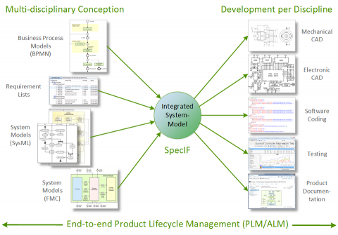
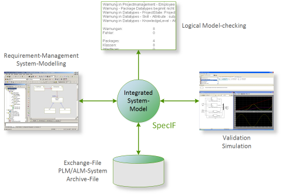

# Introduction

## Motivation

In the field of Systems Engineering (SE) a multitude of methods is being used with benefit every day; 
for example, requirements mana­gement, modeling of system structure and behavior with UML/SysML or simulation with 
Modelica and other languages. 
There is infor­mation from various sources and in different formats, all providing valuable 
input for system design and development.

In practice, it is difficult or even impossible to join the information with acceptable effort and put it in relation. 
Information from diffe­rent sources ("silos") is often inconsistent, because it is main­tained by different organi­zations 
with their own background and purpose. 
Popular modeling standards such as UML/SysML are notations but leave semantic 
inter­pretation to tool makers or users. For data (model) exchange there are several standards with respect to syntax, 
but very few which address the semantics as well.

The Specification Integration Facility (SpecIF) shall support the change from document-centric to artifact-centric colla­boration, which is a generally accepted goal in the domains of systems engineering and product lifecycle management (PLM). 
SpecIF defines a language for describing system models with attention to both syntax and semantics. By creating a common context for graphical and textual content, an understanding (beyond mere communi­cation) is achieved on a logical level. 
Existing technical formats and protocols such as ReqIF or RDF are adopted to take advantage of existing IT infra­structure.

## Goals

SpecIF contributes to the following objectives:

* Lifecycle-Management from the beginning: Structures and content from the early phases of system conception are seam­lessly made available for development.
* Embracing disciplines: SpecIF creates a common context for models from disciplines such as Mechanics, Electronics, Software, Safety and others.
* Embracing methods: Texts as well as structural and behavioral models of popular methods, among others BPMN, SysML and FMC can be integrated. This means that individual elements ("resources") exist once and may appear on several model diagrams.
* Technology-neutral: SpecIF data can be transformed to various technical formats, such as ReqIF, OSLC, XMI, relational database, graph database or web linked-data (RDF).
* Vendor-neutral and independent: SpecIF is not limited to certain tools or vendors; in contrast, SpecIF lets you exchange model data between different tools and organizations.
* Schema-compliant: SpecIF data can be checked formally using a JSON- or XML-schema; the former has been made available at [SpecIF-Schema](https://specif.de/v1.1/schema.json).
* Standard-compliant: SpecIF draws on existing standards, most importantly from W3C, OMG and OASIS.
* Open and cooperative: All results are published with [Creative Commons 4.0 CC BY-SA license](https://creativecommons.org/licenses/by-sa/4.0/legalcode); allowing commercial use. The results can be further developed, but the origin must be stated, and they must be published under similar terms; please consult the referenced license text. We encou­rage everyone interested to join our GfSE working group and to directly contribute to the results.

## Use Cases

Today, there is close cooperation between product OEMs, engineering service providers and suppliers. The business processes demand easy information exchange between all participating organizations:

* Exchange requirement-specifications and model-based system-specifications along the supply-chain.
* Publish results (including system models) from different authoring systems, usually requiring a high level of expertise, to a far bigger group of 'occasional' users for inquiry, commenting or auditing. Uniform access regardless of authoring system is best practice.
* Show changes made over time and support the change management across organizations.

With respect to the content, information comes from different organizations and addresses product strategy and resulting requirements, laws and consumer protection, optimized user interaction, functions, system structure and behavior or even the validation of ratings by means of simulation. 
The following tasks shall be supported:

* Integrate information and models from different sources and in different formats,
* Search and navigate consistently,
* Find and consolidate identical elements in different models,
* Detect and store dependencies and logical relations between model elements, essentially interrelating model elements with a semantic net,
* Detect errors, inconsistencies or violations of design rules,
* Reference ('trace') artifacts in subsequent development steps without copying.

