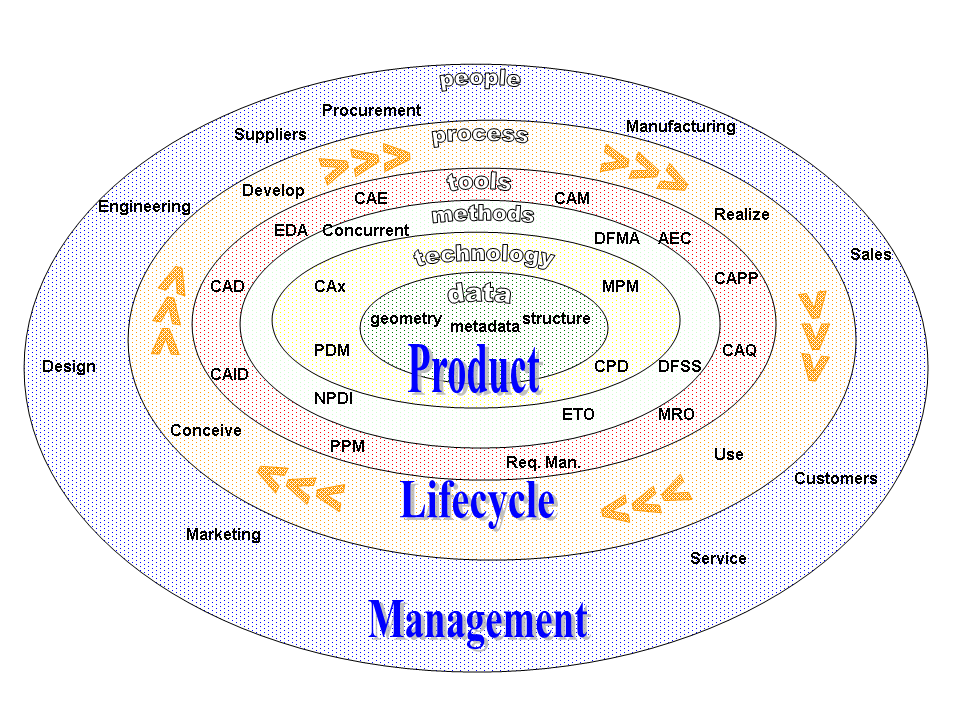
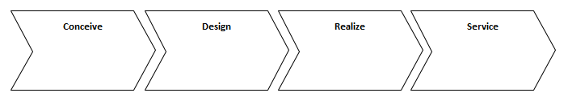
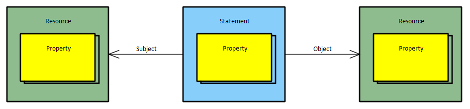
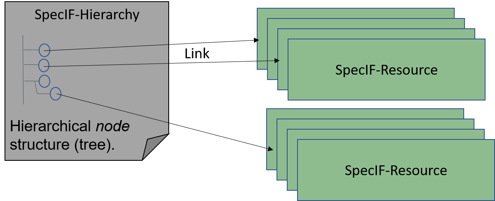
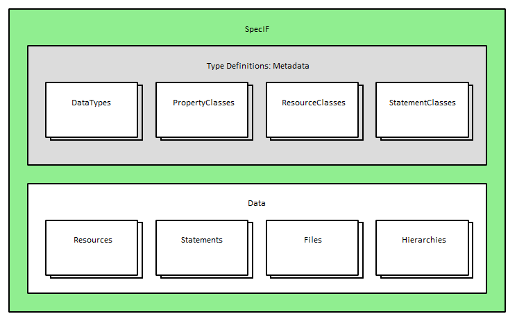
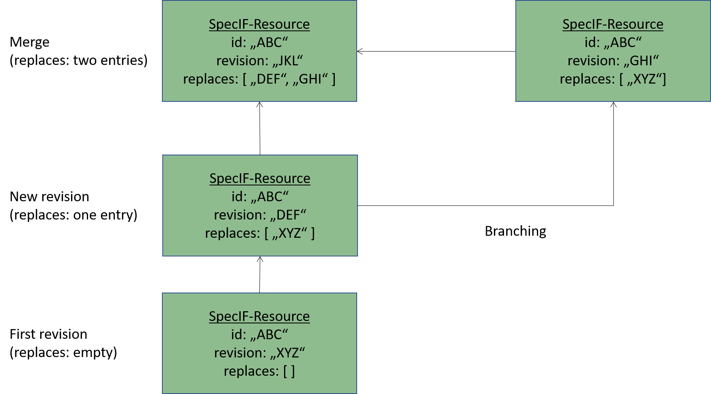

# Concepts

## Product Lifecycle Management

The Specification Integration Facility addresses the problem domain of product lifecycle management (PLM). PLM is used to manage all processes, information and data that will be created in an entire product life cycle. From the first product idea until end-of-life of the product.

There are four phases defined to structure the [PLM](https://en.wikipedia.org/wiki/Product_lifecycle):

1. Concept phase (Conceive - Imagine, specify, plan and innovate)
2. Design phase (Design - Describe, define, develop, test, analyze and validate)
3. Realization phase (Realize - Manufacture, make, build, procure, produce, sell and deliver)
4. Service phase (Service - Use, operate, maintain, support, sustain, phase-out, retire, recycle and disposal)

In all PLM phases different data is created, edited and exchanged between different stakeholders. 
SpecIF is defined as the new universal standard for representation, exchange and integration of all kinds of PLM data in all phases.     

## Data exchange and data integration in PLM

Data exchange and data integration in a product lifecycle is one of the main tasks in PLM. Nowadays many different tools are typically used to support the different phases of PLM and no common standard is available to exchange and integrate PLM data between different tools.

Some standards are available for single domains like CAD data exchange or requirements exchange. Unfortunately these standards do not cover the entire PLM and often manual work is required when exchanging data between different tools, because of some tool-specific interpretations of exchange standards.

To solve these problems, SpecIF will define a standard for data exchange and integrate PLM data of any kind. To achieve this goal SpecIF defines a syntax for a data format and the semantics, describing how specific PLM data shall be expressed using the SpecIF syntax. 
Therefore, SpecIF defines

1. A *syntax* for data representation (data format(s)).
2. A definition of (data) type names and their meanings (*semantics*) - sometimes also called *Vocabulary*.
3. Different *application guides*, that describe how to map specific PLM data to SpecIF.
4. A definition of a *Web API* that is able to provide and consume SpecIF data - helpful for data integration scenarios using web technologies.    

## Application scenarios

SpecIF can be used in at least two different application scenarios.

### Data exchange
It can be used as data exchange format, to exchange PLM data between different tools used in the product life cycle. 

A typical example is the discipline of requirements engineering: A requirements engineer wants to provide a specification to a supplier or a customer for review. With SpecIF the requirements engineer can export the specification contents to a SpecIF file and send it to the stakeholder. The stakeholder can then open or import the SpecIF data with his own SpecIF-supporting tools, make some additions or comments and send the result back to the requirements engineer. Because of the clear defined syntax and semantics of SpecIF, no manual work for data mapping or data integration is necessary.

### SpecIF as tool back-end for PLM tools
The second application scenario is the usage of SpecIF as direct back-end for PLM tools. SpecIF provides all necessary capabilites (syntax, semantics and the Web API definition) to use it as a tool data back-end. 
The typical Create, Read, Update and Delete operations (CRUD) 
[[WikipediaCRUD](https://en.wikipedia.org/wiki/Create,_read,_update_and_delete)] 
are supported which are required for any kind of PLM tool.

Furthermore SpecIF implements the concept of separation of model and view (see section *View concept*) as used in many PLM tools like UML-based modeling platforms or requirements engineering tools.  

## Reuse of existing concepts and standards

SpecIF does not want to reinvent the wheel again.
Instead, SpecIF reuses concepts and terms of existing and established standards as often as possible.

SpecIF uses selected concepts and terms defined by the following standards:

* The [Dublincore Metadata Initiative](https://www.dublincore.org/) (Dublin Core)
* The [Requirements Interchange Format](https://www.omg.org/spec/ReqIF/1.2/PDF) (ReqIF)
* The [International Requirements Engineering Board](https://www.ireb.org/en/) (IREB)
* The [Fundamental Modeling Concepts](http://www.fmc-modeling.org/) (FMC)
* The [Unified Modeling Language](https://www.uml.org/) (UML) and their dialects (e.g. SysML)
* The [Business Process Model and Notation](http://www.bpmn.org/) (BPMN)

For SpecIF data syntax representation and definition the following existing standards are used:

* JavaScript Object Notation (JSON) and the JSON-Schema for data format specification
* XHTML to represent formatted text
* SVG to represent vector graphic data (used for diagram data exchange)
* Swagger resp. OpenAPI for definition of the SpecIF-WebAPI
* The Meta Object Facility (MOF) meta-modeling and the Model-Driven Architecture (MDA) approaches defined by the [Object Management Group (OMG)](https://www.omg.org)

## SpecIF data is graph data

All data represented with SpecIF is graph data consisting of nodes and edges. The nodes are called *Resources* in SpecIF terminology, the edges are called *Statements*.

Resources and Statements can have a list of defined *Properties*. Each property is a key/value pair storing a data value.

A statement is not saved grouped with the resource data. Instead, it has two references using unique identifiers (GUIDs) to define the two connected resources. Each resource element has its own unique identifier. 

In a SpecIF statement the resource element where the statement starts is named as the statement *subject* and the resource element where the statement ends is named as the statement *object*.

Statements itself can also be subject and/or object of another statement. Therefore, it is possible to create n-ary statements in SpecIF.

## View concept

SpecIF supports the concept of separation of model and view. 
The model is the collection of existing SpecIF-Resource elements. 
The view is a tree data structure called *hierarchy* where a selection of the SpecIF-Resource elements are shown in a hierarchical order. 
The elements of a hierarchy structure in SpecIF are called *nodes*.

It is not required, that all available resources are part of a hierarchy structure. 
Each node in a hierarchy tree defines a reference to a specific resource element. 
The resources are linked by the nodes using the resource unique identifier. 
It is possible to reference the same resource element in multiple hierarchy structures. 
This allows reuse of existing data without copying the data. 

The following figure illustrates the concept: 

The hierarchy consists of a tree of nodes and each node links to a specific resource element. Typical application scenarios are a document view for a requirement document using hierarchy to provide a chapter and section structure. Another scenario is the representation of a model tree in a UML-tool consisting of UML-packages, UML-diagrams and UML-elements.

## Data and Metadata - Classes and Data Types

SpecIF allows not just the representation of PLM data, but also provides mechanisms to define 
how the data is structured and how resources and statements are created to represent a 
specific kind of data. Each SpecIF resource and statement is defined with SpecIF itself. 
This principle is called meta-modeling in the domain of object-oriented data modeling and 
is also known in the object-oriented software design called the principle of class and object or class and instance.

For each SpecIF data element a defining class element must exist. The SpecIF terms for the data and meta data types (classes) are:

* A *property class* element defines a property type.
* A *resource class* element defines a resource type.
* A *statement class* element defines a statement type.
* A *data type* element defines the data types used in the property type definitions (property classes).

## Inheritance

SpecIF implements the concept of inheritance - well known from object-oriented software development. It is possible to define a new resource- or statement-class based on an already defined element. The new element (child element) inherits all properties from the element it is derived from (parent element). It is possible to define additional properties on the child element. SpecIF uses the term *extends* to store a reference to the parent element from the child element.

The concept of inheritance in SpecIF is very helpful, when a specific application scenario requires special, additional domain-specific properties. The SpecIF user can define the new classes based on standardized types. A tool, that does not know the application-specific properties, but the standardized base-types, can handle the data as any other standard data with extensions.  

## Data formats

SpecIF data is represented in specific data formats following conventions defined by this specification. The following sections describe these concepts.

### JSON

SpecIF data uses the [JavaScript Object Notation (JSON)](https://www.json.org/json-en.html) to represent its data. 
JSON is a widely used format to represent object oriented data structures. 
It supports the data representation of data objects including arrays.

JSON is selected as data format for SpecIF, because it offers

* very good tool support on all platforms,
* a high level of familiarity,
* a more compact data representation in comparison to XML,
* a superior and easy-to-use support for schema definition and schema validation,
* the possibility to use it as file-based or Web API based format in the same way.

### JSON Schema

JSON can represent any kind of object-oriented data object. 
To define the syntax of SpecIF, [JSONSchema](https://json-schema.org/) is used. 
JSON Schema was introduced to define data formats expressed with JSON.  
JSON Schema itself uses a special kind of JSON format to define any JSON format such as SpecIF.

### File extensions

SpecIF data can be persisted to a JSON file using one of the following methods:

* The SpecIF file gets the file extension *.specif* and contains the JSON serialization of the SpecIF data.
* SpecIF also supports the inclusion of any other files (e.g. images, PDF documents etc.) referenced by a SpecIF content. These attached files are stored together with the .specif file inside a ZIP-archive with the file extension *.specifz*. One or more \*.specif file are contained at root level of the zipped archive and the referenced files are often collected in a folder; sometimes named *files_and_images*.

The following table shows an overview about SpecIF file extensions:

| File extension | Meaning |
|-|-|
| .specif.json or .specif | SpecIF file with JSON content defined by the SpecIF-JSON-Schema.|
| .specif.xml or .specifx | Reserved for future use to store SpecIF data saved as XML.|
| .specif.zip or .specifz | SpecIF zipped archive with at least one \*.specif (or \*.specifx) file at root level and the referenced files, often in a folder *files_and_images*.|
| .specif.html | HTML with embedded SpecIF data. |

### XML representation

SpecIF v1.1 does not define a XML resp. RDF representation. Nevertheless, it may be provided in future releases.

### SpecIF diagram interchange

A diagram is a graphical representation of graph-based data. 
Examples for such diagrams are electrical schematics, UML, SysML or FMC diagrams or any other diagrams 
showing graph data consisting of nodes and edges. 
In SpecIF the data behind the graph nodes are the Resources and the data behind the edges are the Statements.

The simplest way to include graphical diagrams in SpecIF-data is the usage of graphics in 
existing formats (e.g. PNG, GIF, TIFF etc.) and include them into a XHTML property as simple image. 

To semantically integrate diagram data in SpecIF, the Scalable Vector Graphics (SVG) standard 
is used (https://www.w3.org/TR/SVG2/). 
SVG is an XML-standard, defined by the W3C, used to define scalable 2D vector graphics. 
The standard defines a wide range of possibilities to define vector-based graphics. 
SVG files can be opened and viewed with all modern web browsers and SVG allows the inclusion of 
meta-data extensions into the SVG file. 

This is the main reason why SVG is selected as standard for SpecIF diagram exchange, because SpecIF uses SVG and extends the graphical data by meta information for semantic diagram exchange. 
The resulting SpecIF-compliant SVG contains the graphical information, that can be used with all SVG viewers, but it also contains some semantic meta-information that allows traceability to SpecIF resources and statements, visualized in the SVG.

The concrete definition of the SpecIF-SVG-metadata is defined in a separate chapter of this specification.

## Web API

Besides the possibility to store SpecIF data in a file, the data may be persisted using other physical storage options like SQL- and NoSQL-databases. 
To provide a common access point for all SpecIF data a Web API definition is part of SpecIF. 
The Web API definition uses Swagger/OpenAPI technologies to define endpoints and data models to create, read, update and delete (CRUD operations) SpecIF data.

## Multilingualism

In the product lifecycle projects and products with international development teams, 
international markets and customers must often be addressed. 
Therefore SpecIF supports data representation in different languages in parallel.
This multilingualism of SpecIF is of course optional. 

For this purpose all property values of type *xs:string* are a list with the object specifying the text itself, 
it's language and it's format. Any user or hosting system may select the language to show.

The preferred language may be specified at project, resource, statement or property level. A more granular
definition supersedes a more general one. If no preferred language is specified, 'en' is assumed.

## Versioning

SpecIF supports versioning for all kinds of SpecIF data like data types and class definitions as well as resource and statement data. It is not required to store SpecIF files in a separate version control system (e.g. Git or SVN), because SpecIF includes versioning concepts and each element has revision information.

If a change for a SpecIF element is initiated and the used tool supports the versioning concept of SpecIF, the chosen element is not changed. Instead a copy of the chosen element is created and then the change is applied to this copy. The copy element is saved as a revision with the same element ID, but a different revision ID. The new element revision must include a reference to the revision ID of the original element.

This leads to the following SpecIF-versioning rules:

* Multiple revisions of a SpecIF element have the same element ID, but each revision must have a different unique *revision ID*.
* Each SpecIF element shall have zero, one or two entries with a revision ID in the JSON-property *replaces*.
* If an element has no replaces entry, it is the first revision.
* If an element has one replaces entry, it is the successor of the revision given in the replaces entry.
* If an element has two replaces entries, it is the merge result of the two elements given in the replaces entry.

The figure above shows an example of the different versioning and revision scenarios in SpecIF using an example of a resource element. The resource element has the ID "ABC". Each revision of this resource has the same ID but different revision IDs and replaces references. 

With this concept is it is possible to support the concepts of linear revisioning, branching, and merging. 
A typical application scenario is a data export of PLM data from a source data provider, parallel changes from multiple stakeholders and the reintegration of the data into the source data provider.

## Semantics

To avoid mapping data manually when exporting and importing data in different tools, 
the SpecIF standard defines standardized naming (*title*) for data representations and their meaning (semantics).
Most names come from the Dublin Core Metadata Initiative.

One example: The Dublin Core Metadata Initiative has defined the term *dcterms:title* to represent any kind of a name. 
Therefore, in SpecIF a propertyClass named *dcterms:title* is used to assert an element's title. 

In every application domain all properties containing a name use the term *dcterms:title* as key for this property. 
It is used in a requirement to represent the requirement title just as in a SpecIF-UML-mapping to represent the name of a class or any other UML model element and so on.

Using a standardized SpecIF definition of such terms in different PLM application domains makes it possible to exchange data between all tools supporting the SpecIF standard 
without the effort of manual mapping data types and property types when exporting or importing data to or from SpecIF. 

## Semantic model-data integration using the Fundamental Modeling Concepts

Few methods span all required aspects of a complex system. 
In large organizations, business process management, IT architecture management and requirement management, all being
recognized fields of specialization and expertise, use different methods and tools. 
The fact is equally apparent in mechatronic system development, where mechanical, electrical and
software engineers are designing a common system with their respective methods. 
Design alternatives should be discussed and evaluated in a common effort of all disciplines. 
But how to document the results? An overarching modeling approach is needed: Different models must be semantically integrated.

It is no viable approach to ask all stakeholders to use the same method or even the same tool. 
Our approach keeps the proven methods and tools for the different disciplines: A team may choose the most beneficial method and tool – without compromise.
Added value is created by setting the results of ‚any’ modeling effort into a common context. 
So far disparate models shall be semantically integrated in certain aspects of interest. 
Specific model elements are mapped to abstract ones in the integration model. 
By exploring the results in a common context it is possible to get insight into mutual dependencies and to uncover inconsistencies.

Imagine the results of different modeling techniques can be assessed side-by-side in a common context. 
Which elements are conceptually the same and are comparable, therefore? 
How to identify the same entities in different model views?
A variety of graphical notations and model element types is used in different methods.
There are many conceptual similarities, though. 

Based on the approach of the [Fundamental Modeling Concepts](http://www.fmc-modeling.org/) (FMC), developed by Prof. Siegfried Wendt and his team in the 1970s, and considering widely used 
model elements in system specifications, the following abstract model element types (ObjectTypes) are proposed for SpecIF to realize the semantic integration:

- A ▣ *Diagram* is a model diagram with a specific communication purpose, e.g. a business process, a system composition or a schematic drawing.
- An ■ *Actor* is a fundamental model element type representing an active entity, be it an activity, a process step, a function, a system component or a user role.
- A ● *State* is a fundamental model element type representing a passive entity, be it a value, an information store, even a color or shape.
- An ⬧ *Event* is a fundamental model element type representing a time reference, a change in condition/value or more generally a synchronization primitive.
- A ✶ *Feature* is an intentional distinguishing characteristic of a system, often a so-called ‘Unique Selling Proposition’.
- A ↯ *Requirement* is a singular documented physical and functional need that a particular design, product or process must be able to perform. 
- A ⬚ *Collection* is a logical (often conceptual) group of elements or other collections. Examples for collections are groups in BPMN or boundaries on use case diagrams in UML/SysML.
- A 🖿 *Package* is used to organize elements hierarchically to achieve an easy navigation in big models or element collections. Examples for packages are the packages in UML/SysML models or folders in a file system etc.

With these few fundamental elements, model integration can be done with SpecIF.
Each individual element of a specific tool or specific modeling language is mapped to these fundamental element types.
This creates a semantic integration layer for any kind of engineering model data, because all elements are mapped to this common base.

The SpecIF user or a SpecIF tool can always use or display at least this abstract semantic data representation with well defined semantics, 
to get a basic understanding of the model data, represented by SpecIF.

A description how to apply the fundamental elements for model integration is given in more detail in the chapter *Introduction to SpecIF Model Integration*.

## Model Integration Guides

Through the definition of data format (syntax), term definitions (semantics) and fundamental elements to represent engineering models (semantic integration) a big step forward is achieved in comparison with other PLM data formats. Using these definitions, a tool vendor also knows how to map more complex data structures to SpecIF.

For example an UML- or SysML-model has several options of representation in the syntax and semantics of SpecIF. 
To develop a common understanding and to achieve a data exchange between tools, the SpecIF standard shall define model integration guidelines describing the different scenarios 
how tool content has to be mapped to and from SpecIF. 
This is the purpose of the SpecIF model integration guides.

## Versioning of this specification

This specification document consists of different parts. 
Together they describe all concepts behind SpecIF. 

Some parts of SpecIF have their own version numbers/revisions to allow for independent development steps.

This specification describes the release of SpecIF 1.1, which is the first official release of SpecIF.
It is not called 1.0, because the development of the different parts of SpecIF took some time and parts where presented earlier as version 1.0. 
To avoid misunderstandings and confusion, the first official release is called SpecIF 1.1!

This release of *SpecIF 1.1* consists of the following parts, described in the following chapters:

| Title | Revision |
|-|-|
|SpecIF Metamodel and SpecIF JSON-schema|1.1|
|SpecIF class definitions and SpecIF Vocabulary|1.1|
|SpecIF Web API|1.1| 
