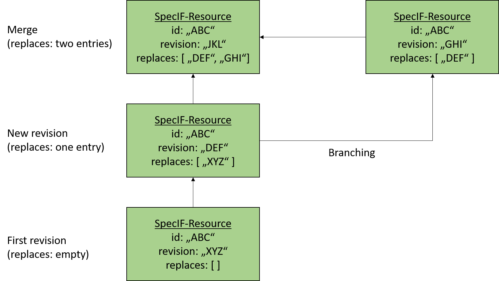

# Concepts

## Product Lifecycle Management

The Specification Integration Facility addresses the problem domain of product lifecycle management (PLM). PLM is used to manage all processes, informations and data that will created in an entire product life cycle. From the first product idea until the end-of-life of the product.

There are four phases defined to structure the PLM [[WikipediaPLM](https://en.wikipedia.org/wiki/)]:

1. Concept phase (Conceive - Imagine, specify, plan, innovate)
2. Design phase (Design - Describe, define, develop, test, analyze and validate)
3. Realization phase (Realize - Manufacture, make, build, procure, produce, sell and deliver)
4. Service phase (Service - Use, operate, maintain, support, sustain, phase-out, retire, recycle and disposal)

In all phases of the PLM different data is created edited and exchanged between different stakeholders. SpecIF is defined as new universal standard for representation and exchange of PLM data of all kind in all phases.     

## Data exchange and data integration in PLM

Data exchange and data integration in a product lifecycle is one of the main tasks in PLM. Nowadays many different tools are typically used to support the different phases of PLM and no common standard is available to exchange and integrate PLM data between different tools.

Some standards are available for single domains like CAD data exchange or requirements exchange. Unfortunately these standards are not cover the entire PLM and often a manual work is required when exchanging data between different tools, because of some tool-specific interpretations of the exchange standards.

To solve these problems, SpecIF will define a standard for data exchange and integrate PLM data of any kind. To achieve this goal SpecIF defines a syntax for a data format and also a semantics, that describes how specific PLM data shall be expressed using the SpecIF syntax. So the SpecIF defines

1. A *syntax* for the data representation (data format(s))
2. A definition of (data) type names and their meanings (*semantics*)
3. Different *application guides*, that describe how to map a specific PLM data to SpecIF
4. A definition of a *Web API* that is able to provide and consume SpecIF data - helpful for data integration scenarios using web technologies.    

## Application scenarios

SpecIF can be used in at least two different application scenarios.

### Data exchange
It can be used as data exchange format, to exchange PLM data between different tools used in the product life cycle. 

A typical example is the discipline of requirements engineering: A requirements engineer wants to provide a specification to a supplier or a customer for review. With SpecIF the requirements engineer can export the specification contents to a SpecIF file and send it to the different stakeholder. The stakeholder can then open or import the SpecIF data with his own SpecIF-supporting tools, make some additions or comments and send the result back to the requirements engineer. Because of the clear defined syntax and semantics of SpecIF, no manual work for data mapping or data integration is necessary.

### SpecIF as tool back-end for PLM tools
The second application scenario is the usage of SpecIF as direct back-end for PLM tools. SpecIF provides with syntax, semantics and the Web API definition all capabilities to use it as a tool data back-end. The typical Create, Read, Update and Delete operations (CRUD) [[WikipediaCRUD](https://en.wikipedia.org/wiki/Create,_read,_update_and_delete)] needed for any kind of PLM tool are supported. 

Furthermore SpecIF implements the concept of separation of model and view (see section *View concept*) as used in many PLM tools like UML-based modeling platforms or requirements engineering tools.  

## Reuse of existing concepts and standards

SpecIF does not want to reinvent the wheel again.
Instead of that SpecIF reuses concepts and terms of still existing and established standards as often as possible.

SpecIF uses selected concepts and terms defined by the following standards:

* The [Dublincore Metadata Initiative](https://www.dublincore.org/) (Dublin Core)
* The [Requirements Interchange Format](https://www.omg.org/spec/ReqIF/1.2/PDF) (ReqIF)
* The [International Requirements Engineering Board](https://www.ireb.org/en/) (IREB)
* The [Fundamental Modeling Concepts](http://www.fmc-modeling.org/) (FMC)
* The [Unified Modeling Language](https://www.uml.org/) (UML) and their dialects (e.g. SysML)
* The [Business Process Model and Notation](http://www.bpmn.org/) (BPMN)

For SpecIF data syntax representation and definition the following existing standards are used:

* JavaScript Object Notation (JSON) and the JSON-Schema for data format specification
* XHTML to represent formatted text
* SVG to represent vector graphic data (used for diagram data exchange)
* Swagger resp. OpenAPI for definition of the SpecIF WebAPI
* The Meta Object Facility (MOF) metamodelling and the Model-driven Architecture (MDA) approaches defined by the [Object Management Group (OMG)](https://www.omg.org)

## SpecIF data is graph data

All data represented with SpecIF is graph data consisting of nodes and edges. The nodes are called *Resources* in the SpecIF terminology, the edges are called *Statements*.

Resources and Statements can have a list of defined *Properties*. Each property is a key/value pair storing a data value.

A statement is not saved below the resource data. Instead of that it has two references using unique identifiers (GUIDs) to define the two connected resources. Each resource element has its own unique identifier. 

In a SpecIF statement the resource element where the statement starts is named as the statement *subject* and the resource element where the statement ends is named as the statement *object*.

Statements itself can also be subject and/or object of another statement. So it is possible to create n-ary statements in SpecIF.

## View concept

SpecIF supports the concept of separation of model and view. The model is the collection of existing SpecIF-Resource elements. The view is a tree data structure called *hierarchy* where a selection of the SpecIF-Resource elements are shown in a hierarchical order. The elements of a hierarchy structure in SpecIF are called *nodes*.

It is not required, that all available resources are part of a hierarchy structure. Each node in a hierarchy tree defines a reference to a specific resource element. The resources are linked by the nodes using the resource unique identifier. It is possible to reference the same resource element in multiple hierarchy structures. This allows reuse of existing data without copying the data. 

The following figure illustrates the concept: 

The hierarchy consists of a tree of nodes and each node links to a specific resource element. Typical application scenarios are a document view for a requirement document using hierarchy to provide a chapter and section structure. Another scenario is the representation of a model tree in a UML-tool consisting of UML-packages, UML-diagrams and UML-elements.

## Data and Metadata - Classes and Data types

SpecIF allows not just the representation of PLM data, but provides also mechanisms to define how the data is structured and how a resource and statement is created to represent a specific kind of data. Each SpecIF resource and statement is defined with SpecIF itself. This principle is called meta-modeling in the domain of object oriented data modeling and is also known in the object-oriented software design called the principle of class and object or class and instance.

For each SpecIF data element must exist a class element defining this data element. The terms in SpecIF for the data and meta data types (classes) are:

* A *property class* element defines a property type.
* A *resource class* element defines a resource type.
* A *statement class* element defines a statement type.
* A *data type* element defines the data types used in the property type definitions (property classes).

## Inheritance

SpecIF includes the concept of inheritance - well known from object-oriented software development. It is possible to define a new resource- or statement-class based on an already defined element. The new element (child element) inherits all properties from the element where it is derived from (parent element). It is just necessary to define additional properties on the child element. SpecIF uses the term *extends* to store a reference to the parent element from the child element.

The concept of inheritance in SpecIF is very helpful, when a specific application scenario requires special, additional domain-specific properties. The SpecIF user can define the new classes based on standardized types. A tool, that does not know the application-specific properties, but the standardizes base-types, can handle the data as any other standard data with extensions.  

## Data formats

SpecIF data is represented in specific data formats following conventions defined by this specification. The following sections describe these concepts.

### JSON

SpecIF data uses the [JavaScript Object Notation (JSON)](https://www.json.org/json-en.html) to represent its data. 
JSON is a widely used format to represent object oriented data structures. 
It supports the data representation of data objects including arrays.

JSON is selected as data format for SpecIF, because of

* a very good tool support on all platforms
* a high level of familiarity
* a more compact data representation in comparison to XML
* a superior and easy-to-use support for schema definition and schema validation
* the possibility to use it as file-based or Web API based format in the same way

### JSON Schema

JSON can represent any kind of object-oriented data object. 
To define the syntax of SpecIF, [JSONSchema](https://json-schema.org/) is used. 
JSON Schema was introduced to define data formats expressed with JSON.  
JSON Schema itself uses a special kind of JSON format to define any JSON format such as SpecIF.

### File extensions

When SpecIF data is persisted to a JSON file it can be done in two ways:

* The SpecIF file gets the file extension *.specif* and contains the JSON serialization of the SpecIF data.
* SpecIF supports also the inclusion of any other files e.g. images, PDF documents etc. referenced by a SpecIF content. These attached files are stored together with the .specif file inside a ZIP-archive with the file extension *.specifz*. One or more \*.specif file are contained at root level of the zipped archive and the referenced files are often collected in a folder; sometimes named *files_and_images*.

The following table shows an overview about the SpecIF file extensions:

| File extension | Meaning |
|-|-|
|.specif | SpecIF file with JSON content defined by the SpecIF-JSON-Schema.|
|.specifx | Reserved for future use to store SpecIF data saved as XML.|
|.specifz | SpecIF zipped archive with at least one \*.specif (or \*.specifx) file at root level and the referenced files, often in a folder *files_and_images*.|

### XML representation

SpecIF v1.0 does not define a XML resp. RDF representation. But it may be provided in future releases.

### SpecIF diagram interchange

A diagram is a graphical representation of graph-based data. 
Examples for such diagrams are electrical schematics, UML, SysML or FMC diagrams or any other diagrams showing graph data consisting of nodes and edges. 
In SpecIF the data behind the graph nodes are the Resources and the data behind the edges are the Statements.

The simplest way to include graphical diagrams in SpecIF-data is the usage of graphics in existing formates (e.g. PNG, GIF, TIFF etc.) and include them into a XHTML property as simple image. 

To semantically integrate diagram data in SpecIF, the Scalable Vector Graphics (SVG) standard is used (https://www.w3.org/TR/SVG2/). 
SVG is an XML-standard, defined by the W3C, used to define scalable 2D vector graphic diagrams. 
The standard defines a wide range of possibilities to define a vector-base graphics. 
SVG graphics can be opened and viewed with all modern web browsers and SVG allows the inclusion of  meta-data extensions into the SVG file. 

This is the main reason why SVG is selected as standard for SpecIF diagram exchange, because SpecIF uses SVG and extends the graphical data by meta information for semantic diagram exchange. 
So the resulting SpecIF-conformant SVG contains the graphical information, that can be used with each SVG viewer, but it also contains some semantic meta-information that allows the traceability 
to the SpecIF resources and statements, visualized in the SVG.

The concrete definition of this SpecIF-SVG-metadata is defined in seperate chapter of this specification.

## Web API

Besides the possibility to store SpecIf data in a file, the data may be persisted using other physical storage options like SQL- and NoSQL-data bases. 
To get a common access point for all SpecIF data a Web API definition is part of the SpecIF. 
The Web API definition uses the technologies of Swagger/OpenAPI to define endpoints and data models to create, read, update and delete (CRUD operations) SpecIF data.

## Multilingualism

In the product lifecycle often projects and products with international development teams, international markets and customers must be addressed. 
Therefore SpecIF supports the data representation in different languages in parallel.
 These multilingualism of SpecIF is defined as an option. 
It is not required to store the data always in multiple languages, but you can use it.

If the multilingualism is not used in a SpecIF data set, the used language has to be declared inside the SpecIF data. 
If no language type is given by the SpecIF data, a SpecIF user (e.g. a target tool) has to use the default language *English (UK)* - language code *en*.   

## Versioning

SpecIF supports versioning for all kind of SpecIF data like data type and class definitions as well as for the resource and statement data. It is not required to store SpecIF files in a separate version control system (e.g. Git or SVN), because SpecIF includes concepts for versioning and each element has a revision information.

When a SpecIF element is changed and the used tool supports the versioning concept of SpecIF, the modified element is not changed. Instead a copy of the element to modify is made which can be modified. This copy is then saved as further resource revision with the same element ID but a different revision ID. The new element revision has to include a reference to the revision ID of the element where it was based on.

These leads to the following rules for SpecIF-versioning:

* Multiple revisions of a SpecIF element have the same element ID, but each revision must have a different unique *revision ID*.
* Each SpecIF element shall have zero, one or two entries with a revision ID in the JSON-property *replaces*.
* If an element has no replaces entry, it is the first revision.
* If an element has one replaces entry, it is the successor of the revision given in the replaces entry.
* If an element has two replaces entries, it is the merge result of the two elements given in the replaces entry.

The figure above shows an example of the different versioning and revision scenarios in SpecIF on an example of a resource element. The resource element has the id "ABC". Each revision of this resource has the same id but different revision IDs and replaces references. 

With this concept is it is possible to support the concepts of linear revisioning, branching, and merging. 
A typical application scenario is a data export of PLM data form a source data provider, parallel changes from multiple stakeholders and the reintegration of the data in the source data provider.

## Semantics

To avoid manual work of mapping data when exporting and importing data in different tools, the SpecIF standard defines standardized naming's (*title*) for data representations and their meanings (semantics).
The most names hereby come from the Dublin Core Metadata Initiative.

One example: The Dublin Core Metadata Initiaive has defined the term *dcterms:title* to represent any kind of a name. 
So in SpecIF a propertyClass for *dcterms:title* is defined. 
These property class is then used in the class definitions for resources and statements each time a title resp. name is required for a special kind of data element.

In every application domains all properties containing a name using as key for this property the term *dcterms:title*. 
It is used in a requirement to represent the requirement title just as in a SpecIF-UML- mapping to represent the name of a class or any other UML-model element and so on.

With a standardized definition of such terms for different application domains in PLM by SpecIF it is possible to exchange data between all tools supporting the SpecIF standard 
without the effort of manual mapping data types and property types when exporting or importing data to or from SpecIF. 

## Semantic model-data integration using the Fundamental Modeling Concepts

Tbd.

## Application Guides

With the definition of the data format (syntax) and the term definitions (semantics) a big step forward is done in comparison with other PLM data formats. 
But another thing for a tool vendor is to know how to map more complex data structures to SpecIF. 

For example an UML- or SysML-model has many as aspects how it can be represented in the syntax and semantics of SpecIF. To come to a common understanding and achieve a tool-comprehensive data exchange, the SpecIF standard shall define application guidelines describing the different scenarios how tool content has to be mapped to SpecIF. This is the purpose of the SpecIF application guides.