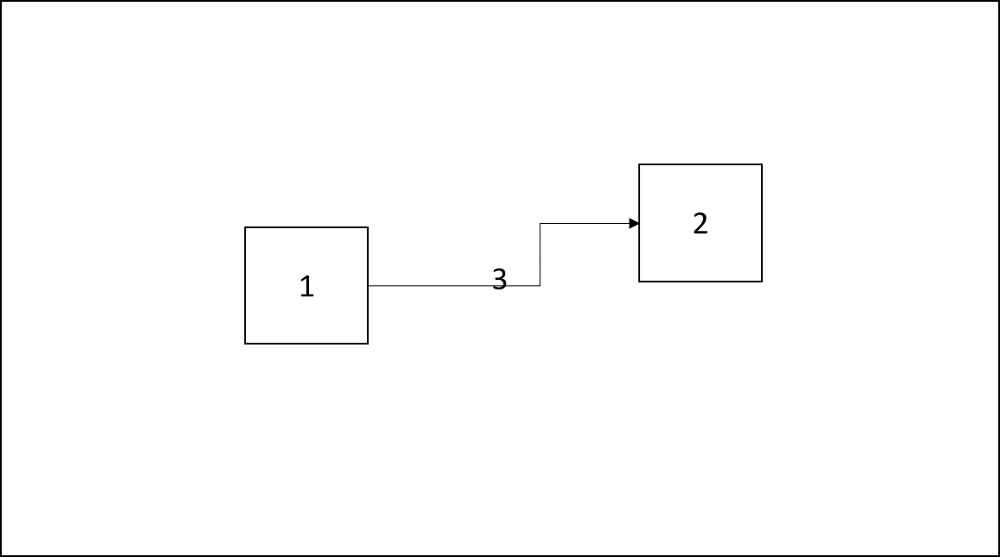

# SpecIF Diagram Exchange using SVG

Diagram exchange is an essential concept of SpecIF to achieve the goal of data interchange in the entire PLM life-cycle where different tools are used that create data
containing diagram drawings.
To achieve this the Scalable Vector Graphics format (SVG) is used to define diagram information.
SVG is a standardized format, defined by the W3C to represent (2D) graphical information as vector graphics using an XML-based format.

The SpecIF standard defines some additional XML-tags and attributes to include semantic diagram information into SVGs as SVG metadata. 
For this purpose SpecIF (re-)uses some tags defined in the OMG standard for Diagram Definition (DD) (OMG No.: formal/2015-06-01).

Therefore, the resulting SVG data consists of the graphical diagram information, represented as SVG. 
Such a SVG can be shown with all SVG viewers (e.g. a web browser), so that a user can easily view the diagram.
Beside the SVG information, some SpecIF-specific meta-information is added to the SVG data.
With this information, a semantical diagram exchange (export/import) between different modeling tools implementing SpecIF is possible.
Typical meta-information are coordinates of the diagram nodes and edges and references to the SpecIF-resources and -statements shown in the diagram.  

## XML namespaces in SVG

The concept of XML-namespaces is used to differentiate the tags defined by SpecIF, SVG and OMG Diagram Definition . 
The following namespaces are relevant for SpecIF-SVG diagram exchange, defined by SpecIF and re-used from OMG diagram interchange (di) and diagram common (dc) standards.

* ```xmlns:specif="https://specif.de/v1.1/schema-DI"```
* ```xmlns:di="http://www.omg.org/spec/DD/20100524/DI"``` - [OMG Diagram Interchange v1.0](https://www.omg.org/spec/UMLDI/1.0/PDF)
* ```xmlns:dc="http://www.omg.org/spec/DD/20100524/DC"``` - [OMG Diagram Definition v1.1](https://www.omg.org/spec/DD/1.1/PDF)

The namespaces and the used SVG version must be declared in the outermost tag (agname: *svg*) of the SVG XML-structure. 
Example:

```xml
<svg xmlns:di="http://www.omg.org/spec/DD/20100524/DI"  
     xmlns:dc="http://www.omg.org/spec/DD/20100524/DC" 
     xmlns="http://www.w3.org/2000/svg"
     xmlns:specif="https://specif.de/v1.1/schema-DI"
     version="1.1"
     ...
     >
```

The tags defined by SpecIF are defined by a XML-schema definition with the namespace URI https://specif.de/v1.1/schema-DI. 
Tags reused from the OMG diagram exchange specifications are defined in the other two namespaces.
Typically SVG 1.1 builds the standard namespace, so each XML-tag without an explicit namespace setting is a SVG-tag.
  
## Embedding SpecIF-SVG data into resource elements

A diagram is typically embedded in a resource element representing a diagram.
For this purpose, SpecIF defines the resource class *SpecIF:Diagram*. 
A resource of the class SpecIF:Diagram has a property with the property class title named *SpecIF:Diagram*.
The property value is able to store formatted XHTML-data. 

There are two possibilities to include a diagram in a SpecIF data set:

1.  Embedd the SVG or a binary graphic data format directly into the XHTML as XML resp. base64-encoded image data.
2.  Store the diagram data in a separate image file (e.g. diagram.svg) and include an image-reference (*img*-tag) to the XHTML property value.
  
Using SVG with metadata is preferred to embedded diagram information in SpecIF. 
Binary graphic formats are supported as well, but you loose the possibility to relate metadata and only graphical information is exchanged. 

## Coordinate system

The SpecIF-conform SVG files follow the definitions of the SVG and the OMG Diagram Definition standards. 
The x-axis is horizontal and its coordinate values increase to the right. Negative coordinates are allowed. 
Similarly, the y-axis is vertical and its coordinate values increase to the bottom. Negative coordinates are allowed. 

   

## SVG structure and grouping

To structure SVG data in a hierarchical way, the SVG standard defines the concept of groups. 
A group can contain further groups as child elements as well as graphical elements like circles, rectangles or lines. 

A SVG diagram that follows the SpecIF standard shall use the following structure using SVG groups:

* One SVG group represents the entire diagram as outermost element. 
* Inside, a list of child groups define the graphical elements visualizing resources and statements. 
Therefore a SVG group is defined for each resource and statement visible on the graph.



The image above shows this principle. 
The big box around is the group of the entire diagram. 
Inside we have three children in form of SVG groups for the three contained elements: Two boxes, named 1 and 2, and one connector, named 3. 

In the SVG we will always use the following group structure for SpecIF diagram interchange example. 
Inside each group graphical SVG standard elements can be included to define the diagram as a visible graphic.
Beside the graphical definitions each group should contain a set of semantic diagram exchange information, included inside the SVG *metadata* tags.  

```xml
<?xml version="1.0" encoding="utf-8"?>
<svg xmlns:di="http://www.omg.org/spec/DD/20100524/DI" 
        xmlns:specif="https://specif.de/schema/v1.0/DI" 
        xmlns:dc="http://www.omg.org/spec/DD/20100524/DC" 
        width="1322" height="1134" version="1.1" 
        xmlns="http://www.w3.org/2000/svg">
    <g class="specif-diagram">
        <metadata>
            ... <!-- metadata for semantically diagram interchange -->
        </metadata>
        <g class="specif-resource-diagram-element"  >
            <metadata>
                ... <!-- metadata for semantically diagram element interchange -->
            </metadata>
            ... <!-- SVG definition of the resource -->
        </g>
        ... <!-- more diagram elements -->
        <g class="specif-statement-diagram-element">
            <metadata>
                ... <!-- metadata for semantically diagram connector interchange -->
            </metadata>
            ...  <!-- SVG definition of the statement -->
        </g>
        ... <!-- more diagram connectors -->
    </g>
</svg>
```

The sequence of the group elements determine the drawing order. 
So the top-most element shall be defined within the last group-child. 

In this example the drawing is done in this sequence: diagram, element #1, element #2, connector #3.

## SpecIF diagram exchange metadata

To enable navigation from SVG to resource and statement data and to include some additional semantic information to SVG, 
the SpecIF standard defines tags to be included in the metadata of the SVG group elements (&lt;g&gt;)

For declaring groups representing resources, statements or the entire diagram, the ``class``-attribute of the group tag is set to the following values:

* ``specif-diagram`` for the root-group, representing the entire diagram,
* ``specif-resource-diagram-element`` for a group defining the visualization of a SpecIF resource - child of specif-diagram group,
* ``specif-statement-diagram-element`` for a group defining the visualization of a SpecIF statement - child of specif-diagram group.

### Referencing model elements
 
In the SVG-group defining the graphical representation of a resource, a tag called ``resourceDiagramElement`` is used to define a reference to the resource, the model element.
The tag has an attribute to reference the ID of the resource and an attribute to reference the revision of the resource. 
The revision reference attribute may be missing or empty. 
In that case the newest revision of the resource is referenced.
    
The tags to define a reference to a SpecIF resource or statement are called:

* ```specif:resourceReference ``` for references to resources,
* ```specif:statementReference ``` for references to statements,
* ```specif:sourceResourceReference``` for a reference to a resource used as a connector source,
* ```specif:targetResourceReference``` for a reference to a resource used as a connector target.

## The tags specif:shape and specif:edge

All elements in modeling tools are typically graph data, either a node or an edge. 
The nodes can have different kinds of shapes; the edges can have different endpoints.

To represent these elements semantically in SpecIF as SVG metadata the tags ```specif:shape``` for nodes and ```specif:edge``` for
connectors are defined. 
Inside these metadata elements, the semantic information in form of references to SpecIF data elements, graphical coordinates and drawing information is included.

### Diagram metadata

To represent the metadata for the entire diagram, the following structure is used:

```xml
<g class="specif-diagram">
       <metadata>
            <specif:shape>
                <specif:resourceReference id="_BF30DD09_E13E_451b_B210_786F93A74936"
                                          revision="87acec461201406dc2b54e25f4a1f436a6763d41" />
                <dc:Bounds x="0" y="0" width="537" height="1134" />
            </specif:shape>
        </metadata>
       ... <!-- groups specifying the elements and connectors, visible on the diagram -->
</g>
``` 

* The group is tagged with the class attribute *specif-diagram*,
* The metadata of the group contains a *specif:shape* child tag,
* Inside the shape tag a *specif:resourceReference*  points to the SpecIF data element, that represents the diagram,
* The diagram coordinates, width and height are expressed using a *dc:Bounds*-tag.

### Element metadata

To represent the metadata for a diagram element (node), the following structure is used:

```xml
<g class="specif-resource-diagram-element">
    <metadata>
        <specif:shape>
            <specif:resourceReference id="_65624FBC_FE08_4dad_971E_5D26EF996570" 
                                      revision="5d3656420cdeb3e4a88dd9927236dbdc23a9b946" />
            <dc:Bounds x="100" y="210" width="100" height="80" />
        </specif:shape>
    </metadata>
    ... <!-- graphical SVG data -->
</g>
```

* The group defining the element is tagged with the class attribute *specif-resource-diagram-element*,
* The metadata of the group contains a *specif:shape* child tag,
* Inside the shape tag a *specif:resourceReference*  points to the SpecIF data element, that represents the resource visualized on the diagram,
* The element coordinates, width and height are expressed using a *dc:Bounds*-tag.

### Connector metadata

To represent the metadata for a diagram connector (edge), the following structure is used:

For a statement the following metadata structure is used, defining a SpecIF-specific tag called ``statementDiagramElement``:

```xml
<g class="specif-statement-diagram-element">
    <metadata>
        <specif:edge direction="unidirectional"
                     layoutStyle="rounded">
            <specif:statementReferences>
                <specif:statementReference id="_AE57392_ABD3_451b_B210_786F93A74936"
                                           revision="87acec461201406dc2b54e25f4a1f436a6763d41">
                <specif:resourceReference id="_BF30DD09_E13E_451b_B210_786F93A74936"
                                          revision="87acec461201406dc2b54e25f4a1f436a6763d41" />
            </specif:statementReferences>

            <specif:sourceResourceReference id="_E64C5208_A8DF_45a5_B022_85C853722664" 
                                            revision="5d3656420cdeb3e4a88dd9927236dbdc23a9b946" />
            <specif:targetResourceReference id="_3EFC0279_A6F2_48c8_9F48_13C05288DBA6" 
                                            revision="b6d540498c1d3720addf7714545543b3835cfc96" />
            <di:waypoints>
                <di:Waypoint x="238" y="105" />
                <di:Waypoint x="407" y="105" />
            </di:waypoints>
        </specif:edge>
    </metadata>
    ... <!-- graphical SVG data -->
</g>
```

* The group defining the connection is tagged with the class attribute *specif-statement-diagram-element*,
* The metadata of the group contains a *specif:edge* child tag.
* Inside the edge tag the following child tags can be present:
  * A *specif:statementReferences*-tag containing a set of *statementReference*- and/or *resourceReference*-tags. A connector on a diagram can represent, in some special cases, more than on SpecIF data element, so it is possible to define a set of references here.
  * A *specif:sourceResourceReference*-tag referencing the connector source SpecIF resource data element.
  * A *specif:targetResourceReference*-tag referencing the connector target SpecIF resource data element.
  * A diagram interchange waypoint collection to define the graphical coordinates of the visualized connector. It contains always at least the start and end coordinates and optional some supporting points in between.

The *specif:edge*-tag can have two optional attributes: ```direction``` and ```layoutStyle```.

The attribute *direction* defines the connector direction. Allowed values are:

*  ```unidirectional``` - The connector is directed from source to target.
*  ```bidirectional``` - The connector is bi-directional.
*  If the attribute is missing (not set), the connector has no direction.

The attribute *layoutStyle* specifies the layout style of the connector. Allowed values are:

* ``bezier`` The connector is drawn as a Bezier curve,
* ``rounded`` The corners of the connector in the waypoints in between start and end are connected rounded,
* If the attribute is missing (not set), the connector is drawn as a path of direct lines using the coordinates defined by the waypoint tags. 

