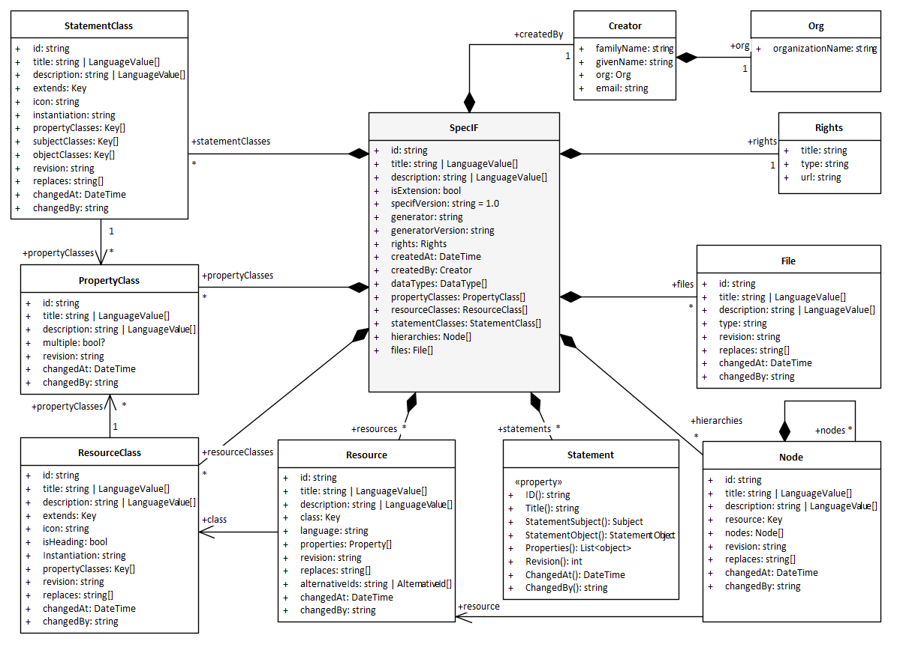
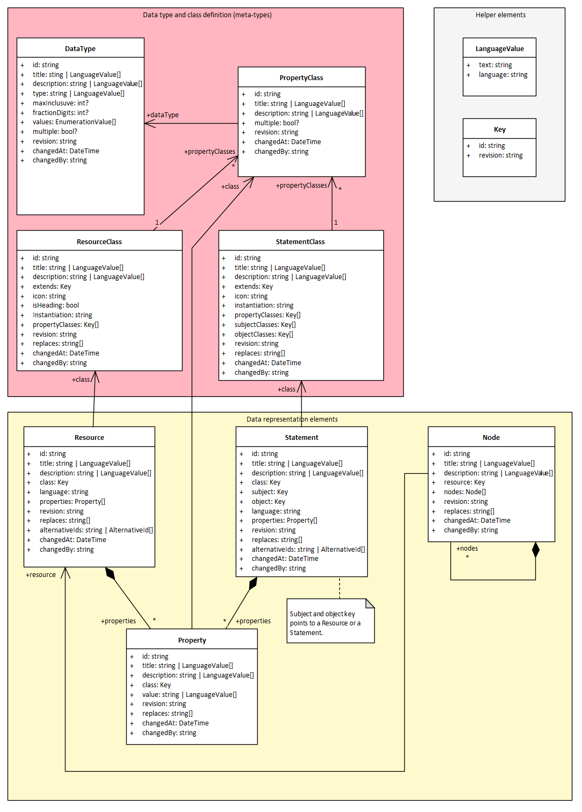

# SpecIF JSON Schema

The SpecIF JSON Schema describes the syntax of SpecIF data. The Schema follows the JSON Schema standard http://json-schema.org/draft-04/schema#.

It is available in the SpecIF GitHub repository under https://github.com/GfSE/SpecIF/blob/master/schema/specif.schema.json.

## SpecIF Schema Overview
   
The following figure shows the base structure of the SpecIF data format as an UML class diagram.


A SpecIF data set contains some descriptional elements and arrays to store the SpecIF data type definitions and data itself. It is possible to include all necessary information a tool needs to work with SpecIF data into one data set.

Each SpecIF element has a unique identifier (GUID) with the JSON-property name *id*. To support the versioning in SpecIF each element type in a SpecIF data set can have a revision identifier. Also these revision hes to be unique inside the same element id, to ensure that no version conflicts occur.

If a tool does not support versioning, the *changedAt* attribute can be used to create a revision hierarchy.  

## SpecIF projects
The SpecIF class is the outermost element of the SpecIF JSON representation. It defines attributes to describe the entire SpecIF data set represented in a SpecIF file or a SpecIF Web API. In a Web API context a SpecIF instance is often used to define a project context. A SpecIF data set can contain the entire content of PLM data created in a project context. 

SpecIF allows the selected and distributed inclusion of data into a SpecIF data set. So you can have also a set of SpecIF files containing the data and class definitions and a second, separated set containing the data content, but referencing the required data types. A SpecIF instance has an attribute called *isExtension* of type boolean. If this value is set to true, a tool that is working with this data, needs further SpecIF data to get the complete definition all required data types and (meta-)classes.
   
### SpecIF JSON example

The following example shows an empty SpecIF JSON-object to demonstrate the principle of data representation within SpecIF using JSON. Not all JSON-properties are set, but the SpecIF schema defines just a selection as mandatory:

```json
{
    "id": "_3555D75E_0344_4BDF_B127_2340C7F2BF9A",
    "title": "Empty SpecIF file",
    "isExtension": false,
    "specifVersion": "1.0",
    "dataTypes": [],
    "resourceClasses": [],
    "statementClasses": [],
    "resources": [],
    "statements": [],
    "hierarchies": [],
    "files": []
}
```

## Definition elements and data elements

The figure below shows the SpecIF elements to define the data types (DataType, PropertyClass, ResourceClass and StatementClass) and the elements containing the PLM data values (Resources, Statements, Properties, Hierarchies). The last-mentioned elements are instances of the class elements and the object-class relation is expressed in SpecIF using the *class* JSON-property.

 

A reference to a SpecIF element is always expressed using the *Key* -helper-element. It contains the *id* and the *revision*-ID of the element to reference.

The data and class definition in SpecIF is a cascading data structure: At first a data type is defined out of a set of primitive data types. The list below shows the available primitive data types based on the data types defined in XML-schemas (XSD):

* *xs:string* - a text string
* *xs:boolean* - a boolean value
* *xs:integer* - a number value
* *xs:double* - a floating point number
* *xs:enumeration* - an enumeration of values (list selection)
* *xs:dateTime* - a date value
* *xhtml* - XHTML formated content

Based on these primitive data types, a SpecIF user can define *DataType* elements. These data types can be used as base for *PropertyClass*-definitions. The property class definitions can then be used to define *ResourceClass*- and *StatementClass*-definitions. Using this approach all kind of data representation can be defined in SpecIF.

The resources, statement, properties and hierarchies do instantiate the class definitions. A SpecIF-tool can automatically generate a property editor for a resource or statement element, because all necessary information is available in the class and data type definition elements. 

## Definition elements

### Data types

SpecIF data types define the data types used in a property to store a PLM data value. All data types are defined out of the primitive data types listed above. All data types excepting the enumerations are defined in a very similar way. 

The JOSN-snippet below shows some data type definitions for non-enumeration types:

```json 
{
    "id": "DT-Boolean",
    "title": "Boolean",
    "description": [],
    "revision": "1",
    "replaces": [],
    "type": "xs:boolean",
    "changedAt": "2016-05-26T08:59:00+02:00"
},
{
    "id": "DT-Byte",
    "title": "Byte",
    "description": [],
    "revision": "1",
    "replaces": [],
    "type": "xs:integer",
    "minInclusive": 0,
    "maxInclusive": 255,
    "changedAt": "2016-05-26T08:59:00+02:00"
},
{
    "id": "DT-Integer",
    "title": "Integer",
    "description": [],
    "revision": "1",
    "replaces": [],
    "type": "xs:integer",
    "minInclusive": -32768,
    "maxInclusive": 32767,
    "changedAt": "2016-05-26T08:59:00+02:00"
},
{
    "id": "DT-Real",
    "title": "Real",
    "description": [],
    "revision": "1",
    "replaces": [],
    "type": "xs:double",
    "fractionDigits": 5,
    "minInclusive": -10000,
    "maxInclusive": 10000,
    "changedAt": "2016-05-26T08:59:00+02:00"
},
{
    "id": "DT-FormattedText",
    "title": "Formatted Text",
    "description": [],
    "revision": "1",
    "replaces": [],
    "type": "xhtml",
    "changedAt": "2016-05-26T08:59:00+02:00"
}
```

#### Enumeration definitions

The definition of an enumeration data type is a little bit different. Here it is necessary to define a list of available values for the enumeration  type. SpecIF supports enumeration with multiple selection, so more than one value of an enumeration can be selected in a SpecIF-property. This is expressed by setting the JOSN-attribute *multiple*. If it is set to *true*, multiple selection is allowed.

The following data type definitions show an example for an enumeration data type definition with SpecIF:

```json
{
    "id": "DT-Status",
    "title": "SpecIF:Status",
    "description": "Enumerated values for status",
    "revision": "1",
    "replaces": [],
    "type": "xs:enumeration",
    "values": [
    {
        "id": "V-Status-0",
        "title": "00_deprecated"
    },
    {
        "id": "V-Status-1",
        "title": "01_rejected"
    },
    {
        "id": "V-Status-2",
        "title": "10_initial"
    },
    {
        "id": "V-Status-3",
        "title": "20_drafted"
    },
    {
        "id": "V-Status-4",
        "title": "30_submitted"
    },
    {
        "id": "V-Status-5",
        "title": "40_approved"
    },
    {
        "id": "V-Status-6",
        "title": "60_completed"
    },
    {
        "id": "V-Status-7",
        "title": "80_released"
    }
    ],
    "multiple": false,
    "changedAt": "2016-05-26T08:59:00+02:00"
}
```

### Property classes
   
Property classes define the type and kind of a property. The property is the element in specif containing the values of the PLM data. Resource and Statement elements contain a array of defined property instances to store the PLM values.

The property class definitions are very important, because here the name reps. title of a property is defined. Properties are in principle key/value pairs representing data. The *title* JSON-property of the property class defines the key.

The SpecIF standard also contains a standardized set of data type and class definitions. The properties are one integral part of a standardized vocabulary for the SpecIF data format (syntax) and the standardization allows the data exchange between different tools without manual data mapping. 

An example of property class definitions is given below:
```json
{
    "id": "PC-Name",
    "title": "dcterms:title",
    "description": "<p>A name given to the resource. <small>(<i>source: <a href=\"http://dublincore.org/documents/dcmi-terms/\">DCMI</a></i>)</small></p><p>Title (reference: Dublin Core) of the resource represented as rich text in XHTML content. SHOULD include only content that is valid inside an XHTML &lt;span&gt; element. <small>(<i>source: <a href=\"http://open-services.net/\">OSLC</a></i>)</small></p>",
    "revision": "1",
    "replaces": [],
    "dataType": {
    "id": "DT-ShortString",
    "revision": "1"
    },
    "changedAt": "2016-05-26T08:59:00+02:00"
},
{
    "id": "PC-Description",
    "title": "dcterms:description",
    "description": "<p>An account of the resource. <small>(<i>source: <a href=\"http://dublincore.org/documents/dcmi-terms/\">DCMI</a></i>)</small></p><p>Descriptive text (reference: Dublin Core) about resource represented as rich text in XHTML content. SHOULD include only content that is valid and suitable inside an XHTML &lt;div&gt; element. <small>(<i>source: <a href=\"http://open-services.net/\">OSLC</a></i>)</small></p>",
    "revision": "1",
    "replaces": [],
    "dataType": {
    "id": "DT-FormattedText",
    "revision": "1"
    },
    "changedAt": "2016-05-26T08:59:00+02:00"
}
```

In the example you can see that as tile for the property with the ID *PC-Name* the term *dcterms:title* is used. So this property class defines a property where the name of an PLM data element can be stored.

### Resource Classes
   
Resource classes define the resource types used to store PLM data. A resource class contains similar to a property class a definition for a title value, defining the syntax. Also it defines a list of key elements pointing to the property classes to define which properties are available to store data values in a resource based on that resource class (JSON-property *propertyClasses*).

An example resource class definition is shown below. The example shows the resource class defining the data structure to store a requirement element following the IREB recommendation.

```json
{
    "id": "RC-Requirement",
    "title": "IREB:Requirement",
    "description": "A 'Requirement' is a singular documented physical and functional need that a particular design, product or process must be able to perform.",
    "revision": "1",
    "replaces": [],
    "icon": "&#8623;",
    "isHeading": false,
    "instantiation": [
    "user"
    ],
    "propertyClasses": [
    {
        "id": "PC-VisibleId",
        "revision": "1"
    },
    {
        "id": "PC-Name",
        "revision": "1"
    },
    {
        "id": "PC-Description",
        "revision": "1"
    },
    {
        "id": "PC-Status",
        "revision": "1"
    },
    {
        "id": "PC-Priority",
        "revision": "1"
    },
    {
        "id": "PC-Perspective",
        "revision": "1"
    },
    {
        "id": "PC-Discipline",
        "revision": "1"
    },
    {
        "id": "PC-Type",
        "revision": "1"
    }
    ],
    "changedAt": "2016-05-26T08:59:00+02:00"
}
```
### Statement Classes
   
Statement classes define the statements (links between SpecIF data elements like resources or statements). Statements starting at a subject data element and end on an object data element. It is possible to restrict the subjects and objects where a statement can be used by defining entries in the *subjectClasses*  and *objectClasses* JSON-properties of the statement class definition. If there is no entries, any element can be used as the statement subject or object.

The following example of a statement class definition defines a statement that can be used between requirement resource elements. It defines the *IREB:refines* relationship. Also known as *deriveReqt* dependency in SysML:
```json
{
    "id": "SC-refines",
    "title": "IREB:refines",
    "description": "The subject requirement refines the object requirement.",
    "revision": "1",
    "replaces": [],
    "instantiation": [
    "user"
    ],
    "subjectClasses": [
    {
        "id": "RC-Requirement",
        "revision": "1"
    }
    ],
    "objectClasses": [
    {
        "id": "RC-Requirement",
        "revision": "1"
    }
    ],
    "changedAt": "2016-05-26T08:59:00+02:00"
}
``` 
## Data elements

The SpecIF data elements resource and statement represent concrete PLM data. All data elements shall have a reference to the definition class element (resource class or statement class) using the *class* JSON-property element. 

SpecIF-properties defined for a resource or statement are stored inside a resource or statement element containing the data value of the represented PLM data. 

### Resources

Resources are the nodes in a SpecIF data set graph. The contain the concrete data values. All elements, that are no relations resp. connectors between elements are represented as resources in SpecIF.

The following example shows a resource representing a requirement element:

```json
{
    "id": "_73392B3D_CF8F_4ac0_BC77_E6A2C9415EF4",
    "revision": "F16C40BE-DFC4-46BB-85C4-FDF9433F8E73",
    "replaces": [],
    "title": "Login",
    "class": {
        "id": "RC-Requirement",
        "revision": "1"
    },
    "description": [],
    "properties": [
        {
            "id": "_73392B3D_CF8F_4ac0_BC77_E6A2C9415EF4_NAME",
            "revision": "F16C40BE-DFC4-46BB-85C4-FDF9433F8E73",
            "replaces": [],
            "title": "dcterms:title",
            "value": "Login",
            "description": [],
            "class": {
                "id": "PC-Name",
                "revision": "1"
            },
            "changedAt": "2019-03-07T11:16:21",
            "changedBy": "oa"
        },
        {
            "id": "_73392B3D_CF8F_4ac0_BC77_E6A2C9415EF4_NOTES",
            "revision": "F16C40BE-DFC4-46BB-85C4-FDF9433F8E73",
            "replaces": [],
            "title": "dcterms:description",
            "value": "The system shall provide the user with the ability to login.",
            "description": [],
            "class": {
                "id": "PC-Description",
                "revision": "1"
            },
            "changedAt": "2019-03-07T11:16:21",
            "changedBy": "oa"
        },
        {
            "id": "_73392B3D_CF8F_4ac0_BC77_E6A2C9415EF4_STATUS",
            "revision": "1",
            "replaces": [],
            "title": "SpecIF:Status",
            "value": "V-Status-5",
            "description": [],
            "class": {
                "id": "PC-Status",
                "revision": "1"
            },
            "changedAt": "2019-03-07T11:16:21",
            "changedBy": "oa"
        }
    ],
    "changedAt": "2019-03-07T11:16:21",
    "changedBy": "oa"
}
```

### Statements

Statements are used in SpecIF to define relationships between concrete SpecIF data elements. Normally they express relationships between two resource elements. In some special cases they can also express relationships between two statements or a resource and a statement. This depends on, what the key given for *subject* and *object* references.

Statements can also have a list of properties to store additional data.

The following example shows a statement example. This statement has no properties defined.

```json
{
    "id": "_2186cb8d_390f_427c_9df3_a9756763b6ed",
    "revision": "820BFEE3-5808-4395-A0C2-F11E27FAFE59",
    "replaces": [],
    "title": "SpecIF:contains",
    "description": [],
    "class": {
        "id": "SC-contains",
        "revision": "1"
    },
    "subject": {
        "id": "_7BBB98BF_6966_46cd_A2B4_677B15CEC761",
        "revision": "2B750A3F-23B5-4ACB-9D70-FB09D9C2604F"
    },
    "object": {
        "id": "_73392B3D_CF8F_4ac0_BC77_E6A2C9415EF4",
        "revision": "E6F0C4F3-6939-4A82-B4D9-2E48B702B8A6"
    },
    "properties": [],
    "changedAt": "2019-05-31T15:13:54.0813277+02:00",
    "changedBy": "oa"
}
``` 

## Hierarchies and Nodes

The *hierarchies* array in the SpecIF data set contains a collection of *node*-SpecIF-elements. With a node-element it is possible to create a hierarchical view to a selected set of resource elements. The *Node* is defined as a recursive data structure. Each node includes a reference to a selected resource (JSON-property *resource*) and the node can contain a collection of child nodes in the JSON-property *nodes*. This allows to use the node to define a hierarchical view to SpecIF resource elements. 

A typical application scenario is the representation of a chapter structure from a textual requirements specification. 

The following example shows the application of nodes to create a hierarchy:
```json
"hierarchies": [
    {
      "id": "_16d04111_9db8_4e4c_8223_7ebd6ec2abac",
      "revision": "60BF9E2F-D684-481B-B7A3-4C401DBE7762",
      "replaces": [],
      "title": [],
      "description": "Requirement specification",
      "resource": {
        "id": "_5D647B1D_D622_4a45_90EB_5FC6ECCD405C",
        "revision": "F583802E-FE82-4D10-BCBF-1B387C04A84C"
      },
      "nodes": [
        {
          "id": "_5a48b367_c1c1_4184_8931_e5bb794d3fd5",
          "revision": "F583802E-FE82-4D10-BCBF-1B387C04A84C",
          "replaces": [],
          "title": [],
          "description": "Element: Introduction",
          "resource": {
            "id": "_7BBB98BF_6966_46cd_A2B4_677B15CEC761",
            "revision": "0D737A07-8DFE-4502-958A-04BBF1B0B16F"
          },
          "nodes": [
            {
              "id": "_81b06448_c844_4452_a3ef_8a2171c597c1",
              "revision": "00875EE1-7491-4AD9-92D1-27B377FCFDCD",
              "replaces": [],
              "title": [],
              "description": "Element: Login",
              "resource": {
                "id": "_73392B3D_CF8F_4ac0_BC77_E6A2C9415EF4",
                "revision": "F16C40BE-DFC4-46BB-85C4-FDF9433F8E73"
              },
              "nodes": [],
              "changedAt": "2019-05-31T15:13:54.0813277+02:00"
            }
          ],
          "changedAt": "2019-05-31T15:13:54.0303315+02:00"
        }
      ],
      "changedAt": "2019-05-31T15:13:53.8253311+02:00"
    }
  ]
}
``` 