# SpecIF Metamodel

This section describes the SpecIF metamodel used to define the SpecIF syntax.

The description by a metamodel is done in a technology independent way following the OMG [Meta Object Facility (MOF) Metamodeling](https://www.omg.org/mof/) technology 
and the OMG [Model Driven Architecture (MDA)](https://www.omg.org/mda/) approach. 
The metamodel defines a platform-independent model (PIM).

The MOF metamodeling approach is a simplified form of UML class modeling to define data structures (terms, attributes and associations) for data models.
From such a platform-independent metamodel, different concrete data representations - platform-specific models (PSM) - can be derived. 
This can for example be a SpecIF representation using JSON, XML or a SQL database schema and so on. 

You will find the realization as JSON schema, used for file- and Web API-representations in the next chapters of this specification.

Further platform-specific models for SpecIF (e.g. XML) are not yet defined and are not part of this release version of the SpecIF-specification, but may be developed and released in future releases of SpecIF.

## SpecIF Repositories

The following figure shows the entry point to the SpecIF metamodel. The attributes of the classes are hidden for better readability and will be discussed in the sections below.

The SpecIF class is the outermost element of a SpecIF data representation. 
We can call it a repository or data set.
It defines the entire SpecIF data set represented in platform-specific implementation by a SpecIF file or a SpecIF persistence layer like a database or data provided by a Web API. 
Such a SpecIF repository instance is often identical with a project context in a development project. 
It can contain the entire content of PLM data created in a project context. 

SpecIF allows the selected and distributed inclusion of data into a SpecIF repository. 
It is not required to have all data, that can be stored in a SpecIF data set, in a single repository.  
Therefore, you can have one SpecIF repository containing the data and class definitions, and a second, separated set containing the data content, but referencing the required data types by the unique identifiers. 
A SpecIF instance has a boolean attribute called *isExtension*. 
If this value is set to true, a tool, that is working with this data, needs further SpecIF data to get the complete definition of all required data types and data type definitions.

### SpecIF-Repository description attributes

To express additional information about the SpecIF repository resp. the project data represented by SpecIF, the metamodel defines some attributes for describing the SpecIF metaclass.

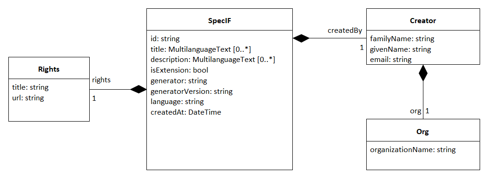

#### SpecIF

The SpecIF metaclass has the following attributes:

- *id: string* -  A unique identifier for the SpecIF repository resp. the project represented by the SpecIF repository/file.
- *title: MultilanguageText[]* - A human readable description for the entire SpecIF repository/project.
- *description: MultilanguageText[]* - A human readable description for documentation purposes.
- *isExtension: bool* - Indicates that the project is not schema-compliant on its own; by default the value is 'false'. Of course, it is expected that once extended the project is schema-compliant.
- *generator: string* - The generator that generates the SpecIF data.
- *generatorVersion: string* - The SpecIF generator tool version.
- *language: string* - An IETF language tag such as 'en', 'en-US, 'fr' or 'de' showing the used language of simple property values. 
Is superseded by a resource's, statement's or property's language value.
- *createdAt: DateTime* - The creation date.
- *createdBy: Creator* - The creator of the SpecIF data set. If specified, at least an e-mail address must be given.
- *rights: Rights* - Copyright and/or license information.

#### Creator

The *Creator* metaclass defines information about the SpecIF data creator.

 It has the following attributes:

* *familiyName: string* - The creator's family name.
* *givenName: string* - The creator's given name.
* *email: string* - The creator's e-mail.
* *org: Org* - The creator's organization.

#### Org

The *Org* metaclass describes the SpecIF creator's organization and has the following attribute:

* *organizationName: string* - The organization name.

#### Rights

The *Rights* metaclass defines a data structure to represent copyright and/or license information about the SpecIF data.
It has the following attributes:

* *title: string* - A title for the copyright/license information (e.g. 'Apache license v2').
* *url: string* - A valid uniform resource locator to further copyright/license information.

## Data representation and data type definitions in SpecIF

In SpecIF it is possible to define concrete data using the concept of graph data, represented by the metaclasses *Resource* (as graph nodes) and *Statement* (as graph edges).
These two elements can contain *Property* elements to store a set of data elements (e.g. a title and a description).
A property has a well defined (primitive) data type (e.g. string, integer etc.). 
This allows a tool to present, edit and validate property data using specialized editors for numbers, 
text or formatted text.

The elements containing the data need a specification about data structure and data types. 
This is done in SpecIF by defining a set of classifiers for the concrete data. 
These classifiers define for example what kind of properties are included in a resource element called 'Requirement'. 

The SpecIF-Metamodel defines a set of classes that are responsible for these data type definitions:

*  The *ResourceClass* defines the type of a *Resource*.
*  The *StatementClass* defines the type of a *Statement*.
*  The *PropertyClass* defines the type of a *Property*.  
*  The *DataType* defines the primitive data types (Integer, String, Double, Boolean, DateTime, Enumerations) used as data types for property definitions. 
The type string can represent formatted text or unformatted text.

## Metamodel helper classes

The SpecIF metamodel defines three helper classes. 
They are described in this section.

### Base Element

Some attributes in the metamodel are common for multiple metaclasses. 
We define this in an abstract metaclass *BaseElement*.

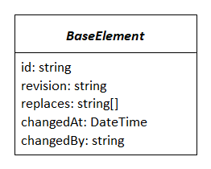

* *id: string* - A unique identifier for the SpecIF element.
* *revision: string* - A unique identifier for the revision of the SpecIF element.
* *replaces: string[]* - The revision IDs of the SpecIF elements replaced by this element revision. 
This array has a maximum length of 2 entries and can contain 0 entries (no predecessor), 1 entry (1 predecessor) or 2 entries (this element is merged from 2 predecessors).
* *changedAt: DateTime* - The date and time when the element was changed.
* *changedBy: string* - The change author.

The following metaclasses are inherited from BaseElement:

* DataType,
* PropertyClass,
* ResourceClass,
* StatementClass,
* Resource,
* Statement,
* Node,
* File.

Remark: The attributes of the base metaclass BaseElement are not set for each child class any more!

### MultilanguageText

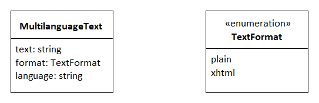

To realize the concept of data storage in multiple languages, SpecIF defines a metaclass called *MultilanguageText*.

This class defines three attributes:

* *text: string* - This attribute contains the data content in a certain language.
* *format: TextFormat* - An enumeration value describing the text format. Allowed values are *plain* for plain text or *xhtml* for formatted content.
* *language: string* - An IETF language tag such as 'en', 'en-US, 'fr' or 'de' showing the used language.

Typically an array of these MultilanguageText objects is used to represent a value in multiple languages.
Each single array value contains the same text content but in a specific language (english, german, etc.).

### EnumeratedValue

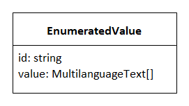

To define enumerations in SpecIF the metaclass *EnumerationValue* is used to define the values for enumerations in data types. 
In SpecIF different data types can be defined as enumerations by defining a set of predefined values. 
This is done using the EnumeratedValue class. 

This class defines two attributes:

* *id: string* - An identifier for the enumeration value. 
This ID must be unique within the collection of enumeration values for an enumeration data type definition.
* *value: MultilanguageText[]* - The enumeration value definition in multiple languages.

### AlternativeId

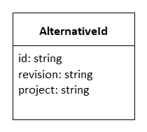

*AlternativeId* data values are used to further define identifier values in addition to the *id* attribute in SpecIF. 
This is helpful for data integrations where multiple tools use their own internal identifiers. 
So you can represent these 'legacy' IDs in SpecIF.
AlternativeId has the following attributes:

* *id: string* - A string with a valid identifier of an element.
* *revision: string* - A unique revision identifier.
* *project: string* - A string with a valid project identifier.

## SpecIF-Metamodel details

The figure below shows the metamodel with properties and associations between elements to represent data representation, data type definitions
and hierarchical structures. 

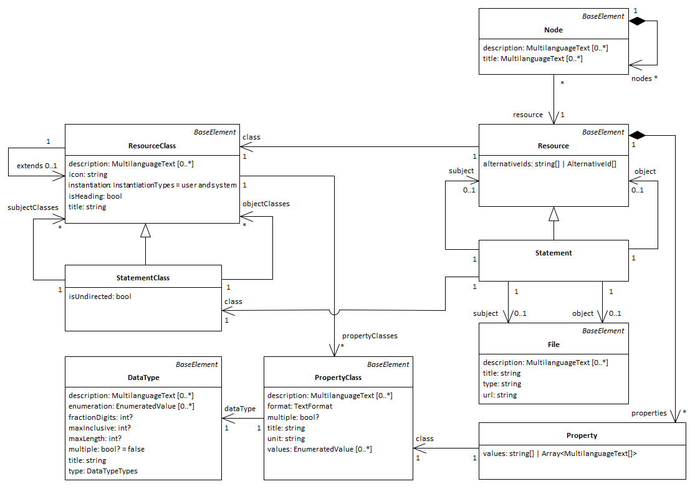

On the right you can see the classes defining the data structures for concrete data elements like *Resource*, *Statement*, *Property*, *Hierarchy* and *Node*.
On the left you can see the data type defining elements like *ResourceClass*, *StatementClass*, *PropertyClass* and *DataType*.

In the following sections the semantics of all elements is described in detail.

### DataType

A *DataType* is used to define the base data types (primitive data types) on which all other type definitions are based. 
SpecIF allows the definition of primitive data types for numbers, formated or unformatted text strings, DateTime values and enumerations.
So the DataType metaclass defines the following attributes to satisfy these requirements:

* *title: string* - A unique name for the defined data type (e.g. 'string').
* *description: MultilanguageText[]* - A human readable description of the data type for documentation purposes.
* *type* - A formal definition of the used base type. The allowed types are taken from the XML-stylesheet-standard (https://www.w3.org/TR/xmlschema11-1/) and defined in the metamodel as Enumeration *DataTypeTypes* as follows:
  * xs:boolean,
  * xs:integer,
  * xs:double,
  * xs:string,
  * xs:anyURI,
  * xs:dateTime,
  * xs:duration.
* *maxInclusive* - The maximum value for a numeric data type.
* *fractionDigits* - The number of digits for floating point numbers.
* *enumeration* - A list of enumerated values.
* *multiple: bool* - This flag indicates for enumeration definitions, that a multiple selection of enumeration values should be possible.
* *maxLength: int* - The maximum length of a text value.

It is possible to restrict the possible values for a data type. 
Enumerated data types can be defined and used in this manner.
The allowed values are defined by the attribute *enumeration* using a list of *EnumeratedValue* elements.

Because of the fact, that different data types are allowed for an enumeration definition, it is possible to define for example a set of strings as enumeration or a set of numbers etc.
This might be helpful for example to define a data type for story points used in agile project management, often defined as Fibonacci numbers.

### PropertyClass

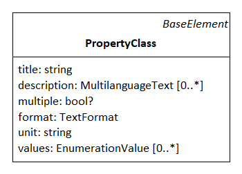

A *PropertyClass* defines the type of a SpecIF property. 
Properties are used to define data of resource and statement elements.
The *PropertyClass* has the following attributes:

*  *title: string* - A unique name for the defined PropertyClass (e.g. 'dcterms:title').
*  *description: MultilanguageText[]* - A human readable description of the data type for documentation purposes.
*  *multiple: bool* - This flag indicates that the property value can hold multiple values (multiple enumeration values or an array of primitive data).
*  *dataType* - This association references the used *DataType* for the ProperyClass.

### ResourceClass

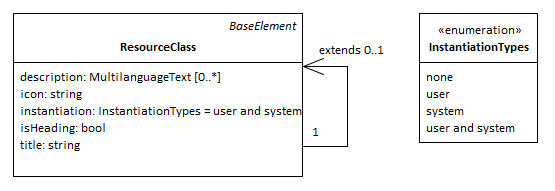

A *ResourceClass* is used to define the type of a resource element. 
In SpecIF the concept of inheritance is supported for data type definition. 
The resource class has an attribute *extends*, where it can extend other existant resource class elements. 
It is possible to add new properties and reuse the existing ones from the base elements - as known from inheritance concepts in object oriented data modeling and programming.

The *ResourceClass* has the following attributes:

* *title: string* - A unique name for the defined ResourceClass (e.g. 'IREB:Requirement').
* *description: MultilanguageText[]* - A human readable description of the data type for documentation purposes.
* *icon: string* - An icon definition usable by authoring tools for resources. This can be a language code of a unicode symbol or a base64 encoded image.
* *isHeading: bool* - Indicates that the defined resource is a heading.
* *instantiation: InstantiationTypes* - Values: 'user' and/or 'system'. Indicates whether an instance of the class is created automatically, manually or both. All is allowed by default. The class is abstract and cannot be instantiated, if the value is set to 'none'.
* *extends* - Reference to a parent resource class element when inheritance is used in the data definition. 
* *propertyClasses* - A list of property class references to define which properties shall be used for the defined resource type. 
 
### StatementClass

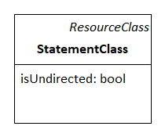

A *StatementClass* inherits the ResourceClass and defines the data type definition of a SpecIF statement. 
Statements are the edges in a SpecIF graph data structure. 
A statement has two ends called *subject* and *object*.  
The StatementClass allows the definition of possible resource types for the subject an object elements of the statement. 
This is done by referencing the allowed subject ResourceClass elements and object ResourceClass elements.

The StatementClass has the following attributes:

* *isUndirected: bool* - This flag indicates that a statement defined by this statement class has no direction. It can be used and navigated in both directions.
* *subjectClasses* - A collection of references to ResourceClass elements to define the allowed types for the statement subject.
* *objectClasses* - A collection of references to ResourceClass elements to define the allowed types for the statement object. 

### Property

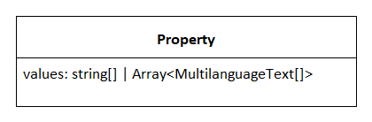

A *Property* is an instance of a PropertyClass and is used to store a concrete data value in SpecIF.
Each property in SpecIF is defined as an array of values. 
The attribute *isMultiple* in the PropertyClass specifies if a property value is an array or a single value.

If isMultiple is set to false and the property attribute values contains more than one value, only the first value shall be used and all other array elements shall be ignored!

Depending on the DataType, that is used as definition of the PropertyClass, each value of the array is either a MultilanguegeText for plain or xtml-textual content 
or a string for all other contents (e.g. numbers, enumerations etc.).
For enumerations the ID of the EnumerationValue is stored as property value.

A property has the following attributes:

* *values* - The values of the property to store the property content data (multiple or single values).
* *class* - A reference to the PropertyClass element defining the property type.

### Resource

A *Resource* is an instance of a PropertyClass and the element in SpecIF that represents a node in the graph data structure. 
Resources represent all kind of concrete data in PLM. 
This might be a requirement, a model element in UML or SysML or an electrical circuit in an E-CAD model etc.

A resource has the following attributes:

* *alternativeIds* - Alternative ID values are used to define further ID values in addition to the *id* attribute in SpecIF. This is helpful for data integrations where multiple tools have their own internal IDs. 
So you can represent these 'legacy' IDs in SpecIF.
* *class* - A reference to the ResourceClass element defining the resource type.
* *properties* - A collection of property elements to store property data for the resource.

### Statement

A *Statement* is an instance of a StatementClass and the element in SpecIf that defines the edge in the graph data structure.
Statements allow to define predicate logic in form of *Subject - Predicate - Object*. 
The subject and the object are resources, statements of file elements, the predicate is always a statement.

A statement is inherited from a resource and has the following additional attributes:

* *subject* - A reference to the resource, statement or file that is used as subject for the statement.
* *object* - A reference to the resource, statement or file that is used as object for the statement.

### Node

The metaclass *Node* allows to define hierarchical data structures (trees) in SpecIF.
Typical application scenarios are hierarchical structures in textual specifications like documents and the structures in CAD and other modeling tools.

The data is not directly included inside node elements. 
Instead, the resources of a node are just included via reference. 
This allows a separation of data model and view (view concept as known e.g. from UML-tools) and the inclusion of the same resource elements into multiple hierarchy trees.

The node element have the following attributes:

* *title: MultilanguageText[]* - A title for the node. Mostly used for internal purposes, because the title normally comes from the referenced resource element properties.
* *description: MultilanguageText[]* - A human readable description for documentation purposes. Mostly used for internal purposes, because the description normally comes from the referenced resource element properties.
* *nodes* - A collection of child node elements for the node.
* *resource* - A reference to the resource element used as Node tree node data.

### File

The last remaining element to describe is the *File* metaclass. 
SpecIF allows the inclusion of any kind of file into the repository.
This allows for example to add files as attachments to a SpecIF specification etc.
The File element allows to describe and reference files contained in a SpecIF repository.  

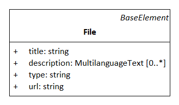

The metaclass *File* has the following attributes:

* *title: string* - In case of a file, the title is the absolute or relative URL.
* *description: MultilanguageText[]* - A human readable description for documentation purposes.
* *type: string* - The file's media type (formerly MIME-type) according to https://www.iana.org/assignments/media-types/media-types.xhtml. 
* *url: string* - An absolute or relative URL to the file. If missing, the title applies.
