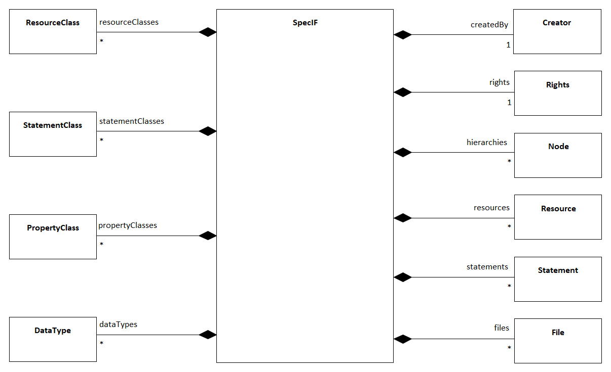
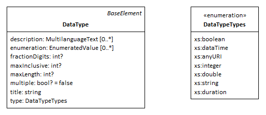
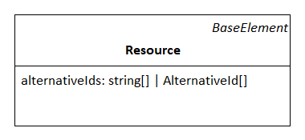
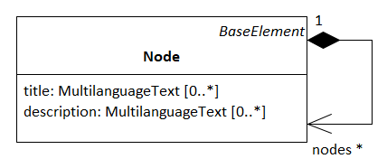

# SpecIF-Metamodel

This section describes the SpecIF-Metamodel.
The describtion by a Metamodel is done in a technology independent way using the OMG MOF Metamodeling approach - often called platform-independent model.
MOF is a simplified form of UML class modeling.
From such a platform-independent metamodel, different concrete data representations - platform-dependent models - can be derived. This can be for example JSON, XML or a SQL data base schema. 

You will find the realization as JSON schema in the next chapter of this specification.

## SpecIF Repositories

The following figure shows the entry point to the SpecIF-Metamodel. The attributes of the classes are hidden for better readability and will be discussed in the sections below.

The SpecIF class is the outermost element of a SpecIF data representation. 
We can call it a repository.
It defines the entire SpecIF data set represented in a SpecIF file or a SpecIF persistance layer like a data base or data provided by a WebAPI. 
Such a SpecIF repository instance is often used to define a project context in a development project. 
It can contain the entire content of PLM data created in a project context. 

SpecIF allows the selected and distributed inclusion of data into a SpecIF repository. 
It is not required to have all data possible sub-types included in your repository. 
These subtypes are the objects defined in the class diagram using the composition connections. 
So you can have one SpecIF repository containing the data and class definitions, and a second, separated set containing the data content, but referencing the required data types. 
A SpecIF instance has an attribute called *isExtension* of type boolean. 
If this value is set to true, a tool that is working with this data, needs further SpecIF data to get the complete definition of all required data types and data type definitions.

The classes *Creator* and *Org* (Organization) are used to describe the SpecIF-repository resp. the SpecIF project itself by describing the author and the organization that is responsible for 
creation of the SpecIF repository.

## Data and data type definitions

In SpecIF it is possible to define concrete data using the concept of graph data, represented by the classes *Resource* - as graph nodes and *Statement* - as graph edges.
These two elements can contain properties to store a set of data elements (e.g a title and a description).
A property has a well defined (primitive) data type (e.g. string, integer etc.). This allows a tool to present, edit and validate property data using specialized editors for numbers, text or formated text.

The elements containing the data need a specification about the data structure and the data types. 
This is done in SpecIF by defining a set of classifiers for the concrete data. 
These classifiers define for example what kind of properties are included in a Resource element called 'Requirement'. 

The SpecIF-Metamodel defines a set of classes that are responsible for these data type definitions:

*  The *ResourceClass* defines the type of Resources.
*  The *StatementClass* defines the type of Statements.
*  The *PropertyClass* defines the type of Properies.  
*  The *DataType* defines primitive data types (Integer, String, Double, Boolean, DateTime) used as data types for property definitions. The type strig can contain formatted text or unformated text.

## Hierarchies

The metacalss *Hierarchy* defines a hierarchical structure to represent Resources as a tree. 
Hieraries are trees of so called *Nodes*. 
Each Node does not contain the Resource data but holds a reference to a Resource element. 
This allows that the same Resource can be contained in multiple Hierarchies. 
So a Hierarchy is a tree structure view on Resources.
Typical application scenarios of hierarchies are document structures in requirement specifications or the package/diagram/element-structure of a UML or SysML model.

## Files

The last remaining element to describe a the top level structure is the *File*. 
SpecIF allows the inclusion of any kind of file into the repository.
This allows for example to add files as attachments to a SpecIF specification etc.
The File-element allows to describe and reference files contained in a SpecIF repository.   

## Detailed SpecIF Metamodel

The figure below shows the metamodel with properties and connections between the elements to represent data, data type definitions
and hierarchical structures. 

On the right you can see the classes defining the data structures for concrete data elements like Resource, Statement, Propery, Hierarchy and Node.
On the left you can see the data type defining elements like ResourceClass, StatementClass, PropertyClass and DataType.

In the following sections the semantics of all elements is described in detail.

### BaseElement

Some attributes in the metamodel are common for at least all metaclasses. 
We define this in a abstract metaclass *BaseElement*.

* *id: string* - A unique ID for the SpecIF element
* *revision: string* - A unique ID for the revision of the SpecIF element 
* *replaces: string[]* - The revision IDs of the SpecIF elements replaced by this element revision. 
This array can contain 0 entries (no predecessor), 1 entry (1 predecessor) or 2 entries (this element is merged from 2 predecessors).
* *changedAt: DateTime* - The date and time where the element was changed.
* *changedBy: string* - The change author.

The following metaclasses are inherited from BaseElement:

* DataType
* PropertyClass
* ResourceClass
* StatementClass
* Resource
* Statement
* Node
* Property

Remark: The attributes of the base metaclass BaseElement are not described for each child class any more!

### LanguageValue

To support the possibilitiy to store data in multiple languages, SpecIF defines a metaclass called *LanguageValue*.

This class defines an attribute *text: string* to take the data content in a certain language and a second attribute to specify
the kind of used language (e.g. *en*, *de* etc.).

### DataType

A *DataType* is used to define the base data types (promitive data types) where all other type definitions are based on. 
SpecIF allows the definition of primitive data types for numbers, formated or unformated text strings, DateTime values and Enumerations.
So the DataType metaclass defines the following attributes to stisfy these requirements:

* *title: string* - A unique name for the defined data type (e.g. 'string')
* *description: string | LanguageValue[]* - A human readable description of the data type for documentation purposes.
* *type* - A formal definition of the used base type. The allowed types are:
  * string
  * integer
  * double
  * DateTime
  * Enumeration
* *maxInclusive* - The maximum value for a numeric data type
* *fractionDigits* - The number of digits for floating point numbers
* *values* - A list of enumeration values
* *multiple: bool* - This flag indicates for enumeration definitions, that a multiple selection of enumeration values should be possible.

### PropertyClass

A *PropertyClass* defines the type of a SpecIF Property. 
Properties are used to define data of Resource and Statement elements.
The PropertyClass has the following attributes:

*  *title: string* - A unique name for the defined PropertyClass (e.g. 'dcterms:title')
*  *description: string | LanguageValue[]* - A human readable description of the data type for documentation purposes.
*  *multiple: bool* - This flag indicates for the Property, that the property value can hold multiple values (muliple enumeration values or an array of primitive data).
*  *dataType* - This association references the used *DataType* for the ProperyClass.

### ResourceClass

A *ResourceClass* is used to define the type of a Resource element. 
In SpecIF the concept of inheritance is supported for data type definition. 
So the Resource class has an attribute *extends* where it can extend other existant ResourceClass elements. 
It is possible to add new properties and reuse the existing ones from the base elements - as known from inheritance concepts in object oriented data modeling and programming.

The ResourceClass has the following attributes:

* *title: string* - A unique name for the defined ResourceClass (e.g. 'IREB:Requirement')
* *description: string | LanguageValue[]* - A human readable description of the data type for documentation purposes.
* *icon: string* - A icon definition usable by authoring tools for the Resources. This can be a language code of a unicode symbol or a base64 encoded image.
* *isHeading: bool* - Indicates, that the defined resource is a heading.
* *instantiation* - Values: 'user' or 'system'. Tbd.
* *extends* - Reference to a parent ResourceClass element when inheriatnce is used in the data definition. 
* *propertyClasses* - A list of PropertyClass references to define which Properties shall be used for the defined Resource type. 
 
### StatementClass

A *StatementClass* inherits the ResourceClass and defines the data type definition of a SpecIF statement. 
Statements are the edeges in a SpecIF graph data structure. 
A Statement has two ends called *subject* and *object*.  
The StatementClass allows the definition of possible Resource types for the subject an object elements of the Statement. 
This is done by referencing the allowed subject ResourceClass elements and object ResourceClass element.

The StatementClass has the following attributes:

* *subjectClasses* - A collection of references to ResourceClass elements to define the allowed types for the Statement subject.
* *objectClasses* - A collection of references to ResourceClass elements to define the allowed types for the Statement object. 

### Property

A *Property* is an instance of a PropertyClass and is used to store a concrete data value in SpecIF.
SpecIF allows, that a property value can be a simple string value, a collection of LanguageValue elements for multi-language data or an array of values. 
Arrays can be a collection of simple string values or a collection of LanguagValue elements.

A Property has the following attributes:

* *value* - The value of the property to store the property data.
* *class* - A reference to the PropertyClass element defining the Property type.

### Resource

A *Resource* is an instance of a PropertyClass and the elemnt in SpecIF that represents a node in the graph data structure. 
Resources represent all kind of concrete data in PLM. 
This might be a Requirement, a model element in UML or SysML or an electrical circuit in an E-CAD model etc.

A Resource has the following attributes:

* *language* - This attribute is used to specify the used language in the Property values when no LanguageValue elements are used, but just simple strings. 
This enables a tool to display the correct language settings (e.g spell checking etc.) for simple string values.
* *alternativeIds* - Alternative ID values are used to define further ID values in addition to the *id* attribute in SpecIF. This is helpful for data integrations where multiple tools have their own internal ids. So you can represent these 'legacy' IDs in SpecIF.
* *class* - A reference to the ResourceClass element defining the Resource type.
* *properties* - A collection of Property elements to store property data for the Resource.

### Statement

A *Statement* is an instance of a StatementClass and the element in SpecIf that defines the edge in the graph data structure.
Statements allow to define predicate logic in form of *Subject - Predicate - Object*. 
The subject and the object are Resources or Statements, the Predicate is always a Statement.

A Statement is inherited from Resource and has the following additional attributes:

* *subject* - A reference to the Resource or Statement that is used as subject for the Statement.
* *object* - A reference to the Resource or Statement that is used as object for the Statement.

### Hierarchy and Node

The metaclasses *Hierarchy* and *Node* allow it to define hierarchical data structures (trees) in SpecIF.
Typlical application scenarios are hierarchical structures in textual specifications like documents and the structures in CAD and other modeling tools.

The elements Hierarchy and Node are similar in some ways. 
Hierarchies are the root nodes of a SpecIF hierarchy tree, the Node elements are the tree nodes. 

The data is not directly included inside the Hierarchy and Node elements. 
Instead, the Resources of a Hierarchy are just included via reference. 
This allows a spearation of data model and view (view concept as known e.g. from UML-tools) and the inclusion of the same Resource elements into multiple Hierachies.

The Hierarchy and Node elemnt have the following attributes:

* *title: string* - A title for the Hierarchy/Node. Mostly used for internal purposes, because the title comes normally from the referenced Resource element properties.
* *description: string | LanguageValue[]* - A human readable description of the data type for documentation purposes. Mostly used for internal purposes, because the description comes normally from the referenced Resource element properies.
* *nodes* - A collection of child node elements for the Hierarchy/Node.
* *resource* - A reference to the Resource element used as Hierarchy/Node tree node data.

### File

tbd.

### Creator

tbd.

### Org

tbd.