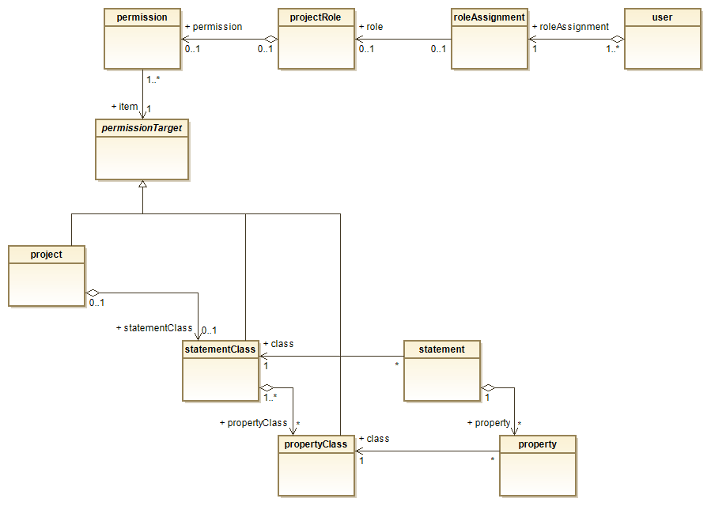
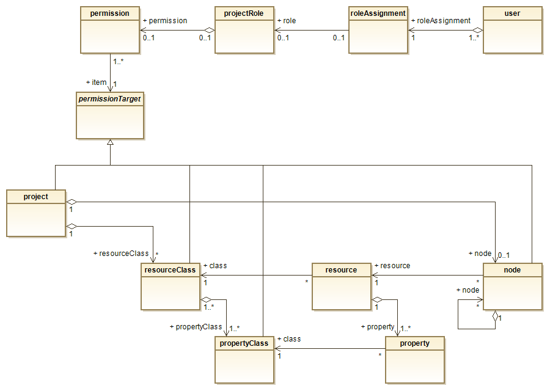

# SpecIF Roles and Permissions

.. to be completed


## Introduction

A permission controls whether a user can create, read, update or delete a resource or a statement and its properties. 
A project role combines a set of permissions to simplify the assignment of permissions to users.

Very basically, SpecIF defines two types of permissions:
- By *Class*: An instance of resource or statement can be accessed, if the most specialized class has a corresponding permission.
If no permission by class is granted at all, access is *prohibited*.
- By *Hierarchy*: An instance of resource can be accessed, if the closest node in the hierarchy has a corresponding permission.
If no permission by hierarchy is defined at all, access is *allowed* (in fact it is rather a prohibition in this case).  

Permissions are inherited:
- By Class: project → resourceClass → propertyClass or project → statementClass → propertyClass. 
A permission granted at project level is inherited by all instances; where permissions at a lower level override a permission at a higher level.
- By Hierarchy: A node inherits all permissions of the parent node, unless permissions of its own are defined.
A permission granted at project level is inherited by all instances; where permissions at a lower level override a permission at a higher level.

Thus, the permissions of an individual resource are derived from both the class tree and the hierarchy tree with its nodes.
However, the permissions of an individual statement are just derived from the class tree.

## Permission Concept

First, let's discuss how permissions work with statements, as it is somewhat simpler when compared with resources.
The class diagram shows at the top:
- None to many permissions define a projectRole. Thus, a projectRole defines a set of permissions for a given project.
- A roleAssignment connects a user to a projectRole. Upon login, none or one roleAssignment is created per project. 
In many cases this assignment is based on the user's group membership (or user role) in a user directory or it is manually administered.
- For example, a user having a projectRole named *SpecIF:Reader* may see the statements (relations), wheras
a projectRole named *SpecIF:Editor* allows to create, read, update and delete statements. 
Finer grained permissions can be granted, as we will see below.

In its lower part, the class diagram shows a permission target, which is an abstraction for project, statementClass and propertyClass.
It means that there is none or one permission for each of the permission targets. If a target does not have a permission, the 
parent's permission applies.
- A role's permission pointing to a propertyClass defines the access rights for all instances of that class, no matter which
statementClass (also resourceClass) makes use of it. Thus, multiple propertyClasses must be defined, if different permission vectors 
are needed depending on the statementClass (or resourceClass).
- A role's permission pointing to a statementClass defines the access rights for all instances of that class. The same access rights apply
to all of the instance's properties, unless overridden by a permission pointing at a propertyClass.
- A role's permission pointing to a project applies to the whole project, unless overridden at a lower level.
- For all permissions pointing at classes, the default is 'false'. If undefined at all levels, the permission is negative.



Next, let us have a look at the resources. 
- At the top, the assignment of permissions to projectRoles and users is the same as discussed before.
- The assignment of permissions to resource instances with their properties works similarly to the statements.
- However, there is another permissionTarget, namely a node in a hierarchy pointing to a resource.
- In case of resources, permissions must be granted not only by class, but also by node.
- A node has the same permission as the resource pointed at: If you can delete a resource, you can alse delete the node.
- By denying a permission to read for one branch in a hierachy and granting it to another, 
the user may see the recources only in that branch 
... provided that the resource is allowed to be read by its classes. So it is possible to limit the access rights to
a resource depending on the position of its referencing node in the hierarchy.
- To simplify the permission management, the default permission by hierarchy tree is 'true', so a permission must be
explitly denied.
- The permissions by hierarchy are also inherited from higher levels: A denial to update applied to a node also apply to all
subordinated child nodes, unless overridden.



A permission has a vector of binary attributes for basic access modes:
- C: Create
- R: Read
- U: Update
- D: Delete

### Some Examples

| Target | C | R | U | D |
|:--- |:---:|:---:|:---:|:---:|
| project | undefined | undefined | undefined | undefined |
| statementClass | undefined | undefined | undefined | undefined |
| propertyClass | undefined | undefined | undefined | undefined |

Effect: All instances of that class including their properties cannot be accessed by the user.

| Target | C | R | U | D |
|:--- |:---:|:---:|:---:|:---:|
| project | undefined | **true** | undefined | undefined |
| statementClass | undefined | undefined | undefined | undefined |
| propertyClass | undefined | undefined | undefined | undefined |

Effect: All instances of that class including their properties can just be seen by the user.

| Target | C | R | U | D |
|:--- |:---:|:---:|:---:|:---:|
| project | undefined | **true** | undefined | undefined |
| statementClass | undefined | undefined | undefined | undefined |
| propertyClass | **true** | **true** | **true** | undefined |

Effect: All instances of that class including their properties can be seen by the user. 
The particular property can be created, read and updated, but not be deleted (to be discussed, whether this makes senses in practice ...)

### Some Cases:
- Permissions per resource instance are defined both by class and by hierarchy: Access is allowed, if it is 
explicitly granted by class *and* not explicitly prohibited by hierarchy.
- If a permission is granted to a resourceClass, it is extended to all of its properties, unless overridden.
- No read permission is given to the instances of a statementClass, but update permission is given to one of its properties. 
Then, the latter is useless, because the statements are never visible and consequently none of the properties 
can ever be selected for update.


## Data Types

example: TypeScript

```typescript
/**
 * Some interface definitions for user roles and permissions.
 * New with SpecIF v1.2
 */

interface Person {
    familyName?: string;
    givenName?: string;
    org?: SpecifOrg;
    email: string;
}

/**
 * A user is a person with a collection of role assignments.
 */
interface SpecifUser extends Person {
    roleAssignments: Array<SpecifRoleAssignment>
}

/**
 * A role is assigned to a user based on group membership or other role information 
 * provided by an identity and access management (IAM) system. 
 */
interface SpecifRoleAssignment {
    project: SpecifId;  // the project reference, use 'any' as default value to cover all remaining projects
    projectRole: SpecifText;  // the title of the role, ideally an ontology term
}

/**
 * A role defined for a project has a collection of permissions.
 */
interface SpecifProjectRole {
    id: SpecifId;
    title: SpecifText;
    description?: SpecifMultiLanguageText;
    permissions: Array<SpecifPermission>;
}

/**
 * A permission defines a permission vector for a target, being either a project, a class or a node.
 */
interface SpecifPermission {
    target: SpecifId;  // a reference to any project, propertyClass, resourceClass, statementClass or node
    permissionVector: SpecifPermissionVector;
}

/**
 * A permission vector defines the basic create, read, update and delete permissions for an item.
 * The authority to change a *PermissionVector* or a *Permission* is reserved to an administrator role
 * in the context of the application code.
 */
interface SpecifPermissionVector {
    C: boolean; // create instance
    R: boolean; // read instance
    U: boolean; // update instance
    D: boolean; // delete instance
}
```


## Reference Implementation

example: TypeScript

```typescript
class CPermission implements SpecifPermission {
    target: SpecifId;  // the item reference
    permissionVector: SpecifPermissionVector;
    constructor(iId: SpecifId, prmS: string) {
        this.target = iId;
        this.permissionVector = {
            C: prmS.includes('C'),
            R: prmS.includes('R'),
            U: prmS.includes('U'),
            D: prmS.includes('D')
        }
    }
}
class CProjectRole implements SpecifProjectRole {
    id: SpecifId;  // so far not necessarily needed
    title: string;
    description?: SpecifMultiLanguageText;
    permissions: SpecifPermissions[] = [];
    constructor(roleTitle: string) {
        this.id = roleTitle.toSpecifId();
        this.title = roleTitle;
    }
    setPermission(iId: SpecifId, prm: string) {
        let idx = LIB.indexBy(this.permissions, 'target', iId);
        if (idx > -1)
            this.permissions[idx] = new CPermission(iId, prm)
        else
            this.permissions.push(new CPermission(iId, prm));
        return this  // make it chainable
    }
    removePermission(iId: SpecifId) {
        let idx = LIB.indexBy(this.permissions, 'target', iId);
        if (idx > -1)
            this.permissions.splice(idx, 1)
        return this  // make it chainable
    }
}
```
