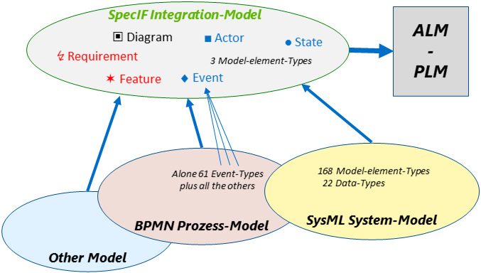

# Introduction to SpecIF Model Integration and Application

The usage of SpecIF for a specific purpose is called an 'application'. 
An important application is to integrate models and other specification artifacts from different sources. 
Currently transformations or importers exist for BPMN, Archimate, ReqIF, Excel and UML/SysML.

The integration of elements of different sources is generally done by name and type. 
In other words, two elements in different models/notations are considered the _same_, if their names and types are equal. 
The checking for equal names is rather simple, but checking for equal types is almost impossible, since every notation and tool is 
using a different set of types. 

Therefore an abstraction (or mapping) to three _fundamental_ model-element types is made, before checking for equality. 
The model-element types of the _Fundamental Modeling Concepts (FMC)_ have been selected for this purpose,
namely _Actor_, _State_ and _Event_. 
Model-elements used by every method or notation can be mapped to these [Ref].

## Model Integration Resources

The SpecIF resources used for semantic model integration are just a few elements, 
based on the concepts defined by the Fundamental Modeling Concepts (FMC) approach as mentioned before.

### Three fundamental model elements

FMC defines three fundamental elements to represent all semantic aspects expressed by model elements:

* An ■ *Actor* is a fundamental model element type representing an active entity, be it an activity, a process step, a function, a system component or a user role.
* A ● *State* is a fundamental model element type representing a passive entity, be it a value, an information store, even a color or shape.
* An ♦ *Event* is a fundamental model element type representing a time reference, a change in condition/value or more generally a synchronization primitive.

The idea behind using just these three elements is, that all kinds of structural or behavioral modeling can be expressed as a bipartite graph of just these elements.
One example are Petri-Nets consisting of transitions (actors) and places (states). 
Another example taken from structural modeling are Component Diagrams in UML or Internal Block Diagrams in SysML.

Hereby the components are active elements (represented as actors in SpecIF), because the components are active system elements, 
able to change the state of the system.
Passive elements, representing just data, like UML-object-elements with attributes are mapped to state-elements, 
because they represent a current state of the system by their attribute values and do not change the system state on their own.

By using the concept of mapping all model elements to the three fundamental elements it is necessary the keep the information about the original model element, that was mapped.
This is done by the property *dcterms:type*. 
By storing the type name of the original model element in the dcterms:type property, it allows a transformation from the legacy model to SpecIF and back again. 

### Requirement and Feature

As extension to the fundamental modeling elements and the collection two further elements are defined in SpecIF: The resource classes *Requirement* and *Feature*.

* A ✶ *Feature* is an intentional distinguishing characteristic of a system, often a so-called ‘Unique Selling Proposition’.
* A ↯ *Requirement* is a singular documented physical and functional need that a particular design, product or process must be able to perform. 

These elements are widely used in Systems Engineering of all kind of systems and are in fact highly important in practice.
So these elements complement the set of fundamental elements used to express contents required for system modeling in the Product Lifecycle Management.

### First Glimpse on the Elements of SpecIF Model Integration

The (class-)diagram above gives an overview of the most important element types, defined in SpecIF used for semantic model integration.
This is called the *SpecIF Integration-Model*
Beside the class elements, representing the resource classes, the association connection between the classes shows the available statements, defined
by SpecIF statement classes. 

For better readability of the class diagrams, the aspects are shown on more than one diagram. 
You have to interpret the diagrams in combination to get the complete picture of SpecIF Model Integration.
If two diagrams show a resource class with the same name, it is the same element and all associations defined by one diagram are also valid for the second diagram.
   
### View

In many engineering models the elements defining a concept or documentation are visualized graphically. 
Such visualizations are called a view or diagram. 
SpecIF defines the resource class ▣ *Diagram* to represent all kinds of graphical visualizations of model data.
All diagrams of all kinds of graphical notations can be visualized applying this resource class. 

### Grouping

Models can express a logical or conceptual structure of modeled aspects or the model itself by grouping elements together.
This aspect is covered by the resource class 🖿 *Collection*.
Examples for collections are folders in a file system, groups in BPMN or packages in UML/SysML.

Because a collection can contain other collections, a hierarchy structure (or 'tree') can be expressed using SpecIF.

## Model Integration Statements

The statements in SpecIF are used to express a predicate logic (subject - predicate - object) between SpecIF elements.
Examples for such logical expressions are:

* A *collection* *contains* a *diagram*.
* An *event* *triggers* an *actor*
* A *diagram* *shows* a *state*

In the context of model integration we differentiate between statements to express behavioral aspects and structural aspects.

### Expressing Structure

Structural aspects are expressed with the following statements:

* The *contains* statement expresses that a element is contained in another element. 
Typical application scenarios are to express for example that a collection *contains* an actor or a state *contains* a sub-state etc.

 
* The *shows* statement expresses that a model-element is depicted on a diagram.  
This semantic relation is obvious for a human observer of a diagram, but it gets easily queried by the machine, if there is the explicit statement.
Not only all resources and statements (nodes and edges) of the diagram is easily listed, but also the diagrams showing a given resource or statement.
This is known as the concept of separation of model and view.
* To express traceability-dependencies between requirement elements and requirements or other element types, the following statements are used:
  * A requirement *refines* a requirement
  * A requirement *dependsOn* a requirement
  * A requirement *duplicates* a requirement
  * A requirement *contradicts* a requirement 
  * A model element (state, actor or event) *satisfies* a requirement
* The concept of Allocation known systems engineering is mapped to SpecIF by defining the *allocates* statement

### Expressing Behavior

To express the behavioral aspects of a system or a process the following statements are available in SpecIF:

* An actor *writes* a state. In a system composition a function writes a value.
* An actor *reads* a state. In a system composition a function reads a value.
* An actor *stores* a state. This is the combination of read and write and equates to a bi-directional data or material exchange.
* An actor *precedes* and actor. This is used typically to express that a behavior consists of a sequence of actions and/or events. 

### Instantiation

To express that a resource is an instance of another resource (e.g. an Object is an instance of a Class, a Method return type is an instance of a type definition etc.) the statement 
*rdf:type* is used. 
This statement expresses that the subject is an instance of the statement object.
Use this statement in all cases where a class-instance semantics shall be expressed. 

### Document Outlines

SpecIF defines resource class types useful for applications dealing with textual documentation. 
Typical application scenarios are 
* Document-based requirement specifications
* User manuals
* Any other kind of textual specifications or text documents

The following class diagram shows the SpecIF application for document structures.

* The ⬚	 *Hierarchy* element is the root for a document
* A __H__ *Heading* is used to define a heading text and to bring structure into a document
* A __P__ *Paragraph* can be used to include some text paragraphs with no special semantics (e.g. prose text) a the document
* A ✶ *Feature* and
* a ↯ *Requirement* are, as explained above, important to describe benefits and needs of a system to develop.

The statement *contains* is used to define the semantics for the document hierarchy. 

### Comments

The SpecIF resource type *Comment* is used to include or add additional comments to a resource in a model or a document element. 
To assign a comment to a resource the statement type *refersTo* is used. 
Typical application scenarios for using comments are reviews (review comments) or comments attached to a resource as additional short information.

Comments are usually transient: Upon agreement the model or text is changed accordingly and the comment deleted.
When generating a document, the comments can be included or omitted, similarly to MS Word.

## Mapping of different modeling environments to SpecIF
 
Transformations are in fact a mapping from element types of different modeling environments resp. data models to SpecIF. 
In case of the SysML, the mapping relates SysML model-element types to SpecIF model-element types. 
The same applies to various other applications such as BPMN and Archimate.

The following chapters describe semantic mappings and examples for transformations from different modeling environments to SpecIF.
It is currently still work in progress and not yet complete. 
The first release of SpecIF will therefore not define a fully-complete mapping for each modeling environment, 
but still tries to define a subset for the most important elements and how to map them to SpecIF.  

1. [Model Integration Guide for FMC](./06_SpecIF_Model_Integration_Guide_for_FMC.md)
1. [Model Integration Guide for BPMN](./06_SpecIF_Model_Integration_Guide_for_BPMN.md)
1. [Model Integration Guide for Archimate](./06_SpecIF_Model_Integration_Guide_for_Archimate.md)
1. [Model Integration Guide for UML and SysML](./06_SpecIF_Model_Integration_Guide_for_SysML.md)

