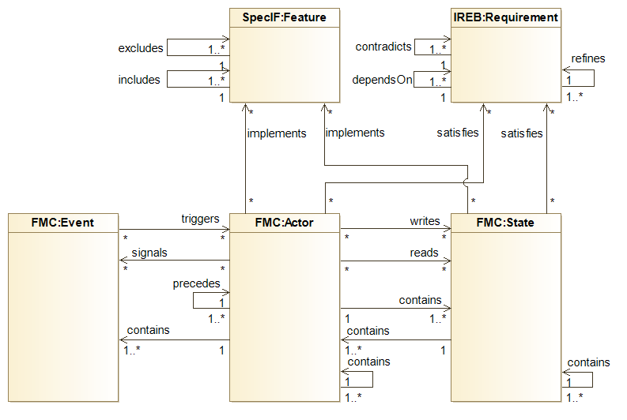

# Introduction to SpecIF Model Integration

The use of SpecIF for a specific purpose is called an 'application'. An important application is to
integrate models and other specification artefacts from different sources. Currently transformations or importers exist for 
BPMN, Archimate, ReqIF, Excel and SysML.

A general introduction is given in [Model-Integration with SpecIF](https://specif.de/files/SpecIF/documents/2019-11-24%20Model-Integration%20with%20SpecIF).
Please refer to the [tutorials](https://github.com/GfSE/SpecIF/tree/master/tutorials) for an explanation of SpecIF resources and statements with their respective classes.

Transformations are in fact a mapping from element types of 
different modeling environments to SpecIF. In case of the SysML, the mapping relates SysML model-element types to 
SpecIF model-element types. The same applies to various other applications such as BPMN and Archimate.

The integration of elements of different sources is generally done by name and type. In other words, two elements in 
different models/notations are considered the _same_, if their names and types are equal. The checking for equal names
is rather simple, but checking for equal types is almost impossible, since every notation and tool is using a different
set of types. Therefore an abstraction (or mapping) to three _fundamental_ model-element types is made before checking
for equality. The model-element types of the _Fundamental Modeling Concepts (FMC)_ have been selected for this purpose,
namely _Actor_, _State_ and _Event_. Model-elements used by every method or notation can be mapped to these [Ref].

The fundamental model-element classes and eligible statement classes used for model-integration are shown:

The following sections of the SpecIF Model Integration Guide shows mappings and examples for transformations from different modeling environments to SpecIF:

