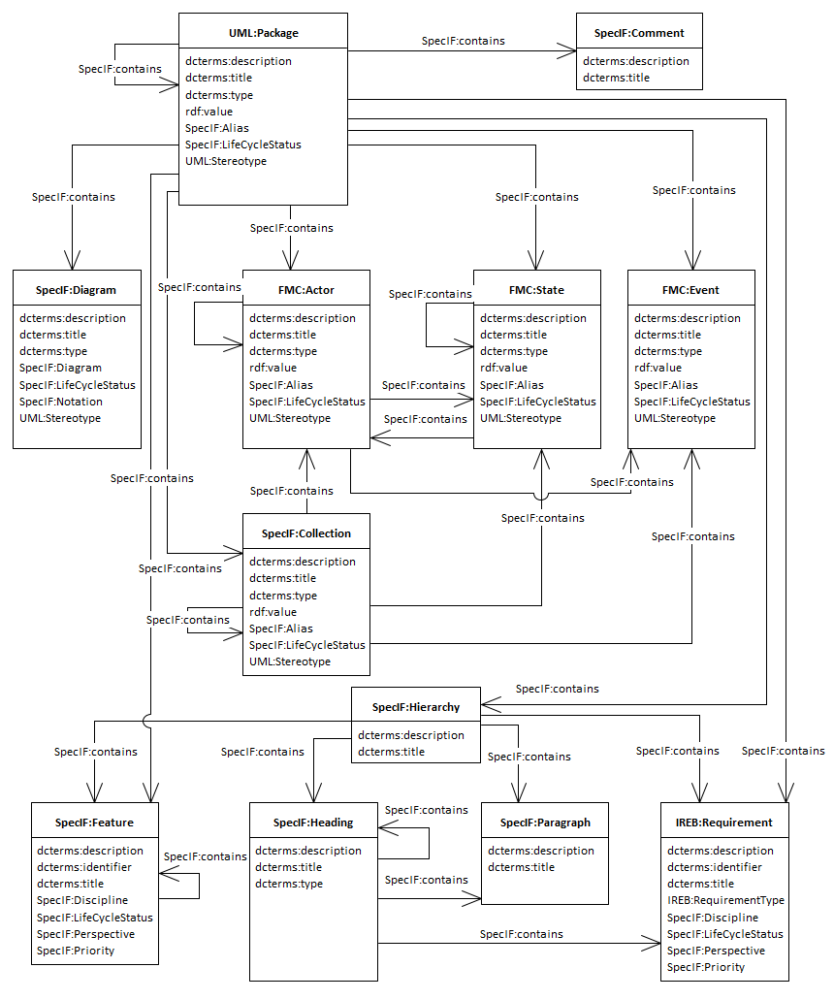
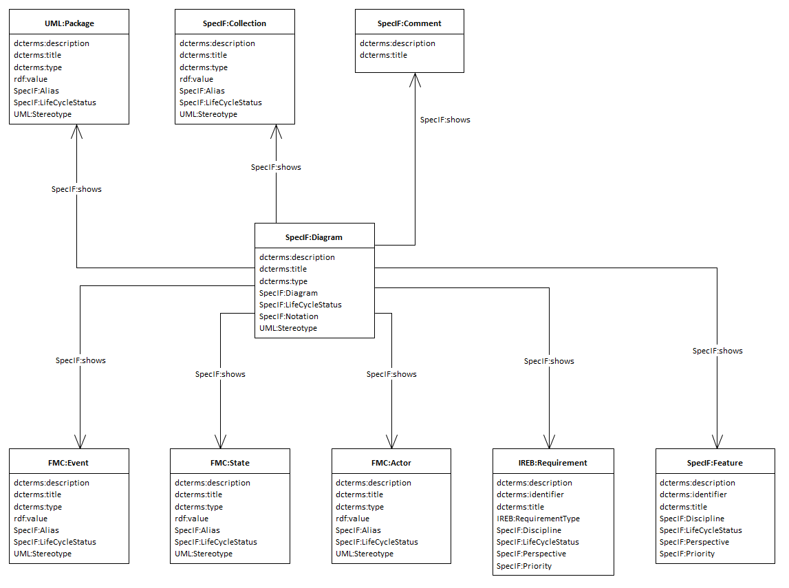
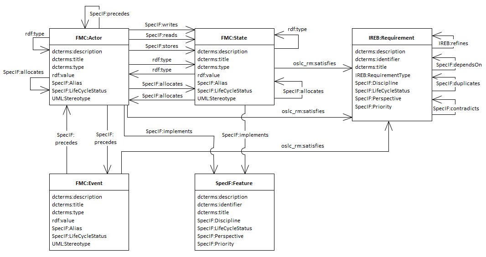

# Introduction to SpecIF Model Integration

The usage of SpecIF for a specific purpose is called an 'application'. 
An important application is to integrate models and other specification artifacts from different sources. 
Currently transformations or importers exist for BPMN, Archimate, ReqIF, Excel and UML/SysML.

The integration of elements from different sources is generally done by name and type. 
In other words, two elements in different models/notations are considered the _same_, if their names and types are equal. 
Checking for equal names is rather simple, but checking for equal types is almost impossible, since every notation and tool is 
using a different set of types. 

Therefore an abstraction (or mapping) to three _fundamental_ model-element types is performed, before checking for equality. 
The model element types of the _Fundamental Modeling Concepts (FMC)_ have been selected for this purpose,
namely _Actor_, _State_ and _Event_. 
Model elements used by any method or notation can be mapped to these [[Dungern2016](https://specif.de/files/resources/enso-m/documents-en/TdSE-2016_Dungern_Semantic-Model-Integration-for-System-Specification_(Text).pdf)].

## Model Integration Resources

There are just a few SpecIF resource classes used for semantic model integration.

### Fundamental Model Element Types

As mentioned before, the Fundamental Modeling Concepts (FMC) approach defines three fundamental element types to represent all semantic aspects:

* An ■ *Actor* (vocabulary term FMC:Actor) is a fundamental model element type representing an active entity, be it an activity, a process step, a function, a system component or a user role.
* A ● *State* (vocabulary term FMC:State) is a fundamental model element type representing a passive entity, be it a value, an information store, even a color or shape.
* An ⬧ *Event* (vocabulary term FMC:Event) is a fundamental model element type representing a time reference, a change in condition/value or more generally a synchronization primitive.

The idea behind using just these three elements is, that all kinds of structural or behavioral modeling can be expressed as a bipartite graph of just these elements.
An example taken from structural modeling are Component Diagrams in UML or Internal Block Diagrams in SysML.
As an example of behavioral modeling, Petri-Nets consist of transitions (actors) and places (states). 

Hereby the components are active elements (represented as SpecIF:Actor). Because the components are active system elements, 
they are able to change the system state.
Passive elements (represented as SpecIF:State) may represent data, like UML-object-elements, whose attributes are mapped to state elements, 
because they represent a current system state by their attribute values.

While all model elements are mapped to the three fundamental elements, the original model element type
is kept by the property *dcterms:type*. 
Storing the original model element in the dcterms:type property is also important for bidirectional transformations. 

### Requirement and Feature

As extension to the fundamental modeling elements and the collection two further elements are defined in SpecIF: The resource classes *Requirement* and *Feature*.

* A ✶ *Feature* (vocabulary term SpecIF:Feature) is an intentional distinguishing characteristic of a system, often a so-called ‘Unique Selling Proposition’.
* A ↯ *Requirement* (vocabulary term IREB:Requirement) is a singular documented physical and functional need that a particular design, product or process must be able to perform. 

These elements are widely used in Systems Engineering of all kinds of systems and are in fact highly important in practice.
So these elements complement the set of fundamental elements used to express contents required for system modeling in the Product Lifecycle Management.

### View

In many engineering models the elements defining a concept or documentation are visualized graphically. 
Such visualizations are called a view or diagram. 
SpecIF defines the resource class ▣ *Diagram* (vocabulary term SpecIF:Diagram) to represent all kinds of graphical visualizations of model data.
All diagrams of all kinds of graphical notations can be visualized applying this resource class. 

### Package

Models can contain many elements and diagrams. 
To structure and navigate through the elements used in a model the concept of folders or packages is often used 
to bring structure to a model.
This structure is normally used independently from semantics, which are expressed by the diagrams using model elements
and connectors.
The model structure is used for navigation and model data organization to sort elements or group them.  

In SpecIF the concept of packages is taken from UML and provided by the resource class 🖿 *Package* (vocabulary term UML:Package).
Applications for package resources are packages in UML/SysML or folders/directories in a file system etc. 

Because a package can contain other packages, a hierarchy structure (or 'tree') can be expressed using SpecIF.

### Collection

Models can express a logical or conceptual structure of modeled aspects or the model itself by grouping elements together.
This aspect is covered by the resource class ⬚ *Collection* (vocabulary term SpecIF:Collection).
Examples for collections are groups in BPMN or boundary elements on UML diagrams.

A package is used to bring structure into a model without expressing some
semantic aspects. 
It is just for sorting elements and helps the users of the model to find things fast and easy.

In comparison to a package a collection is typically defined as a graphical element on a diagram to express that the 
element surrounded by the collection element are grouped together or have a similar meaning or responsibility. 

### A glimpse on the elements of SpecIF Model Integration

The (class-)diagram above gives an overview of the most important element types, defined in SpecIF and used for semantic model integration.
This is called the *SpecIF Integration Model*.

Beside the class elements, representing the resource classes, association connections between the classes show the available statements, defined
by SpecIF statement classes. 
For better readability of the class diagrams, the aspects are shown on more than one diagram. 
You have to interpret the diagrams in combination to get the complete picture of SpecIF Model Integration.
If two diagrams show a resource class with the same name, it is the same element and all associations defined by one diagram are also valid for the second diagram.
   
## Model Integration statements

The statements in SpecIF are used to express a predicate logic (subject - predicate - object) between SpecIF elements.
Examples for such logical expressions are:

* A *collection* *contains* a *diagram*.
* An *event* *triggers* an *actor*.
* A *diagram* *shows* a *state*.

In the context of model integration we differentiate between statements to express behavioral aspects and structural aspects.

### Expressing structure

Structural aspects are expressed with the following statements:

* The *contains* statement expresses that an element is contained in another element. 
Typical application scenarios are to express for example that a collection *contains* an actor or a state *contains* a sub-state etc.

 
* The *shows* statement expresses that a model element is depicted on a diagram.  
This semantic relation is obvious for a human observer of a diagram. If there is the explicit statement it is easily understood by a machine too.
Not only are all resources and statements (nodes and edges) of the diagram easily listed, but also the diagrams showing a given resource or statement.
This is known as the concept of separation of model and view.

### Expressing traceability aspects

* To express traceability-dependencies between requirement elements and requirements or other element types, the following statements are used:
  * A requirement *refines* a requirement,
  * A requirement *dependsOn* a requirement,
  * A requirement *duplicates* a requirement,
  * A requirement *contradicts* a requirement,
  * A model element (state, actor or event) *satisfies* a requirement.
* The concept of allocation known from systems engineering is mapped to SpecIF by defining the *allocates* statement.

### Expressing behavior

To express the behavioral aspects of a system or a process the following statements are available in SpecIF:

* An actor *writes* a state. In a system composition a function writes a value.
* An actor *reads* a state. In a system composition a function reads a value.
* An actor *stores* a state. This is the combination of read and write and equates to a bi-directional data or material exchange.
* An actor *precedes* an actor. This is used to express that a behavior consists of a sequence of actions.
* An actor *precedes* an event with dcterms:type set to *SpecIF:signals*. This is used to express that an event is created by an action.
* An event *precedes* an actor with dcterms:type set to *SpecIF:triggers*. This is used to express that an action is triggered by an incoming event.  

The following diagram shows the behavioral statements used in SpecIF model integration.

 

### Instantiation

To express that a resource is an instance of another resource (e.g. an object is an instance of a class, a method return type is an instance of a type definition etc.) the statement 
*rdf:type* is used. 
This statement expresses that the subject is an instance of the statement object.
Use this statement in all cases where class-instance semantics shall be expressed. 

### Document outlines

SpecIF defines resource class types useful for applications dealing with textual documentation. 
Typical application scenarios are 
* Document-based requirement specifications,
* User manuals,
* Any other kind of textual specifications or text documents.

The following class diagram shows the SpecIF application for document structures.

* The 🖹	*Hierarchy* element is the root for a document,
* A 'H' *Heading* is used to define a heading text and to bring structure into a document,
* A 'P' *Paragraph* can be used to include some text paragraphs with no special semantics (e.g. prose text) into the document,
* A ✶ *Feature* and
* a ↯ *Requirement* are, as explained above, important to describe benefits and needs of a system to develop.

The statement *contains* is used to define the semantics for the document hierarchy. 

### Comments

The SpecIF resource type 🗅 *Comment* is used to include or add additional comments to a resource in a model or a document element. 
To assign a comment to a resource the statement type *refersTo* is used. 
Typical application scenarios for using comments are reviews (review comments) or comments attached to a resource as additional short information.

Comments are usually transient: Upon agreement, the model or text is changed accordingly and the comment deleted.
When generating a document, the comments can be included or omitted, similarly to MS Word.

## SpecIF Classes for Model Integration

As discussed, the SpecIF schema is generic and allows various applications such as model integration. 
Each application is characterized by a set of agreed-upon data types and classes. 
The class definitions described above for integration of models from different tools and notations have been 
developed over many years through projects and case studies in the arena of Enterprise Architecture 
(notations FMC, BPMN and Archimate) and in the arena of Mechatronic Systems Engineering (notations FMC and SysML).

With the set of elements defined and released with version 1.1 of SpecIF it is possible to map nearly all elements -
existing and used in graphical 2D models and in textual specification and documentation content - over the lifecycle 
of a system.

With this first release of SpecIF there are surely some gaps for some specialized application scenarios and domains,
but the goal of covering a bulk of artifacts existing in PLM and MBSE is still achieved.
SpecIF will show its potential as integration and data exchange standard with more upcoming applications and practical 
use.

### Mapping of different modeling environments to SpecIF
 
Transformations are in fact a mapping from element types of different modeling environments resp. data models to SpecIF. 
In case of SysML, the mapping relates SysML model element types to SpecIF model element types. 
The same applies to various other applications such as BPMN and Archimate.

The following chapters describe semantic mappings and examples for transformations from different modeling environments 
to SpecIF.
It is currently still work in progress and not yet complete. 
The first release of SpecIF will therefore not define a fully-complete mapping for each modeling environment, 
but still tries to define a subset for the most important elements and how to map them to SpecIF.  

1. [Model Integration Guide for FMC](./06_SpecIF_Model_Integration_Guide_for_FMC.md)
1. [Model Integration Guide for BPMN](./06_SpecIF_Model_Integration_Guide_for_BPMN.md)
1. [Model Integration Guide for Archimate](./06_SpecIF_Model_Integration_Guide_for_Archimate.md)
1. [Model Integration Guide for UML and SysML](./06_SpecIF_Model_Integration_Guide_for_SysML.md)

