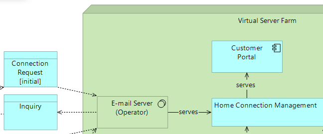
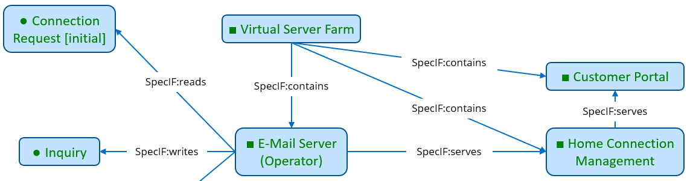
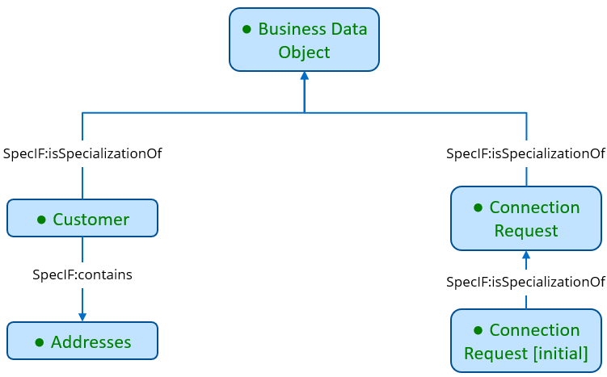

# SpecIF Model Integration Guide for ArchiMate®

## ArchiMate® to SpecIF mapping

### Resources

| [ArchiMate® Open Exchange (XML)](https://www.opengroup.org/xsd/archimate/) | [SpecIF](https://specif.de) |
| --- | --- |
| BusinessActor, BusinessRole, BusinessCollaboration, BusinessInterface, BusinessProcess, BusinessFunction, BusinessInteraction, BusinessService, ApplicationComponent, ApplicationCollaboration, ApplicationInterface, ApplicationFunction, ApplicationInteraction, ApplicationProcess, ApplicationService, Node, Equipment, Facility, DistributionNetwork, Device, SystemSoftware, TechnologyCollaboration, TechnologyInterface, Path, CommunicationNetwork, TechnologyFunction, TechnologyProcess, TechnologyInteraction, TechnologyService, OrJunction, AndJunction | [FMC:Actor](https://specif.de/apps/view#import=../examples/Vocabulary.specifz;view=doc;project=P-SpecIF-Vocabulary;node=N-4NoXVcSzSs07Htg4959SJnDEm0D) |
| Goal, Capability, Contract, Representation, Artefact, Product, BusinessObject, DataObject | [FMC:State](https://specif.de/apps/view#import=../examples/Vocabulary.specifz;view=doc;project=P-SpecIF-Vocabulary;node=N-yeUw4dc3iTxk7PHLdQo7efxLvBc) |
| BusinessEvent, ApplicationEvent, TechnologyEvent, ImplementationEvent | [FMC:Event](https://specif.de/apps/view#import=../examples/Vocabulary.specifz;view=doc;project=P-SpecIF-Vocabulary;node=N-8HwdIxFap0pTQ5JiE31I1BQJ15z) |
| Requirement, Constraint | IREB:Requirement |
| Location, Grouping | [SpecIF:Collection](https://specif.de/apps/view#import=../examples/Vocabulary.specifz;view=doc;project=P-SpecIF-Vocabulary;node=N-MCUw5EHwNYxa9wqMtctM4J2A2G8) |

Where:

* The listed elements are described in the [ArchiMate® 3.1 Specification](https://pubs.opengroup.org/architecture/archimate3-doc/chap04.html).
* All SpecIF resource class terms are defined in the [Vocabulary](https://specif.de/apps/view#import=../examples/Vocabulary.specifz;view=doc;node=N-YpyUlWVLwxYblBgWOr154btbA9u).
* For all entities in the left column the namespace 'archimate:' is used; the XML header defines ```xsi:schemaLocation="http://www.opengroup.org/xsd/archimate/3.0/ http://www.opengroup.org/xsd/archimate/3.1/archimate3_Diagram.xsd"```.
* The original model element type is stored in a property named _dcterms:type_. 

### Statements

At present, the following statements are derived from ArchiMate® diagrams, where the _statement terms_ (_predicates_) are highlighted in _italics_:

| [ArchiMate® Open Exchange (XML)](https://www.opengroup.org/xsd/archimate/) |  | [SpecIF](https://specif.de) | Comment |
| --- | --- | --- | --- |
| view |  | SpecIF:shows |  |
| Composition, Aggregation, Realization, Assignment |  | SpecIF:contains | ArchiMate® Structural (or 'unifying') Relationship |
| Access (accessType:Write) |  | SpecIF:writes | ArchiMate® Dependency Relationship |
| Access (accessType:Read) |  | SpecIF:reads | ArchiMate® Dependency Relationship |
| Association |  | SpecIF:isAssociatedWith | ArchiMate® Dependency Relationship |
| Influence |  | SpecIF:influences | ArchiMate® Dependency Relationship |
| Serving |  | SpecIF:serves | ArchiMate® Dependency Relationship |
| Flow, Triggering |  | SpecIF:precedes | ArchiMate® Dynamic Relationship |
| Specialization |  | SpecIF:isSpecializationOf |  |

Where:

* The listed elements are described in the [ArchiMate® 3.1 Specification](https://pubs.opengroup.org/architecture/archimate3-doc/chap05.html).
* All SpecIF statement class terms are defined in the [Vocabulary](https://specif.de/apps/view#import=../examples/Vocabulary.specifz;view=doc;node=N-blM4lfyHM55YlbfBZ3NWj4SYwa3).
* For all entities in the left column the namespace 'archimate:' is used; the XML header defines ```xsi:schemaLocation="http://www.opengroup.org/xsd/archimate/3.0/ http://www.opengroup.org/xsd/archimate/3.1/archimate3_Diagram.xsd"```.
* The original model element type is stored in a property named _dcterms:type_. 

### Example

ArchiMate® 3.1 defines numerous viewpoints, 25 in total. Two typical ones are chosen to demonstrate an ArchiMate® to SpecIF transformation.

#### Layered Viewpoint

The following clipping from ArchiMate® Layered Viewpoint represents two data objects, one system service, two application components and a node:



The following SpecIF graph expresses the same:



#### Information Structure Viewpoint

The following clipping from ArchiMate® Information Structure Viewpoint represents five data objects similar to a UML Class Diagram:


The following SpecIF graph expresses the same:



#### Full Example

The full example can be inspected, here:

* [Telephone Connection Request (Open-Exchange XML)](https://specif.de/examples/Telephone-Connection-Request.xml)
* [Telephone Connection Request (specif)](https://specif.de/examples/Telephone-Connection-Request.specif)
* [Telephone Connection Request (SpecIF-Viewer)](https://specif.de/apps/view#import=../examples/Telephone-Connection-Request.specif.zip)

### Transformation Code
Here you may look at the current code of the [ArchiMate® to SpecIF transformation](https://github.com/GfSE/Archimate-SpecIF-Bridge/blob/master/source/js/archimate2SpecIF.js).
