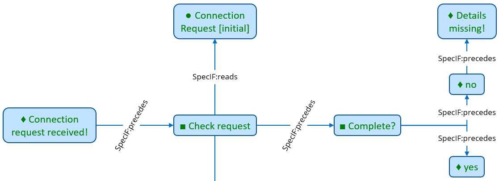

# SpecIF Model Integration Guide for BPMN

## BPMN to SpecIF mapping

For introduction to the Business Process Model and Notation (BPMN), see the [BPMN 2.0 Symbol Reference](https://camunda.com/de/bpmn/bpmn-2-0-symbol-reference/), for example.

### Resources

| [BPMN-XML](https://www.omg.org/spec/BPMN/2.0/About-BPMN/) | [SpecIF](https://specif.de) |
| --- | --- |
| collaboration | SpecIF:Diagram |
| process<sup>1</sup> | *tbd* |
| participant<sup>2</sup>, laneSet, lane<sup>3</sup>, task, manualTask, userTask, scriptTask, serviceTask, sendTask, receiveTask, callActivity, transaction, subProcess, businessRuleTask, forking and joining parallelGateway, joining exclusiveGateway, joining inclusiveGateway | [FMC:Actor](https://specif.de/apps/view#import=../examples/Vocabulary.specifz;view=doc;node=N-4NoXVcSzSs07Htg4959SJnDEm0D) |
| forking exclusiveGateway, forking inclusiveGateway, forking eventBasedGateway | [FMC:Actor](https://specif.de/apps/view#import=../examples/Vocabulary.specifz;view=doc;node=N-4NoXVcSzSs07Htg4959SJnDEm0D) plus [FMC:Event](https://specif.de/apps/view#import=../examples/Vocabulary.specifz;view=doc;node=N-8HwdIxFap0pTQ5JiE31I1BQJ15z) per outgoing sequenceFlow |
| dataObjectReference<sup>4</sup>, dataStoreReference<sup>4</sup>, messageFlow<sup>5</sup> | [FMC:State](https://specif.de/apps/view#import=../examples/Vocabulary.specifz;view=doc;node=N-yeUw4dc3iTxk7PHLdQo7efxLvBc) |
| startEvent, timerStartEvent, messageStartEvent, intermediateEvent, messageThrowEvent, intermediateThrowEvent, intermediateCatchEvent, intermediateTimerCatchEvent, intermediateMessageCatchEvent, boundaryEvent, timerBoundaryEvent, messageBoundaryEvent, endEvent | [FMC:Event](https://specif.de/apps/view#import=../examples/Vocabulary.specifz;view=doc;node=N-8HwdIxFap0pTQ5JiE31I1BQJ15z) |
| group<sup>6</sup> | [SpecIF:Collection](https://specif.de/apps/view#import=../examples/Vocabulary.specifz;view=doc;node=N-MCUw5EHwNYxa9wqMtctM4J2A2G8) |

Where:

* For all entities in the left column the namespace 'bpmn:' is used; the XML header defines ```targetNamespace="http://bpmn.io/schema/bpmn"```.
* All SpecIF resource class terms are defined in the [Vocabulary](https://specif.de/apps/view#import=../examples/Vocabulary.specifz;view=doc;node=N-YpyUlWVLwxYblBgWOr154btbA9u).
* The original model element type is stored in a property named _dcterms:type_. 

Comments:

1. The participants are transformed, but not the processes, for the following reasons:
    * To our experience with different tools, there is no process without participant, but there can be participants without a process.
	* Participants are source or target of messageFlows, but not the referenced processes.
	* Thus, the role and need of a process in BPMN as implemented by the tools we know is unclear.
2. A participant is also called a 'pool'.
3. A lane is considered a responsible person or role, thus an FMC:Actor.
4. Interestingly enough, in BPMN the name and other information are properties of _dataObjectReference_ resp. _dataStoreReference_ (rather than _dataObject_ or _dataStore_). Also the associations point to the references. Therefore, the references are transformed and the dcterms:type is anyways set to _dataObject_ resp. _dataStore_.
5. A messageFlow between different processes is transformed to a _dataObject_ with _SpecIF:writes_ and _SpecIF:reads statements_ connecting to the sending resp. receiving process steps or events.
6. Currently a _group_ is not represented as a SpecIF model element, because some (or even all) widely used BPMN modelers do not indicate explicitly in their BPMN-XML export, which activities or other are contained. Thus, the semantics of a group are not easily derived. The geometric coordinates of the diagram can be analyzed to identify contained elements of a group, of course: This is a development task to do.

### Statements

At present, the following statements are derived from BPMN diagrams, where the _statement terms_ (_predicates_) are highlighted in _italics_:

| [BPMN-XML](https://www.omg.org/spec/BPMN/2.0/About-BPMN/) |  | [SpecIF](https://specif.de) | Comment |
| --- | --- | --- | --- |
| *Appearance on diagram* | diagram _SpecIF:shows_ model-element | SpecIF:shows |  |
| *Graphical Containment* | process _SpecIF:contains_ lane | SpecIF:contains |  |
| *Graphical Containment* | lane _SpecIF:contains_ activity or event | SpecIF:contains |  |
| dataInputAssociation | activity _SpecIF:reads_ data | SpecIF:reads |  |
| dataOutputAssociation | activity _SpecIF:writes_ data | SpecIF:writes |  |
| sequenceFlow | activity _SpecIF:precedes_ activity | SpecIF:precedes |  |
| sequenceFlow ('outgoing' with respect to the event) | event _SpecIF:precedes_ activity | SpecIF:precedes |  |
| sequenceFlow ('incoming' with respect to the event) | activity _SpecIF:precedes_ event | SpecIF:precedes |  |
| association | annotation _SpecIF:refersTo_ model-element | SpecIF:refersTo |  |

Where:

* For all entities in the left column the namespace 'bpmn:' is used; the XML header defines ```targetNamespace="http://bpmn.io/schema/bpmn"```.
* 'model-element' is one of [ 'FMC:Actor', 'FMC:State', 'FMC:Event' ]
* 'activity' is one of [ task, manualTask, userTask, scriptTask, serviceTask, sendTask, receiveTask, callActivity, transaction, subProcess ], thus a FMC:Actor.
* 'data' is one of [ dataObjectReference, dataStoreReference ], thus a FMC:State.
* 'event' is one of [ startEvent, intermediateThrowEvent, intermediateCatchEvent, boundaryEvent, endEvent ], thus a FMC:Event.
* All SpecIF statement class terms are defined in the [Vocabulary](https://specif.de/apps/view#import=../examples/Vocabulary.specifz;view=doc;node=N-blM4lfyHM55YlbfBZ3NWj4SYwa3).
* The original model element type is stored in a property named _dcterms:type_. 
 
### Example

The following clipping from BPMN-XML represents an event, an activity, a sequenceFlow and a forking exclusive gateway:


The following SpecIF graph expresses the same:



The full example can be inspected, here:

* [Telephone Connection Request (BPMN-XML)](https://specif.de/examples/Telephone-Connection-Request.bpmn)
* [Telephone Connection Request (specif)](https://specif.de/examples/Telephone-Connection-Request.specif)
* [Telephone Connection Request (SpecIF-Viewer)](https://specif.de/apps/view#import=../examples/Telephone-Connection-Request.specif.zip)

### Transformation Code

Here you may look at the current code of the [BPMN to SpecIF transformation](https://github.com/GfSE/BPMN-SpecIF-Bridge/blob/master/source/js/BPMN2SpecIF.js).
