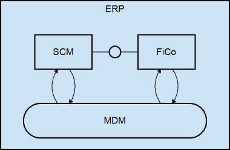
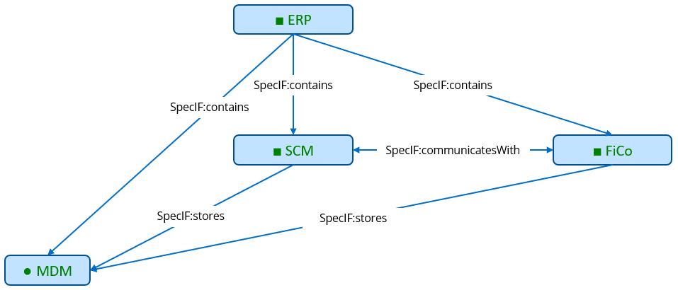

# SpecIF Model-Integration Guide for FMC

## FMC to SpecIF Mapping

For introduction to the Fundamental Modeling Concepts (FMC), see the [FMC Overview](http://f-m-c.org/). 
The FMC Metamodel is given in [Knöpfel, Gröne, Tabeling: Fundamental Modeling Concepts - Effective Communication of IT-Systems](https://www.wiley.com/en-us/Fundamental+Modeling+Concepts%3A+Effective+Communication+of+IT+Systems-p-9780470027103).

However, this Metamodel seems to be rather theoretic and it is perhaps not complete for practical purposes. 
When analyzing, among others we have the following questions:

- Why are some relations named as nouns, others as verbs (e.g. *"Observability"* vs. *"triggers"*).
- Why is *Write access* an unambiguous mapping in one direction (as denoted by the arrow) and why not *Read access*?
- Should the relation between *Location* and *Value* be named *has*?
- Can *Agent*, *Operation*, *Storage* and perhaps other entities be hierarchically nested?

There is no standard serialization defined for FMC. As to our knowledge there is only one modeling tool for FMC, namely [ARCWAY Ccokpit](https://arcway.com).
We will show in the following the mapping of the entities and relationships realized in this tool.

### Resources

| [ARCWAY Cockpit](https://arcway.com) | [SpecIF](https://specif.de) |
| --- | --- |
| Plan | [SpecIF:Diagram](https://specif.de/apps/view#import=../examples/Vocabulary.specifz;view=doc;node=N-vocjQYmvtlIzcGsieVchOGhCUmb) |
| Function, Agent, Operation | [FMC:Actor](https://specif.de/apps/view#import=../examples/Vocabulary.specifz;view=doc;node=N-4NoXVcSzSs07Htg4959SJnDEm0D) |
| Information, Channel, Location, Storage, Value | [FMC:State](https://specif.de/apps/view#import=../examples/Vocabulary.specifz;view=doc;node=N-yeUw4dc3iTxk7PHLdQo7efxLvBc) |
| Event, Point in time | [FMC:Event](https://specif.de/apps/view#import=../examples/Vocabulary.specifz;view=doc;node=N-8HwdIxFap0pTQ5JiE31I1BQJ15z) |
|  | [SpecIF:Collection](https://specif.de/apps/view#import=../examples/Vocabulary.specifz;view=doc;node=N-MCUw5EHwNYxa9wqMtctM4J2A2G8) |

Where:

- All resource class terms are defined in the [Vocabulary](https://specif.de/apps/view#import=../examples/Vocabulary.specifz;view=doc;node=N-YpyUlWVLwxYblBgWOr154btbA9u).
- The original model element type is stored in a property named _dcterms:type_. 

### Statements

| [ARCWAY Cockpit](https://arcway.com) |  | [SpecIF](https://specif.de) | Comment |
| --- | --- | --- | --- |
| Occurrence | A model-element occurs on a plan | SpecIF:shows | Inverted statement |
| Containment | A model-element contains a model-element | SpecIF:contains |  |
| Reading | An actor reads a state | SpecIF:reads |  |
| Writing | An actor writes a state | SpecIF:writes |  |
| Modification | An actor writes and reads a state | SpecIF:stores |  |
| Influence | A state influences a state (via an unnamed function=actor) | *tbd* | Rarely used, if ever |
| Relation | A state influences and is reversely influenced by a state (via an unnamed function=actor) | *tbd* | Rarely used, if ever |
| Receiving | An actor receives messages from an actor (through an unnamed channel=state) | SpecIF:receivesFrom |  |
| Sending | An actor sends messages to an actor (through an unnamed channel=state) | SpecIF:sendsTo |  |
| Communication | An actor sends to and receives messages from an actor (through an unnamed channel=state) | SpecIF:communicates |  |
| Succession | A model-element succeeds a model-element | SpecIF:precedes | Inverted statement |
| Precedence | A model-element precedes a model-element | SpecIF:precedes |  |

Where:

- 'model-element' is one of [ 'FMC:Actor', 'FMC:State', 'FMC:Event' ].
- All statement class terms are defined in the [Vocabulary](https://specif.de/apps/view#import=../examples/Vocabulary.specifz;view=doc;node=N-blM4lfyHM55YlbfBZ3NWj4SYwa3).
- The original model element type is stored in a property named _dcterms:type_. 

### Example

#### FMC Block Diagram

The following example of a FMC block diagram represents three application components and a data object:

The following SpecIF graph expresses the same:

### Transformation Code

Here you may take a look at the current code of the [FMC Export from ARCWAY Cockpit to SpecIF](https://github.com/GfSE/ARCWAY-to-SpecIF-Exporter/blob/master/source/SpecIF-Export.rpttpl).
