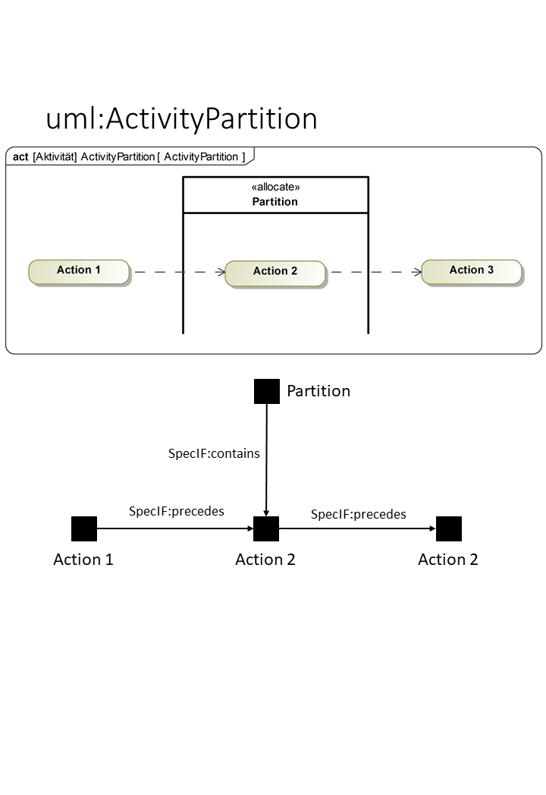
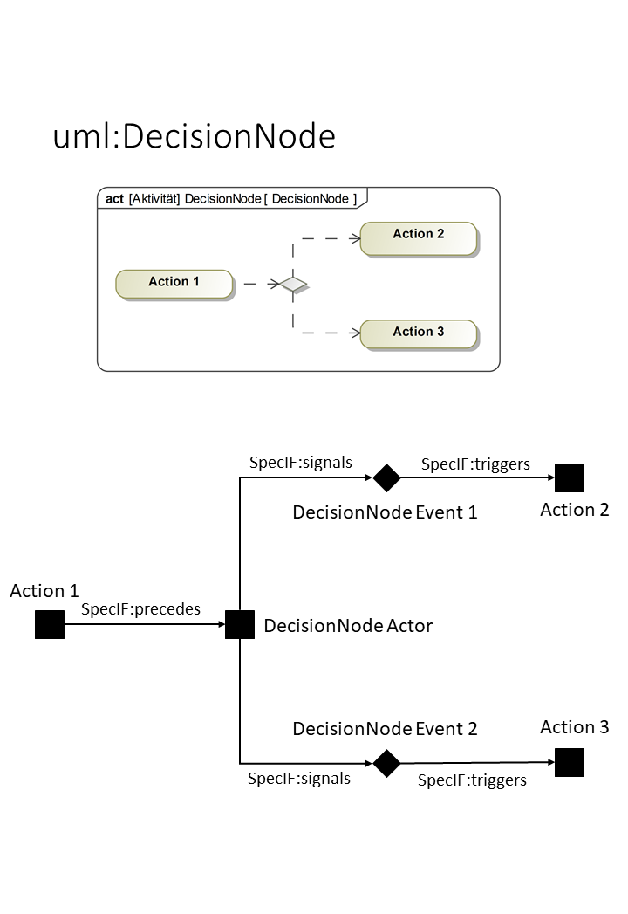
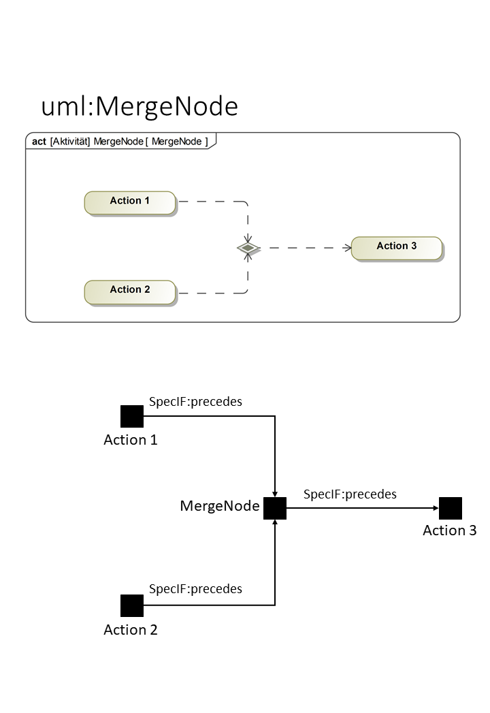

# SpecIF Model Integration Guide for UML and SysML

To semantically map SysML to SpecIF we map the UML and include the elements and concepts of the UML-profile mechanism. 
All SysML 1.x elements are profiled UML elements with stereotypes and tagged values. So it easy to map these elements using the UML metaclasses and the stereotypes.
SpecIF defines the propertties dcterms:type for defining a UML-metamodel reference and the property UML:Stereotype to define a stereotype. So SysML elements are profiled UML elements.

## UML/SysML to SpecIF Mapping

The mapping from UML/SysML to SpecIF is discussed in a working group. At the moment there is a sketch for a mapping of 
UML and SysML to SpecIF-Elements. This Mapping Table is not released and still in discussion. It consists of a resource-, property-
and statement-mapping and only contains elements that are used in activity and block definition diagrams. The mapping is shown
in the following three tables.
The general idea is to map a high number of UML/SysML elements to a small model core in SpecIF. This model core consist of the
fundamental modeling elements Actor, State and Event and the two SpecIF-Elements SpecIF:Diagram and SpecIF:Collection. 
Mapped elements in the mapping tables should have a matching semantic meaning, e.g. a SysML Action is 
an active element. Regarding to the [SpecIF Vocabulary](https://specif.de/apps/view.html#import=%22../examples/Vocabulary.specifz%22),
a FMC:Actor represents an active element. Since these definitions match both elements can be added to the mapping table. 

### Resource mapping table

|UML-Metaclass|UML:Stereotype|SpecIF Resource Class|dcterms:type|Remark|
|-|-|-|-|-|
|Model||SpecIF:Collection|OMG:UML:2.5.1:Model|A root model node (root package of a model repository).|
|Package||SpecIF:Collection|OMG:UML:2.5.1:Package|A model package|
|ClassDiagram||SpecIF:Diagram|OMG:UML:2.5.1:ClassDiagram|A UML class diagram|
|CompositeStructureDiagram||SpecIF:Diagram|OMG:UML:2.5.1:CompositeStructureDiagram|A UML composite structure diagram|
|ComponentDiagram||SpecIF:Diagram|OMG:UML:2.5.1:ComponentDiagram|A UML component diagram|
|DeploymentDiagram||SpecIF:Diagram|OMG:UML:2.5.1:DeploymentDiagram|A UML deployment diagram|
|ObjectDiagram||SpecIF:Diagram|OMG:UML:2.5.1:ObjectDiagram|A UML object diagram|
|PackageDiagram||SpecIF:Diagram|OMG:UML:2.5.1:PackageDiagram|A UML/SysML package diagram|
|ProfileDiagram||SpecIF:Diagram|OMG:UML:2.5.1:ProfileDiagram|A UML/SysML profile diagram|
|ActivityDiagram||SpecIF:Diagram|OMG:UML:2.5.1:ActivityDiagram|A UML/SysML activity diagram|
|SequenceDiagram||SpecIF:Diagram|OMG:UML:2.5.1:SequenceDiagram|A UML/SysML sequence diagram|
|CommunicationDiagram||SpecIF:Diagram|OMG:UML:2.5.1:CommunicationDiagram|A UML communication diagram|
|InteractionOverviewDiagram||SpecIF:Diagram|OMG:UML:2.5.1:InteractionOverviewDiagram|A UML interaction overview diagram|
|TimingDiagram||SpecIF:Diagram|OMG:UML:2.5.1:TimingDiagram|A UML timing diagram|
|UseCaseDiagram||SpecIF:Diagram|OMG:UML:2.5.1:UseCaseDiagram|A UML/SysML use case diagram|
|StateMachineDiagram||SpecIF:Diagram|OMG:UML:2.5.1:StateMachineDiagram|A UML/SysML state machine diagram|
|SysML-RequirementDiagram|Requirement|SpecIF:Diagram|OMG:UML:2.5.1:ClassDiagram|A SysML Requirement Diagram|
|SysML-BlockDefinitionDiagram|BlockDefinition|SpecIF:Diagram|OMG:UML:2.5.1:ClassDiagram|A SysML Block Definition Diagram|
|SysML-InternalBlockDiagram|InternalBlock|SpecIF:Diagram|OMG:UML:2.5.1:ObjectDiagram|A SysML Internal Block Diagram|
|SysML-ParametricDiagram|Parametric|SpecIF:Diagram|OMG:UML:2.5.1:ObjectDiagram|A SysML Parametric Constraint Diagram|
|FMC4SE FMC Diagram|FMC4SE|SpecIF:Diagram|OMG:UML:2.5.1:ObjectDiagram|A FMC4SE FMC Diagram|
||
|Class||FMC:State|OMG:UML:2.5.1:Class||
|State||FMC:State|OMG:UML:2.5.1:State||
|Port||FMC:State|OMG:UML:2.5.1:Port||
|Attribute||FMC:State|OMG:UML:2.5.1:Attribute||
|Object||FMC:State|OMG:UML:2.5.1:Object||
|TaggedValue||FMC:State|OMG:UML:2.5.1:TaggedValue||
|ObjectRunState||FMC:State|OMG:UML:2.5.1:RunState||
|Constraint||FMC:State|OMG:UML:2.5.1:Constraint||
|Parameter||FMC:State|OMG:UML:2.5.1:Parameter||
||
|Component||FMC:Actor|OMG:UML:2.5.1:Component||
|Activity||FMC:Actor|OMG:UML:2.5.1:Activity||
|Action||FMC:Actor|OMG:UML:2.5.1:Action||
|CallBehaviorAction||FMC:Actor|OMG:UML:2.5.1:CallBehaviorAction||
|InputPin||FMC:Actor|OMG:UML:2.5.1:InputPin||
|OutputPin||FMC:Actor|OMG:UML:2.5.1:OutputPin||
|Operation||FMC:Actor|OMG:UML:2.5.1:Operation||
|StateMachine||FMC:Actor|OMG:UML:2.5.1:StateMachine||
|Actor||FMC:Actor|OMG:UML:2.5.1:Actor||
|DecisionNode||FMC:Actor + FMC:Event|OMG:UML:2.5.1:DecisionNode||
|MergeNode||FMC:Actor|OMG:UML:2.5.1:MegeNode||
|ForkNode||FMC:Actor|OMG:UML:2.5.1:ForkNode||
|JoinNode||FMC:Actor|OMG:UML:2.5.1:JoinNode||
|ActivityPartition||FMC:Actor (+ SpecIF:contains)|OMG:UML:2.5.1:ActivityPartition||
|SendSignalAction||FMC:Actor (+ SpecIF:signals)|OMG:UML:2.5.1:SendSignalAction||
|AcceptEventAction||FMC:Actor (+ SpecIF:triggers)|OMG:UML:2.5.1:AcceptEventAction||
|TimeEvent||FMC:Event|OMG:UML:2.5.1:TimeEvent||
|Signal||FMC:Event|OMG:UML:2.5.1:Signal||
|InitialNode||FMC:Event|OMG:UML:2.5.1:InitialNode||
|ActivityFinalNode||FMC:Event|OMG:UML:2.5.1:ActivityFinal||
|FlowFinalNode||FMC:Event|OMG:UML:2.5.1:FlowFinal||
||
|Class|requirement|IREB:Requirement|OMG:UML:2.5.1:Class|A SysML requirement model element. Also map tool-specific requirement representations (e.g. EA-Requirement-Elements) to this resource class.|

### Statement mapping table

|UML Metaclass|Stereotype|SpecIF Statement Class|dcterms:type|Remark|
|-|-|-|-|-|
|ObjectFlow|-|FMC:State + SpecIF:reads/writes + SpecIF:preceds|OMG:UML:2.5.1:ObjectFlow|FMC:State + SpecIF:reads/writes to transfer the Object, additionally a control flow to trigger the reading actor|
|ControlFlow|-|SpecIF:triggers/preceds/signals|OMG:UML:2.5.1:ControlFlow|The connection type (precedes/triggers/signals) depends on the types of the connected elements|
|Transition|-|???|OMG:UML:2.5.1:Transition|Used to interconnect states|
|Connector (w/o direction)|acces type|SpecIF:stores|OMG:UML:2.5.1:Connector|Used in FMC4SE compositional structure modeling (---)|
|Connector (Unidirectional)|access type|SpecIF:writes/SpecIF:reads|OMG:UML:2.5.1:Connector|Used in FMC4SE compositional structure modeling (-->)|
|Connector (Bi-Directional)|access type|SpecIF:stores|OMG:UML:2.5.1:Connector|Used in FMC4SE compositional structure modeling (<->)|
|Composition|-|SpecIF:contains|OMG:UML:2.5.1:CompositeAggregation|UML/SysML composition (black diamond)|
|Aggregation|-|SpecIF:contains|OMG:UML:2.5.1:Aggregation|UML/SysML aggregation (white diamond)|
|Association|-|???|OMG:UML:2.5.1:Association|UML/SysML association|
|Dependency|-|SpecIF:dependsOn|OMG:UML:2.5.1:Dependency|UML/SysML dependency|
|Dependency|satisfy|oslc_rm:satisfies|OMG:UML:2.5.1:Dependency|SysML satisfy connection|
|Dependency|verify|SysML:verifies|OMG:UML:2.5.1:Dependency|SysML verify connection|
|Dependency|allocate|SysML:allocates|OMG:UML:2.5.1:Dependency|SysML allocation connection|
|Deployment|deploy|SysML:allocates|OMG:UML:2.5.1:Deployment|UML deployment connection|
|Extension|-|UML:Extends|OMG:UML:2.5.1:Extension|UML Profile extension relation. The subject (stereotype) extends the object (metaclass).|
|||||
|Trigger||SpecIF:triggers||Triggers a AcceptEventAction|
|Signal||SpecIF:signals||Signals a SignalEvent|
|||||
|Classifier of a model element/Resource||rdf:type||The object is the classifier/type of the subject.|
|behavior is implemented by||UML:BehaviorReference?||The subject behavior is implemented by the object (a piece of source code)|

### Property mapping table

|UML-Name|SpecIF-Property Class|Remark|
|-|-|-|
|NamedElement.name|dcterms:title|The name of an UML element|
|Comment|dcterms:description|The model element descriptional text.|
|NamedElement.visibility|SpecIF:VisibilityKind|e.g. Public, Private, Protected, Package|
|?|SpecIF:Status|The element status value.|
|Stereotype|UML:Stereotype|The Stereotype of a model element|
|typeOf(Metaclass)|dcterms:type|e.g. OMG:UML:2.5.1:Constraint. To avoid define a SpecIF Resource type for each UML element, a type attribute is used instead of metaclass inheritance. Have a look at the dterms:type vocabulary for details.|
|_VALUES_ (TaggedValue.Value / Attribute.Default / Constraint.Notes)|rdf:value|An (initial) value of an attribute, tagged value, object run state etc.|
|alias|SpecIF:Alias|An alias for a model element|

### Examples for SysML mapping and transformation of Activity diagrams
In SpecIF model elements are representated as FMC:Actor (square), FMC:State (circle) and FMC:Event (diamond). Elements 
in SpecIF are named resources and relations between these resources are named statements (arrows). 
The following figure shows the element representation in Cameo Systems Modeler and SpecIF. The notation that is shown in 
the figure is also used for the following examples.

In the next three figures examples for the transformation of activity diagram elements are shown in a small context. The
example elements are a ActivityPartition, a DecisionNode and a MergeNode. 
The first figure shows three Actions, two ControlFlows and a ActivityPartition in a SysML-diagram and in the SpecIF-notation.
Actions are transformed into FMC:Actor resources aswell as the activity partition. For the assignment that "Action 2" is
contained by the ActivityPartition a statement SpecIF:contains is generated in the transformation. Since the Actions are
connected by two ControlFlows there are SpecIF:precedes statements between the actions. SpecIF:precedes represents a
ControlFlow between two FMC:Actors.
 

The following figure shows a example for the transformation of a DecisionNode. The DecisionNode in the context has one 
incoming ControlFlow from a action and two outgoing controlflows to two actions. The DecisionNode is represented by a FMC:Actor
and two FMC:Events in the SpecIF-Notation. The statements between the resources are dependent on the types of the resources.
For statements from a FMC:Actor to a FMC:Actor a SpecIF:precedes statement, from a FMC:Actor to a FMC:Event a SpecIF:signals
statement and from a FMC:Event to a FMC:Actor a SpecIF:triggers statement is used. 

In a MergeNode two incoming activity flows are merged into one outgoing activity flow. The DecisionNode is transformed into
a FMC:Actor. Incoming and outgoing ControlFlows in the example are from FMC:Actor to FMC:Actor. This results in SpecIF:precedes
statements for the connection from the other elements to the FMC:Actor of the MergeNode. The same SpecIF representation is
used for the transformation of JoinNodes and ForkNodes. 

Regarding the model structure SysML-Tools provide a containment tree, that shows diagrams and elements that are assigned
to a diagramm (shown in the figure below). Additional Relations between the elements and global Signals or SignalEvents 
are shown in the containment tree. After the transformationto SpecIF this structure is provided by the SpecIF-Hierarchy. 
Different structure levels are defined by hierarchy-elements and nodes. E.g a Activity (in the example CabinProcess) can
be a hierarchy-element. A nodelist can be added to this hierarchy-element to create a structure. One hierarchy-element is 
always linked to one model-element. In the figure below the model structure is shown in a Cameo Systems Modeler containment
tree and in the SpecIF-Viewer. The SpecIF-Viewer is offering a possibility to read a SpecIF files and create a overview.
The model structure is shown on the left side in the hierarchy tree. Information about model elements are provided by the 
"Document" section and relations to other model elements are provided by the "Statements" section.  

