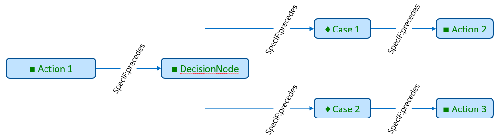
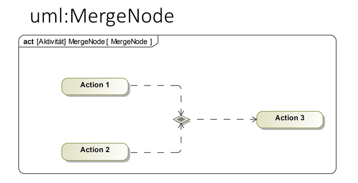

# SpecIF Model Integration Guide for UML and SysML

To semantically map SysML to SpecIF we map the UML and include the elements and concepts of the UML-profile mechanism. 
All SysML 1.x elements are profiled UML elements with stereotypes and tagged values. So it easy to map these elements using the UML metaclasses and the stereotypes.
SpecIF defines the properties dcterms:type for defining a UML-metamodel reference and the property UML:Stereotype to define a stereotype. 
So SysML elements are profiled UML elements.

## UML/SysML to SpecIF Mapping

The mapping from UML/SysML to SpecIF is currently still discussed in a working group of the GfSE. 
At the moment there is a sketch for a mapping of UML and SysML to SpecIF elements. 
This mapping does not cover the complete UML/SysML today and some parts are still in discussion. 
It consists of a resource-, property- and statement-mapping and only contains elements that are often used in activity, block definition and other popular diagrams
used in Systems and Software Engineering. 
The mapping is shown in the following tables.

The general idea is to map a high number of UML/SysML elements to a small number of elements from SpecIF.
The most elements are the elements of the *SpecIF Integration Model.* 
This model core consist of the fundamental modeling elements Actor, State and Event and the two elements SpecIF:Diagram, UML:Package and SpecIF:Collection. 
Mapped elements in the mapping tables should have a matching semantic meaning, e.g. a SysML Action is an active element. 
Regarding to the SpecIF class definitions, a FMC:Actor represents an active element. 
Since these definitions match both elements can be added to the mapping table. 

To define the values for the *dcterms:type* property, the UML metamodel in version 2.5.1 (OMG document number: formal/2017-12-05) is used as reference. 

### Mapping of UML Profiles

By defining a so called UML-Profile,
it is possible to define new element types from existing UML elements with additional meanings or additional properties.
The elements defined by a profile extension are marked by a special term, called a Stereotype. 
SysML in version 1.x is a modeling language that is defined as an UML-profile as well. 
So in the mapping tables below one column is showing the Stereotype if necessary. 
When an UML-element has no stereotype or a stereotype that is not yet covered by the mapping tables, 
the element should be mapped in the same way as the UML element without a stereotype (UML native element type)!

For example the UML element of the UML-type *Interface* with Stereotype *myStereotype* 
is mapped in the same way as an Interface __without__ a stereotype (to a FMC:State with dcterms:type set to OMG:UML:2.5.1:Interface),
but the SpecIF property *UML:Stereotype* must then be set to *myStereotype*.

### Resource mapping tables

#### Package mappings

|UML-Metaclass|UML:Stereotype|SpecIF Resource Class|dcterms:type|Remark|
|-|-|-|-|-|
|Model|-|UML:Package|OMG:UML:2.5.1:Model|A root model node (root package of a model repository).|
|Package|-|UML:Package|OMG:UML:2.5.1:Package|A model package|

#### Diagram mappings

|UML-Metaclass|UML:Stereotype|SpecIF Resource Class|dcterms:type|Remark|
|-|-|-|-|-|
|ClassDiagram|-|SpecIF:Diagram|OMG:UML:2.5.1:ClassDiagram|A UML class diagram|
|CompositeStructureDiagram|-|SpecIF:Diagram|OMG:UML:2.5.1:CompositeStructureDiagram|A UML composite structure diagram|
|ComponentDiagram|-|SpecIF:Diagram|OMG:UML:2.5.1:ComponentDiagram|A UML component diagram|
|DeploymentDiagram|-|SpecIF:Diagram|OMG:UML:2.5.1:DeploymentDiagram|A UML deployment diagram|
|ObjectDiagram|-|SpecIF:Diagram|OMG:UML:2.5.1:ObjectDiagram|A UML object diagram|
|PackageDiagram|-|SpecIF:Diagram|OMG:UML:2.5.1:PackageDiagram|A UML/SysML package diagram|
|ProfileDiagram|-|SpecIF:Diagram|OMG:UML:2.5.1:ProfileDiagram|A UML/SysML profile diagram|
|ActivityDiagram|-|SpecIF:Diagram|OMG:UML:2.5.1:ActivityDiagram|A UML/SysML activity diagram|
|SequenceDiagram|-|SpecIF:Diagram|OMG:UML:2.5.1:SequenceDiagram|A UML/SysML sequence diagram|
|CommunicationDiagram|-|SpecIF:Diagram|OMG:UML:2.5.1:CommunicationDiagram|A UML communication diagram|
|InteractionOverviewDiagram|-|SpecIF:Diagram|OMG:UML:2.5.1:InteractionOverviewDiagram|A UML interaction overview diagram|
|TimingDiagram|-|SpecIF:Diagram|OMG:UML:2.5.1:TimingDiagram|A UML timing diagram|
|UseCaseDiagram|-|SpecIF:Diagram|OMG:UML:2.5.1:UseCaseDiagram|A UML/SysML use case diagram|
|StateMachineDiagram|-|SpecIF:Diagram|OMG:UML:2.5.1:StateMachineDiagram|A UML/SysML state machine diagram|
|SysML-RequirementDiagram|Requirement|SpecIF:Diagram|OMG:UML:2.5.1:ClassDiagram|A SysML Requirement Diagram|
|SysML-BlockDefinitionDiagram|BlockDefinition|SpecIF:Diagram|OMG:UML:2.5.1:ClassDiagram|A SysML Block Definition Diagram|
|SysML-InternalBlockDiagram|InternalBlock|SpecIF:Diagram|OMG:UML:2.5.1:ObjectDiagram|A SysML Internal Block Diagram|
|SysML-ParametricDiagram|Parametric|SpecIF:Diagram|OMG:UML:2.5.1:ObjectDiagram|A SysML Parametric Constraint Diagram|
|FMC4SE FMC Diagram|FMC4SE|SpecIF:Diagram|OMG:UML:2.5.1:ObjectDiagram|A FMC4SE FMC Diagram|

#### State mappings (passive elements)

|UML-Metaclass|UML:Stereotype|SpecIF Resource Class|dcterms:type|Remark|
|-|-|-|-|-|
|Class|-|FMC:State|OMG:UML:2.5.1:Class|We know that a class can have behavioral parts. But a class is mostly used to define data structures, so it was decided to map it to the passive elements.|
|Interface|-|FMC:State|OMG:UML:2.5.1:Interface|A UML interface element.|
|Enumeration|-|FMC:State|OMG:UML:2.5.1:Enumeration|A UML enumeration element.|
|State|-|FMC:State|OMG:UML:2.5.1:State|A state in a state machine/state chart.|
|Port|-|FMC:Actor (+ FMC:State)|OMG:UML:2.5.1:Port|The Port is mapped to an FMC:Actor and connected to a  FMC:State with rdf:type == typeOf(Port) by using a SpecIF:reads/writes/precedes statement.|
|Attribute|-|FMC:State|OMG:UML:2.5.1:Attribute|An attribute of a class. Typically connected by *SpecIF:contains* from the class resource.|
|Object|-|FMC:State|OMG:UML:2.5.1:Object|An UML object.|
|TaggedValue|-|FMC:State|OMG:UML:2.5.1:TaggedValue|A tagged value. Very important for profiles like SysML.|
|ObjectRunState|-|FMC:State|OMG:UML:2.5.1:RunState|An object run state with a concrete value.|
|Constraint|-|FMC:State|OMG:UML:2.5.1:Constraint|A model constraint.|
|Parameter|-|FMC:State|OMG:UML:2.5.1:Parameter|An operation parameter.|
|Class|block|FMC:State|OMG:UML:2.5.1:Class|A SysML Block.|
|Class|valueType|FMC:State|OMG:UML:2.5.1:Class|A SysML ValueType.|
|Class|constraint|FMC:State|OMG:UML:2.5.1:Class|A SysML ContraintBlock.|

#### Actor mappings (active elements)

|UML-Metaclass|UML:Stereotype|SpecIF Resource Class|dcterms:type|Remark|
|-|-|-|-|-|
|Component|-|FMC:Actor|OMG:UML:2.5.1:Component|A UML Component.|
|Property|-|FMC:Actor|OMG:UML:2.5.1:Property|A UML/SysML Property.|
|SysML-ConstraintProperty|constraintProperty|FMC:Actor|OMG:UML:2.5.1:Property|A SysML ContraintProperty (Instance of a ConstraintBlock).|
|Activity||FMC:Actor|OMG:UML:2.5.1:Activity|An activity definition.|
|Action|-|FMC:Actor|OMG:UML:2.5.1:Action|A Action is typically an instance of an Activity.|
|CallBehaviorAction|-|FMC:Actor|OMG:UML:2.5.1:CallBehaviorAction||
|UseCase|-|FMC:Actor|OMG:UML:2.5.1:UseCase|A UML/SysML use case.|
|InputPin|-|FMC:Actor|OMG:UML:2.5.1:InputPin||
|OutputPin|-|FMC:Actor|OMG:UML:2.5.1:OutputPin||
|Operation|-|FMC:Actor|OMG:UML:2.5.1:Operation|A class or State operation.|
|StateMachine|-|FMC:Actor|OMG:UML:2.5.1:StateMachine|A statechart state machine.|
|Actor|-|FMC:Actor|OMG:UML:2.5.1:Actor|A human actor.|
|DecisionNode|-|FMC:Actor + FMC:Event (+ SpecIF:signals + SpecIF:triggers)|OMG:UML:2.5.1:DecisionNode|Incoming edge: SpecIF:precedes; Outgoing edge: SpecIF:signals an FMC:Event and the event SpecIF:triggers the next FMC:Actor.|
|MergeNode|-|FMC:Actor|OMG:UML:2.5.1:MegeNode|As statement SpecIF:precedes is used.|
|ForkNode|-|FMC:Actor|OMG:UML:2.5.1:ForkNode||
|JoinNode|-|FMC:Actor|OMG:UML:2.5.1:JoinNode||
|ActivityPartition|-|FMC:Actor (+ SpecIF:contains)|OMG:UML:2.5.1:ActivityPartition||
|SendSignalAction|-|FMC:Actor (+ SpecIF:precedes with dcterms:type = SpecIF:signals )|OMG:UML:2.5.1:SendSignalAction||
|AcceptEventAction|-|FMC:Actor (+ SpecIF:precedes with dcterms:type = SpecIF:triggers)|OMG:UML:2.5.1:AcceptEventAction||

#### Event mappings

|UML-Metaclass|UML:Stereotype|SpecIF Resource Class|dcterms:type|Remark|
|-|-|-|-|-|
|TimeEvent|-|FMC:Event|OMG:UML:2.5.1:TimeEvent||
|Signal|-|FMC:Event|OMG:UML:2.5.1:Signal||
|InitialNode|-|FMC:Event|OMG:UML:2.5.1:InitialNode||
|ActivityFinalNode|-|FMC:Event|OMG:UML:2.5.1:ActivityFinal||
|FlowFinalNode|-|FMC:Event|OMG:UML:2.5.1:FlowFinal||

#### Requirement mappings

|UML-Metaclass|UML:Stereotype|SpecIF Resource Class|dcterms:type|Remark|
|-|-|-|-|-|
|Class|requirement|IREB:Requirement|-|A SysML requirement model element. Also map tool-specific requirement representations (e.g. EA-Requirement-Elements) to this resource class.|

#### Other resource mappings

|UML-Metaclass|UML:Stereotype|SpecIF Resource Class|dcterms:type|Remark|
|-|-|-|-|-|
|Comment|-|SpecIF:Comment|-|A UML comment (note) element.|
|UseCase Subject|-|SpecIF:Collection|-|UML-Boundary elements used in UML/SysML use case diagrams.|

### Statement mappings

|UML Metaclass|Stereotype|SpecIF Statement Class|dcterms:type|Remark|
|-|-|-|-|-|
|ObjectFlow|-|FMC:State + SpecIF:reads/writes + SpecIF:precedes|OMG:UML:2.5.1:ObjectFlow|FMC:State + SpecIF:reads/writes to transfer the Object, additionally a control flow to trigger the reading actor|
|ControlFlow|-|SpecIF:precedes|OMG:UML:2.5.1:ControlFlow|The connection type (precedes with dcterms:tzype = triggers or signals) depends on the types of the connected elements|
|Transition|-|FMC:Event + FMC:Actor + SpecIF:precedes + SpecIF:reads/writes||Used to interconnect states. See state mapping example for details.|
|Connector (w/o direction)|access type|SpecIF:stores|OMG:UML:2.5.1:Connector|Used in FMC4SE compositional structure modeling (---)|
|Connector (Unidirectional)|access type|SpecIF:writes/SpecIF:reads|OMG:UML:2.5.1:Connector|Used in FMC4SE compositional structure modeling (-->)|
|Connector (Bi-Directional)|access type|SpecIF:stores|OMG:UML:2.5.1:Connector|Used in FMC4SE compositional structure modeling (<->)|
|Composition|-|SpecIF:contains|OMG:UML:2.5.1:CompositeAggregation|UML/SysML composition (black diamond)|
|Aggregation|-|SpecIF:contains|OMG:UML:2.5.1:Aggregation|UML/SysML aggregation (white diamond)|
|Association|-|SpecIF:contains (one or multiple)|OMG:UML:2.5.1:Association|UML/SysML association defining an attribute|
|Association|-|SpecIF:isAssociatedWith|OMG:UML:2.5.1:Association|UML/SysML association expressing a logical association|
|Generalization|-|SpecIF:isSpecializationOf|OMG:UML:2.5.1:Generalization|UML/SysML generalization ('inheritance relation')|
|Dependency|-|SpecIF:dependsOn|OMG:UML:2.5.1:Dependency|UML/SysML dependency|
|Dependency|satisfy|oslc_rm:satisfies|OMG:UML:2.5.1:Dependency|SysML satisfy connection|
|Dependency|verify|SysML:verifies|OMG:UML:2.5.1:Dependency|SysML verify connection|
|Dependency|allocate|SpecIF:allocates|OMG:UML:2.5.1:Dependency|SysML allocation connection|
|Deployment|deploy|SpecIF:allocates|OMG:UML:2.5.1:Deployment|UML deployment connection|
|Extension|-|UML:Extends|OMG:UML:2.5.1:Extension|UML Profile extension relation. The subject (stereotype) extends the object (metaclass).|
|OwnedComment|-|SpecIF:refersTo|OMG:UML:2.5.1:OwnedComment|Connection between a Comment and an UML element (also known as note link).|
|||||
|Trigger|-|SpecIF:triggers||Triggers an AcceptEventAction|
|Signal|-|SpecIF:signals||Signals a SignalEvent|
|||||
|Classifier of a model element/Resource|-|rdf:type||The object is the classifier/type of the subject.|
|behavior is implemented by|-|UML:BehaviorReference?||The subject behavior is implemented by the object (a piece of source code)|

### Property mappings

|UML-Name|SpecIF-Property Class|Remark|
|-|-|-|
|NamedElement.name|dcterms:title|The name of an UML element.|
|Comment|dcterms:description|The model element descriptional text.|
|NamedElement.visibility|SpecIF:VisibilityKind|e.g. Public, Private, Protected, Package|
|?|SpecIF:Status|The element status value.|
|Stereotype|UML:Stereotype|The Stereotype of a model element|
|typeOf(metaclass)|dcterms:type|e.g. OMG:UML:2.5.1:Constraint. To avoid define a SpecIF Resource type for each UML element, a type attribute is used instead of metaclass inheritance. Have a look at the dterms:type column in the mapping tables for details.|
|_VALUES_ (TaggedValue.Value / Attribute.Default / Constraint.Notes)|rdf:value|An (initial) value of an attribute, tagged value, object run state etc.|
|alias|SpecIF:Alias|An alias for a model element|

## Mapping of the model structure

Beside the mapping of model elements and connectors from UML to resources and statements in SpecIF, UML/SysML tools provide a tree structure 
for bringing structure to the model(-repository) itself.
This model tree structure shall be mapped to SpecIF using SpecIF hierarchy/node elements.
So after the transformation to SpecIF this structure is provided by SpecIF hierarchy.
 
Different structure levels are defined by hierarchy elements and nodes. 
E.g an activity can be a hierarchy element. 
A node list can be added to this hierarchy element to create a structure. 
One hierarchy element is always linked to one model element. 
In the figure below the model structure is shown in a Cameo Systems Modeler containment tree and in a SpecIF-Viewer. 
A SpecIF-Viewer is offering the possibility to read SpecIF files and create an overview.
The model structure is shown on the left side in the hierarchy tree. 
Information about model elements are provided in the "document" section and relations to other model elements are provided in the "statements" section.  

In the UML tool Sparx Enterprise Architect the model structure tree is shown similar to the Cameo containment tree in a "Project Browser" window.
When model data is transformed to SpecIF this tree structure shall be mapped one to one to a SpecIF hierarchy so that a data and structure exchange 
is possible between different UML tools.

## Examples

### Examples for UML/SysML mapping and transformation of activity diagrams

In SpecIF model elements are represented as FMC:Actor (square), FMC:State (circle) and FMC:Event (diamond). 
Elements  in SpecIF are named resources and relations between these resources are named statements (arrows). 
The following figure shows the element representation in Cameo Systems Modeler and SpecIF. The notation that is shown in 
the figure is also used for the following examples.

In the next three figures examples for the transformation of activity diagram elements are shown in a small context. 
The example elements are an ActivityPartition, a DecisionNode and a MergeNode. 
The first figure shows three Actions, two ControlFlows and a ActivityPartition in a UML or SysML diagram and in the SpecIF notation.
Actions are transformed into FMC:Actor resources as well as the activity partition. 
The graphical containment of *Action 2* in the ActivityPartition is transformed to a statement SpecIF:contains. 
SpecIF:precedes represents a ControlFlow between two FMC:Actors.

 
 

The following figure shows an example for the transformation of a DecisionNode. 
In the example, the DecisionNode has one incoming Control flow from *Action 1* and two outgoing control flows to *Action 2* and *Action 3*. 
In SpecIF-Notation, the DecisionNode is represented by a *FMC:Actor* and a *FMC:Event* per decision case. 
The control flows are again transformed to *SpecIF:precedes*.

 
 

In a MergeNode two incoming activity flows are merged into one outgoing control flow. 
The JoiningNode is transformed into a FMC:Actor and the control flows to *SpecIF:precedes*. 

 
 

### Example for mapping state charts and state transitions to the SecIF Integration Model elements

In UML/SysML Statechart diagrams a transition between two states can be modeled in different ways, but result in the same semantic result (same behavior). 
To bring a statechart to live activities are assigned to states and state transitions. 
When a state is entered, exited or when the state is active one or more action can be executed to execute some behavior (or code).
Also an action can be executed when the state transition is done.
A state in a statechart defines for that purpose the entry-, exit- or do-actions.
From the semantic point of view it makes no difference if an action is executed when one state is exited as exit-action or as entry-action when the next state is entered, because per definition a state transition should consume no time.
So for the semantic integration used by SpecIF, all these semantic equal concepts are mapped to the same schema using the SpecIF integration model elements.

 

The diagram above shows an small example how to map the behavior of a state transition to the concepts of FMC semantic modeling used in SpecIF.
In the UML/SysML statechart on the left side you gave two states (S1 and S2) connected by a transition.
No further actions are assigned in this example diagram.
A transition between two states shall be mapped in SpecIF to the two state elements with an additional event and actor element between the two states.
You see the equivalent SpecIF elements on the right side of the diagram using the notation of UML object diagrams.
The FMC:Actor element between the two states has no behavior in our example, because no behavior is defined in the state chart.  

So all transitions are mapped using this approach defined by FMC and Petri-Nets used to define behavior with the SpecIF integration model.

If there are behavioral elements (entry-, exit- or do-actions) or events defined explicitly in the state chart, they are mapped straight forward using multiple FMC:Actor resources with SpecIF:precedes statements or further FMC:Event resources. 
   

