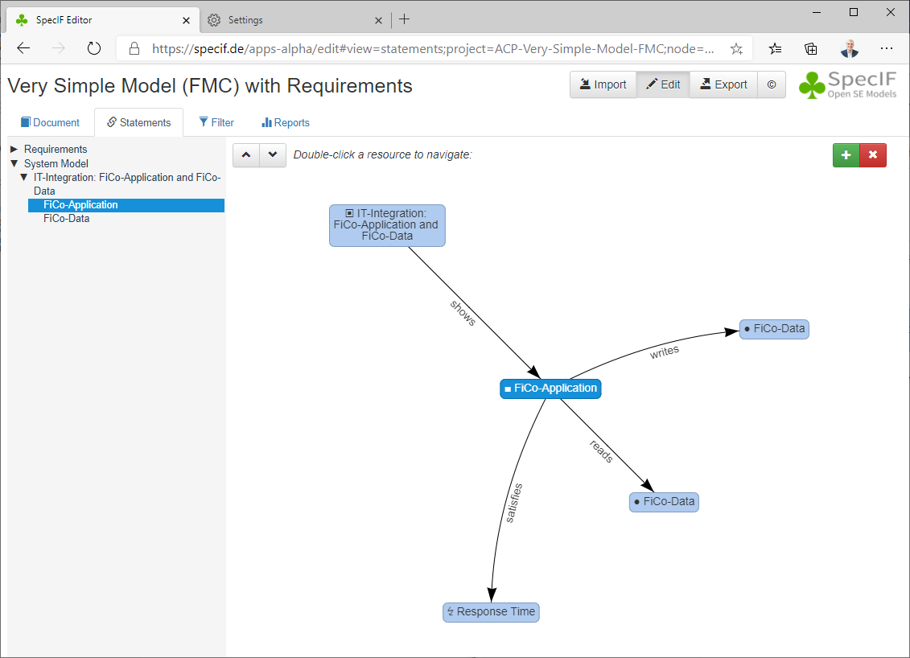

# Tutorial 9: 'Very Simple Model (FMC) with Requirements'

Before, we have discussed how to represent a very simple model, see Tutorial 6: [Very Simple Model (FMC)](./06_Very-Simple-Model-FMC.md). Now we will relate some requirements to the model-elements.


Let us first look at the relations of the model-elements. A relation is represented by a statement made with the respective resources. Below, the statements for one of the model-elements, namely \'FiCo-Application\' are shown:




Let us at last have a look at the full example, now:

```json
{
    "id": "ACP-Very-Simple-Model-FMC",
    "title": "Very Simple Model (FMC) with Requirements",
    "$schema": "https://specif.de/v1.0/schema.json",
    "rights": {
        "title": "Creative Commons 4.0 CC BY-SA",
        "type": "dcterms:rights",
        "url": "https://creativecommons.org/licenses/by-sa/4.0/"
    },
    "createdAt": "2020-03-06T09:05:00+01:00",
    "dataTypes": [{
        "id": "DT-ShortString",
        "title": "String [96]",
        "description": "String with length 96",
        "type": "xs:string",
        "maxLength": 96,
        "changedAt": "2018-05-10T11:54:00+01:00"
    }, {
        "id": "DT-FormattedText",
        "title": "Formatted Text with length 8192",
        "type": "xhtml",
        "maxLength": 8192,
        "changedAt": "2018-05-10T11:54:00+01:00"
    },{
        "id": "DT-Priority",
        "title": "SpecIF:Priority",
        "description": "Enumerated values for priority",
        "type": "xs:enumeration",
        "values": [{
          "id": "V-Prio-0",
          "value": "SpecIF:priorityHigh"
        },{
          "id": "V-Prio-1",
		  "value": "SpecIF:priorityRatherHigh"
        },{
          "id": "V-Prio-2",
          "value": "SpecIF:priorityMedium"
        },{
          "id": "V-Prio-3",
          "value": "SpecIF:priorityRatherLow"
        },{
          "id": "V-Prio-4",
          "value": "SpecIF:priorityLow"
        }],
        "multiple": false,
        "changedAt": "2020-10-17T10:00:00+01:00"
    }],
    "propertyClasses": [{
        "id": "PC-Name",
        "title": "dcterms:title",
        "dataType": "DT-ShortString",
        "changedAt": "2018-05-10T11:54:00+01:00"
    }, {
        "id": "PC-Description",
        "title": "dcterms:description",
        "dataType": "DT-FormattedText",
        "changedAt": "2018-05-10T11:54:00+01:00"
    }, {
        "id": "PC-Diagram",
        "title": "SpecIF:Diagram",
        "dataType": "DT-FormattedText",
        "changedAt": "2018-05-10T11:54:00+01:00"
    }, {
        "id": "PC-Type",
        "title": "dcterms:type",
        "dataType": "DT-ShortString",
        "changedAt": "2018-05-10T11:54:00+01:00"
    },{
        "id": "PC-Priority",
        "title": "SpecIF:Priority",
        "description": "The 'Priority' of the resource.",
        "dataType": "DT-Priority",
        "changedAt": "2020-03-26T22:59:00+02:00"
    }],
    "resourceClasses": [{
		"id": "RC-Folder",
		"title": "SpecIF:Heading",
		"description": "Folder with title and text for chapters or descriptive paragraphs.",
		"isHeading": true,
		"instantiation": ["auto","user"],
		"propertyClasses": ["PC-Name","PC-Description"],
		"changedAt": "2016-05-26T08:59:00+02:00"
	},{
        "id": "RC-Diagram",
        "title": "SpecIF:Diagram",
        "description": "A 'Diagram' is a graphical model view with a specific communication purpose, e.g. a business process or system composition.",
        "instantiation": ["user"],
        "icon": "&#9635;",
        "propertyClasses": ["PC-Name","PC-Description","PC-Diagram","PC-Type"],
        "changedAt": "2018-05-10T11:54:00+01:00"
    }, {
        "id": "RC-Actor",
        "title": "FMC:Actor",
        "description": "An 'Actor' is a fundamental model element type representing an active entity, be it an activity, a process step, a function, a system component or a role.",
        "instantiation": ["auto"],
        "icon": "&#9632;",
        "propertyClasses": ["PC-Name","PC-Description","PC-Type"],
        "changedAt": "2018-05-10T11:54:00+01:00"
    }, {
        "id": "RC-State",
        "title": "FMC:State",
        "description": "A 'State' is a fundamental model element type representing a passive entity, be it a value, a document, an information storage or even a physical shape.",
        "instantiation": ["auto"],
        "icon": "&#9679;",
        "propertyClasses": ["PC-Name","PC-Description","PC-Type"],
        "changedAt": "2018-05-10T11:54:00+01:00"
    }, {
        "id": "RC-Event",
        "title": "FMC:Event",
        "description": "An 'Event' is a fundamental model element type representing a time reference, a change in condition/value or more generally a synchronisation primitive.",
        "instantiation": ["auto"],
        "icon": "&#9830;",
        "propertyClasses": ["PC-Name","PC-Description","PC-Type"],
        "changedAt": "2018-05-10T11:54:00+01:00"
    }, {
        "id": "RC-Requirement",
        "title": "IREB:Requirement",
        "description": "A 'Requirement' is a singular documented physical and functional need that a particular design, product or process must be able to perform.",
        "icon": "&#8623;",
        "propertyClasses": [ "PC-Name", "PC-Description", "PC-Priority" ],
        "changedAt": "2020-03-26T22:59:00+02:00"
   }],
    "statementClasses": [{
        "id": "SC-shows",
        "title": "SpecIF:shows",
        "description": "'Diagram' shows 'Model-Element'",
        "instantiation": ["auto"],
        "subjectClasses": ["RC-Diagram"],
        "objectClasses": ["RC-Actor", "RC-State", "RC-Event"],
        "changedAt": "2018-05-10T11:54:00+01:00"
    }, {
        "id": "SC-writes",
        "title": "SpecIF:writes",
        "description": "'Actor' (Role, Function) writes 'State' (Information)",
        "instantiation": ["auto"],
        "subjectClasses": ["RC-Actor"],
        "objectClasses": ["RC-State"],
        "changedAt": "2018-05-10T11:54:00+01:00"
    }, {
        "id": "SC-reads",
        "title": "SpecIF:reads",
        "description": "'Actor' (Role, Function) reads 'State' (Information)",
        "instantiation": ["auto"],
        "subjectClasses": ["RC-Actor"],
        "objectClasses": ["RC-State"],
        "changedAt": "2018-05-10T11:54:00+01:00"
    },
    {
        "id": "SC-satisfies",
        "title": "oslc_rm:satisfies",
        "description": "Statement: Model-Element satisfies Requirement",
        "instantiation": ["user"],
        "subjectClasses": [ "RC-Actor", "RC-State" ],
        "objectClasses": [ "RC-Requirement" ],
        "changedAt": "2016-05-26T08:59:00+02:00"
    }],
    "resources": [{
        "id": "Folder-Requirements",
        "title": "Requirements",
        "class": "RC-Folder",
        "properties": [{
            "class": "PC-Name",
            "value": "Requirements"
        }],
        "changedAt": "2020-03-06T08:32:00+01:00"
    }, {
        "id": "Folder-SystemModel",
        "title": "System Model",
        "class": "RC-Folder",
        "properties": [{
            "class": "PC-Name",
            "value": "System Model"
        }],
        "changedAt": "2020-03-06T08:32:00+01:00"
    }, {
        "id": "Diagram-aec0df7900010000017001eaf53e8876",
        "title": "IT-Integration: FiCo-Application and FiCo-Data",
        "class": "RC-Diagram",
        "properties": [{
            "class": "PC-Name",
            "value": "IT-Integration: FiCo-Application and FiCo-Data"
        }, {
            "class": "PC-Description",
            "value": "<div></div>"
        }, {
            "class": "PC-Diagram",
            "value": "<div><p class=\"inline-label\">Model Diagram:</p><p><object type=\"image/png\" data=\"files_and_images/Very-Simple-Model-FMC.png\">Notation: FMC Block Diagram</object></p></div>"
        }, {
            "class": "PC-Type",
            "value": "FMC Block Diagram"
        }],
        "changedAt": "2020-03-06T08:32:00+01:00"
    }, {
        "id": "MEl-50fbfe8f0029b1a8016ea86245a9d83a",
        "title": "FiCo-Application",
        "class": "RC-Actor",
        "properties": [{
            "class": "PC-Name",
            "value": "FiCo-Application"
        }, {
            "class": "PC-Description",
            "value": "<div><p>IT-Application for Finance and Controlling.</p></div>"
        }],
        "changedAt": "2020-03-06T09:04:00+01:00"
    }, {
        "id": "MEl-50feddc00029b1a8016e2872e78ecadc",
        "title": "FiCo-Data",
        "class": "RC-State",
        "properties": [{
            "class": "PC-Name",
            "value": "FiCo-Data"
        }, {
            "class": "PC-Description",
            "value": "<div><p>Finance and Controlling Data, such as cost-units per project with budget, accrued cost etc.</p></div>"
        }],
        "changedAt": "2020-03-06T09:03:00+01:00"
    }, {
        "id": "Req-0Z7916e2872e78ecadc50feddc00918a",
        "title": "Consistency",
        "class": "RC-Requirement",
        "properties": [{
            "class": "PC-Name",
            "value": "Consistency"
        }, {
            "class": "PC-Description",
            "value": "<div><p>The data store MUST be consistent at all times.</p></div>"
        }],
        "changedAt": "2020-10-17T10:00:00+01:00"
    }, {
        "id": "Req-1a8016e2872e78ecadc50feddc00029b",
        "title": "Data Volume",
        "class": "RC-Requirement",
        "properties": [{
            "class": "PC-Name",
            "value": "Data Volume"
        }, {
            "class": "PC-Description",
            "value": "<div><p>The data store MUST support a total volume up to 850 GB.</p></div>"
        }],
        "changedAt": "2020-10-17T10:00:00+01:00"
    }, {
        "id": "Req-2b9016e2872e78ecadc50feddc0013Ac",
        "title": "Response Time",
        "class": "RC-Requirement",
        "properties": [{
            "class": "PC-Name",
            "value": "Response Time"
        }, {
            "class": "PC-Description",
            "value": "<div><p>The system SHOULD respond on user queries within 300 ms.</p></div>"
        }],
        "changedAt": "2020-10-17T10:00:00+01:00"
    }],
    "statements": [{
        "id": "Sshw-aec0df7900010000017001eaf53e8876-50fbfe8f0029b1a8016ea86245a9d83a",
        "description": "'FMC Block Diagram' shows 'FiCo-Application'",
        "class": "SC-shows",
        "subject": "Diagram-aec0df7900010000017001eaf53e8876",
        "object": "MEl-50fbfe8f0029b1a8016ea86245a9d83a",
        "changedAt": "2020-03-06T08:32:00+01:00"
    }, {
        "id": "Sshw-aec0df7900010000017001eaf53e8876-50feddc00029b1a8016e2872e78ecadc",
        "description": "'FMC Block Diagram' shows 'FiCo-Data'",
        "class": "SC-shows",
        "subject": "Diagram-aec0df7900010000017001eaf53e8876",
        "object": "MEl-50feddc00029b1a8016e2872e78ecadc",
        "changedAt": "2020-03-06T08:32:00+01:00"
    }, {
        "id": "Swri-50fbfe8f0029b1a8016ea86245a9d83a-50feddc00029b1a8016e2872e78ecadc",
        "description": "'FiCo-Application' writes 'FiCo-Data'",
        "class": "SC-writes",
        "subject": "MEl-50fbfe8f0029b1a8016ea86245a9d83a",
        "object": "MEl-50feddc00029b1a8016e2872e78ecadc",
        "changedAt": "2020-03-06T09:05:00+01:00"
    }, {
        "id": "Srea-50fbfe8f0029b1a8016ea86245a9d83a-50feddc00029b1a8016e2872e78ecadc",
        "description": "'FiCo-Application' reads 'FiCo-Data'",
        "class": "SC-reads",
        "subject": "MEl-50fbfe8f0029b1a8016ea86245a9d83a",
        "object": "MEl-50feddc00029b1a8016e2872e78ecadc",
        "changedAt": "2020-03-06T09:05:00+01:00"
    }, {
        "id": "Ssat-50feddc00029b1a8016e2872e78ecadc-1a8016e2872e78ecadc50feddc00029b",
        "description": "'FiCo-Data' satisfies 'Data Volume'",
        "class": "SC-satisfies",
        "subject": "MEl-50feddc00029b1a8016e2872e78ecadc",
        "object": "Req-1a8016e2872e78ecadc50feddc00029b",
        "changedAt": "2020-10-17T10:00:00+01:00"
    }, {
        "id": "Ssat-50feddc00029b1a8016e2872e78ecadc-0Z7916e2872e78ecadc50feddc00918a",
        "description": "'FiCo-Data' satisfies 'Consistency'",
        "class": "SC-satisfies",
        "subject": "MEl-50feddc00029b1a8016e2872e78ecadc",
        "object": "Req-0Z7916e2872e78ecadc50feddc00918a",
        "changedAt": "2020-10-17T10:00:00+01:00"
    }, {
        "id": "Ssat-50fbfe8f0029b1a8016ea86245a9d83a-2b9016e2872e78ecadc50feddc0013Ac",
        "description": "'FiCo-Application' satisfies 'Response Time'",
        "class": "SC-satisfies",
        "subject": "MEl-50fbfe8f0029b1a8016ea86245a9d83a",
        "object": "Req-2b9016e2872e78ecadc50feddc0013Ac",
        "changedAt": "2020-10-17T10:00:00+01:00"
    }],
    "hierarchies": [{
		"id": "N-Folder-Requirements",
		"resource": "Folder-Requirements",
		"nodes": [{
			"id": "N-1a8016e2872e78ecadc50feddc00029b",
			"resource": "Req-1a8016e2872e78ecadc50feddc00029b",
            "changedAt": "2020-10-17T10:00:00+01:00"
		}, {
			"id": "N-0Z7916e2872e78ecadc50feddc00918a",
			"resource": "Req-0Z7916e2872e78ecadc50feddc00918a",
            "changedAt": "2020-10-17T10:00:00+01:00"
		}, {
			"id": "N-2b9016e2872e78ecadc50feddc0013Ac",
			"resource": "Req-2b9016e2872e78ecadc50feddc0013Ac",
            "changedAt": "2020-10-17T10:00:00+01:00"
		}],
        "changedAt": "2020-10-17T10:00:00+01:00"
    }, {
		"id": "N-Folder-SystemModel",
		"resource": "Folder-SystemModel",
		"nodes": [{
			"id": "N-Diagram-aec0df7900010000017001eaf53e8876",
			"resource": "Diagram-aec0df7900010000017001eaf53e8876",
			"nodes": [{
				"id": "N-50fbfe8f0029b1a8016ea86245a9d83a",
				"resource": "MEl-50fbfe8f0029b1a8016ea86245a9d83a",
				"changedAt": "2020-03-06T09:05:00+01:00"
			}, {
				"id": "N-50feddc00029b1a8016e2872e78ecadc",
				"resource": "MEl-50feddc00029b1a8016e2872e78ecadc",
				"changedAt": "2020-03-06T09:05:00+01:00"
			}],
			"changedAt": "2020-10-17T10:00:00+01:00"
		}],
        "changedAt": "2020-10-17T10:00:00+01:00"
    }],
    "files": []
}
```

The instances, the actual model content, have not been discussed, yet:
- You can easily see the diagram and the two model-elements in *resources*. The *properties* carry the information payload; those without a defined value can be omitted, e.g. the diagram has no property of type \"PC-Text\" and the model-elements have no property of type \"PC-Type\".
- The four *statements* are equally easy to interpret: One *shows* relationship per model-element plus the *writes* and *reads* relationships between the model-elements.
- By the way, if you display this example with the [SpecIF Viewer](http://specif.de/apps-alpha/view.html#import=../examples/06_Very-Simple-Model-FMC.specifz) and you hover the mouse over one of the model-elements or double-click it, you can see the potential of web-technology. This is not by virtue of SpecIF, but when the SVG is generated in a way that the model-element *id* is associated to a graphic element and an app like the SpecIF Viewer finds it, such behaviour is easily implemented.


You may also view/download the example [Very Simple Model (FMC)](http://specif.de/examples/06_Very-Simple-Model-FMC.specifz "SpecIF Example \'Very Simple Model (FMC)\'") or view it using the [SpecIF Viewer](http://specif.de/apps/view#import=../examples/06_Very-Simple-Model-FMC.specifz).
