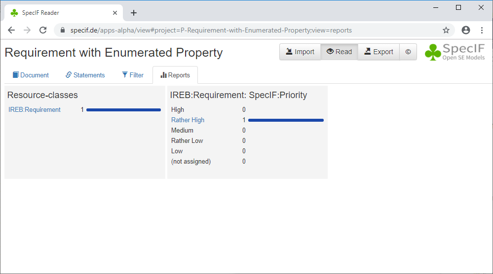

# Tutorial 5: 'Requirement with Enumerated Property'

Next, we would like to discuss how to add a property to a resource which may assume one of several predefined (\"enumerated\") values. The previously discussed requirement will now get a property indicating it's  priority.

Again, let's start with the new elements of a SpecIF data-set.

```json
{
    "dataTypes": [{
      "id": "DT-Priority",
      "title": "SpecIF:Priority",
      "description": "Enumerated values for priority",
      "type": "xs:enumeration",
      "values": [{
          "id": "V-Prio-0",
          "value": "High"
      },{
          "id": "V-Prio-2",
          "value": "Medium"
      },{
          "id": "V-Prio-4",
          "value": "Low"
      }],
      "multiple": false,
      "changedAt": "2016-05-26T08:59:00+02:00"
    }],
    "propertyClasses": [{
      "id": "PC-Priority",
      "title": "SpecIF:Priority",
      "description": "The 'Priority' of the resource.",
      "dataType": "DT-Priority",
      "changedAt": "2016-05-26T08:59:00+02:00"
    }]
}
```

Some explanations:
- We see a new *dataType* with \"type\":\"xs:enumeration\". It's predefined *values* are listed with an identifier and a value. Any property instance may specify a value by *id*.
- The attribute *multiple* indicates whether a property instance may assume only one or several values (single or multiple choice). If missing, the value is \"false\".
- The *dataType* as well as the *propertyClass* have a *title* with an assigned vocabulary term. Thus a system \'understands\' the meaning or role of the information item. 


Let us have a look at the full example, now:

```json
{
    "$schema": "https://specif.de/v1.0/schema.json",
    "id": "P-Requirement-with-Enumerated-Property",
    "title": "Requirement with Enumerated Property",
    "createdAt": "2020-03-04T20:12:59.960Z",
    "dataTypes": [{
      "id": "DT-ShortString",
      "title": "String[256]",
      "description": "String with max. length 256",
      "type": "xs:string",
      "maxLength": 256,
      "changedAt": "2016-05-26T08:59:00+02:00"
    },{
      "id": "DT-Text",
      "title": "Plain or formatted Text",
      "description": "A text string, plain, or formatted with XHTML or markdown",
      "type": "xs:string",
      "changedAt": "2021-02-14T08:59:00+02:00"
    },{
      "id": "DT-Priority",
      "title": "SpecIF:Priority",
      "description": "Enumerated values for priority",
      "type": "xs:enumeration",
      "values": [{
          "id": "V-Prio-0",
          "value": "High"
      },{
          "id": "V-Prio-1",
          "value": "Rather High"
      },{
          "id": "V-Prio-2",
          "value": "Medium"
      },{
          "id": "V-Prio-3",
          "value": "Rather Low"
      },{
          "id": "V-Prio-4",
          "value": "Low"
      }],
      "multiple": false,
      "changedAt": "2016-05-26T08:59:00+02:00"
    }],
    "propertyClasses": [{
      "id": "PC-Name",
      "title": "dcterms:title",
      "description": "A name given to the resource.",
      "dataType": "DT-ShortString",
      "changedAt": "2016-05-26T08:59:00+02:00"
    },{
      "id": "PC-Description",
      "title": "dcterms:description",
      "description": "An account of the resource (source: http://dublincore.org/documents/dcmi-terms/). Descriptive text represented in plain or rich text using XHTML or Markdown. SHOULD include only content that is valid and suitable inside an XHTML &lt;div&gt; element (source: http://open-services.net/).",
      "dataType": "DT-Text",
      "changedAt": "2021-02-23T08:59:00+02:00"
    },{
      "id": "PC-Priority",
      "title": "SpecIF:Priority",
      "description": "The 'Priority' of the resource.",
      "dataType": "DT-Priority",
      "changedAt": "2016-05-26T08:59:00+02:00"
    }],
    "resourceClasses": [{
      "id": "RC-Requirement",
      "title": "IREB:Requirement",
      "description": "A 'Requirement' is a singular documented physical and functional need that a particular design, product or process must be able to perform.",
      "icon": "&#8623;",
      "propertyClasses": [ "PC-Name", "PC-Description", "PC-Priority" ],
      "changedAt": "2016-05-26T08:59:00+02:00"
    }],
    "statementClasses": [],
    "resources": [{
        "id": "Req-5ba3512b0000bca",
        "title": "Minimum button size",
        "class": "RC-Requirement",
        "properties": [{
            "class": "PC-Name",
            "value": "Minimum button size"
        },{
            "class": "PC-Description",
            "value": "<p>The <i>button size</i> MUST not be less than 20mm in diameter.</p>"
        },{
            "class": "PC-Priority",
            "value": "V-Prio-1"
        }],
        "changedAt": "2017-06-19T20:13:08+02:00"
    }],
    "statements": [],
    "hierarchies": [{
        "id": "N-bca801377e3d1525",
        "resource": "Req-5ba3512b0000bca",
        "changedAt": "2019-05-29T13:19:28.546Z"
    }]
}
```

Some more explanations:
- Here we see that the *resourceClass* has an additionally listed *propertyClass* \"PC-Priority\".
- Also the resource's list of *properties* has an additional element with a priority value. Note that the *id* of a *dataType.value* is being referenced.


Finally let us have a look at the tab \"Reports\" of the SpecIF-Viewer. You may check yourself by clicking the link at the very lower right corner of this page. 



- The first report panel on the left shows how many *resourceClasses* are defined, one in this case, and how many resources of that class exist, also a single one in this case.
- The second report panel shows how how many instances of the given class (see the title of the report) have any of the defined value of a property with an enumerated dataType. Also trivial in this case: Resources of class \"IREB-Requirement\" have one property with enumerated values and the single instance has the value \"Rather High\".
- However, note that none of the reports have been programmed explicitly. Just the classes of the current projects are used to construct the report panels. Then, the respective instance counts are added. These reports are completely generic by virtue of the SpecIF class definitions.
- In one of the later tutorials we will see that the enumerated properties may also be used for a faceted filtering of resources.


You may also view/download the example [Requirement with Enumerated Property](http://specif.de/examples/05_Requirement-with-Enumerated-Property.specif "SpecIF Example \'Requirement with Enumerated Property\'") or display it using the [SpecIF Viewer](http://specif.de/apps/view#import=../examples/05_Requirement-with-Enumerated-Property.specif).
