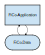
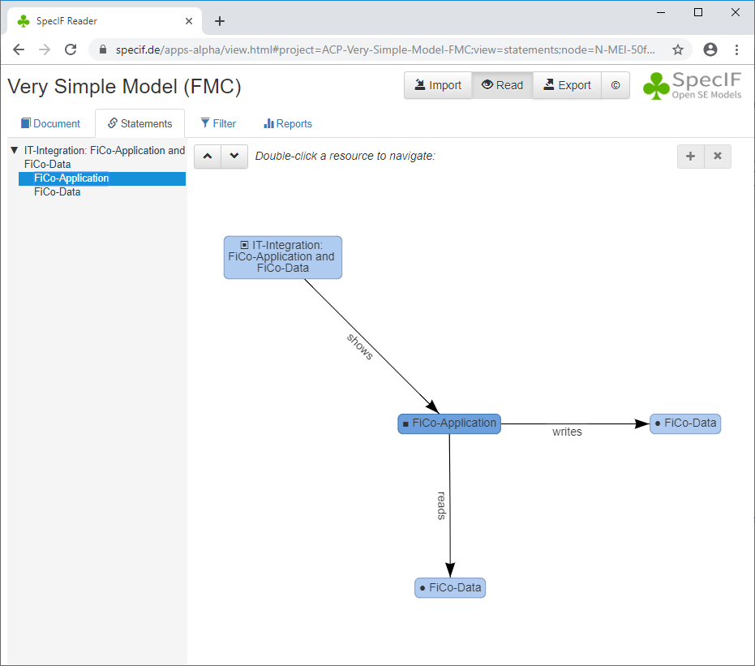

# Tutorial 6: 'Very Simple Model (FMC)'

In the previous tutorials we have introduced all concepts we need to represent a simple model with SpecIF. Let's start with a block-diagram using the notation of the [Fundamental Modelling Concepts (FMC)](http://f-m-c.org/). Let us first look at the model, itself:



- In fact, this is not a model, but a diagram representing a model. It is a view of the model for a specific communication purpose; it is meant to be interpreted by a human being. In this particularly simple case, the diagram shows the whole model, but usually there are more and each diagram depicts a certain aspect of a model.
- We see two model elements with two relations. The upper box represents an IT-System with some business logic and the lower box represents the information being processed. The directed connections represent a writing and a reading relationship; thus this application can write and read the data.
- The notation being used is known as a block-diagram of the *Fundamental Modelling Concepts (FMC)*. A box with sharp corners represents an active element called *Actor*, while a box with rounded corners represents a passive element called *State*. *Actor* is a concept used for a system, tool, human role or function, whereas *State* is a concept used for information in general, a document, a database, a form or color.
- The model-diagram above defines three resources, namely each of the depicted model-elements plus the diagram itself.


Let us first look at the relations of the model-elements. A relation is represented by a statement made with the respective resources. Below, the statements for one of the model-elements, namely \'FiCo-Application\' are shown:



- While the model-diagram shown first was created by an engineer to define an aspect of the model, the graph above shows all statements with a particular model-element, \'FiCo-Application\' in this case. 
- An accumulation of *all* statements with this model-element is shown, no matter where they have been defined; it is the semantic net around the selected element with a radius of one. 
- Each arrow is a statement, e.g. \'FiCo-Application reads FiCo-Data\'. 
- So we see that the selected model-element is shown on one diagram and that it writes and reads another model-element. 
- The icon in front of a model-element name helps to distinguish the fundamental model-element types. The icon is consistently defined for all instances in the respective *resourceClass* below.
- This statement view lends itself particularly well to discover any inconsistendcy between model-views. Also it may help to discover model gaps, for example, if an information element is written, but never read.


Again, let's start with the new elements of a SpecIF data-set.

```json
{
    "propertyClasses": [{
      "id": "PC-Diagram",
      "title": "SpecIF:Diagram",
      "dataType": "DT-FormattedText",
      "changedAt": "2018-05-10T11:54:00+01:00"
    }, {
      "id": "PC-Type",
      "title": "dcterms:type",
      "dataType": "DT-ShortString",
      "changedAt": "2018-05-10T11:54:00+01:00"
    }],
    "resourceClasses": [{
      "id": "RC-Diagram",
      "title": "SpecIF:Diagram",
      "description": "A 'Diagram' is a graphical model view with a specific communication purpose, e.g. a business process or system composition.",
      "instantiation": ["user"],
      "icon": "&#9635;",
      "propertyClasses": ["PC-Name","PC-Description","PC-Diagram","PC-Type"],
      "changedAt": "2018-05-10T11:54:00+01:00"
    }, {
      "id": "RC-Actor",
      "title": "FMC:Actor",
      "description": "An 'Actor' is a fundamental model element type representing an active entity, be it an activity, a process step, a function, a system component or a role.",
      "instantiation": ["auto"],
      "icon": "&#9632;",
      "propertyClasses": ["PC-Name","PC-Description","PC-Type"],
      "changedAt": "2018-05-10T11:54:00+01:00"
    }, {
      "id": "RC-State",
      "title": "FMC:State",
      "description": "A 'State' is a fundamental model element type representing a passive entity, be it a value, a document, an information storage or even a physical shape.",
      "instantiation": ["auto"],
      "icon": "&#9679;",
      "propertyClasses": ["PC-Name","PC-Description","PC-Type"],
      "changedAt": "2018-05-10T11:54:00+01:00"
    }, {
      "id": "RC-Event",
      "title": "FMC:Event",
      "description": "An 'Event' is a fundamental model element type representing a time reference, a change in condition/value or more generally a synchronisation primitive.",
      "instantiation": ["auto"],
      "icon": "&#9830;",
      "propertyClasses": ["PC-Name","PC-Description","PC-Type"],
      "changedAt": "2018-05-10T11:54:00+01:00"
    }],
}
```

- In this example we need three *resourceClasses* for the diagram plus the model-elements of class *Actor* and *State*.
- The forth resourceClass given with \"id\":\"RC-Event\" is not used here, but it is the third fundamental model-element type. One of the interesting principles of FMC is that *any model notation* consists of only three fundamental model-element types, namely *Actor*, *State* and *Event*.
- Apart from the *propertyClasses* discussed in earlier tutorials, we find two new ones: 
The diagram shall be referenced by a separate property \"id\":\"PC-Diagram\" to give it a distinguished role by means of it's \"title\":\"SpecIF:Diagram\". 
The original type of each element, which can be seen as a subclass to the fundamental class, is specified in a property of class \"id\":\"PC-Type\".


Next, we look at the *statementClasses*:

```json
{
    "statementClasses": [{
      "id": "SC-shows",
      "title": "SpecIF:shows",
      "description": "'Diagram' shows 'Model-Element'",
      "instantiation": ["auto"],
      "subjectClasses": ["RC-Diagram"],
      "objectClasses": ["RC-Actor", "RC-State", "RC-Event"],
      "changedAt": "2018-05-10T11:54:00+01:00"
    }, {
      "id": "SC-writes",
      "title": "SpecIF:writes",
      "description": "'Actor' (Role, Function) writes 'State' (Information)",
      "instantiation": ["auto"],
      "subjectClasses": ["RC-Actor"],
      "objectClasses": ["RC-State"],
      "changedAt": "2018-05-10T11:54:00+01:00"
    }, {
      "id": "SC-reads",
      "title": "SpecIF:reads",
      "description": "'Actor' (Role, Function) reads 'State' (Information)",
      "instantiation": ["auto"],
      "subjectClasses": ["RC-Actor"],
      "objectClasses": ["RC-State"],
      "changedAt": "2018-05-10T11:54:00+01:00"
    }],
}
```

- The first statementClass with \"id\":\"SC-shows\" will be used to relate the diagram to all depicted model-elements. In a more complex model it allows to easily find out on which diagrams a given model-element appears. 
- In such a statement, only an instance of the class with \"id\":\"RC-Diagram" can serve as a subject (source) and only an instance of any fundamental model-element type can serve as an object (target).
- The last two statementClasses will be used for the 'writes' and 'reads' predicates (relationships) discussed in the beginning. We see that in both cases only an instance of the class with \"id\":\"RC-Actor" can serve as a subject and only an instance of the class with \"id\":\"RC-State" can serve as an object.
- The attribute *subjectClasses* can be omitted as discussed in Tutorial 2: [Related-Terms](./02_Related-Terms.md), then any resource can be used as a subject. Similarly for *objectClasses*.


Let us at last have a look at the full example, now:

```json
{
    "$schema": "https://specif.de/v1.0/schema.json",
    "id": "ACP-Very-Simple-Model-FMC",
    "title": "Very Simple Model (FMC)",
    "createdAt": "2020-03-06T09:05:00+01:00",
    "dataTypes": [{
      "id": "DT-ShortString",
      "title": "String[96]",
      "description": "String with max. length 96.",
      "type": "xs:string",
      "maxLength": 96,
      "changedAt": "2016-05-26T08:59:00+02:00"
    },{
      "id": "DT-Text",
      "title": "Plain or formatted Text",
      "description": "A text string, plain, or formatted with XHTML or markdown",
      "type": "xs:string",
      "changedAt": "2021-02-14T08:59:00+02:00"
    }],
    "propertyClasses": [{
      "id": "PC-Name",
      "title": "dcterms:title",
      "dataType": "DT-ShortString",
      "changedAt": "2018-05-10T11:54:00+01:00"
    }, {
      "id": "PC-Description",
      "title": "dcterms:description",
      "description": "An account of the resource (source: http://dublincore.org/documents/dcmi-terms/). Descriptive text represented in plain or rich text using XHTML or Markdown. SHOULD include only content that is valid and suitable inside an XHTML &lt;div&gt; element (source: http://open-services.net/).",
      "dataType": "DT-Text",
      "changedAt": "2021-02-23T08:59:00+02:00"
    }, {
      "id": "PC-Diagram",
      "title": "SpecIF:Diagram",
      "dataType": "DT-FormattedText",
      "changedAt": "2018-05-10T11:54:00+01:00"
    }, {
      "id": "PC-Type",
      "title": "dcterms:type",
      "dataType": "DT-ShortString",
      "changedAt": "2018-05-10T11:54:00+01:00"
    }],
    "resourceClasses": [{
      "id": "RC-Diagram",
      "title": "SpecIF:Diagram",
      "description": "A 'Diagram' is a graphical model view with a specific communication purpose, e.g. a business process or system composition.",
      "instantiation": ["user"],
      "icon": "&#9635;",
      "propertyClasses": ["PC-Name","PC-Description","PC-Diagram","PC-Type"],
      "changedAt": "2018-05-10T11:54:00+01:00"
    }, {
      "id": "RC-Actor",
      "title": "FMC:Actor",
      "description": "An 'Actor' is a fundamental model element type representing an active entity, be it an activity, a process step, a function, a system component or a role.",
      "instantiation": ["auto"],
      "icon": "&#9632;",
      "propertyClasses": ["PC-Name","PC-Description","PC-Type"],
      "changedAt": "2018-05-10T11:54:00+01:00"
    }, {
      "id": "RC-State",
      "title": "FMC:State",
      "description": "A 'State' is a fundamental model element type representing a passive entity, be it a value, a document, an information storage or even a physical shape.",
      "instantiation": ["auto"],
      "icon": "&#9679;",
      "propertyClasses": ["PC-Name","PC-Description","PC-Type"],
      "changedAt": "2018-05-10T11:54:00+01:00"
    }, {
      "id": "RC-Event",
      "title": "FMC:Event",
      "description": "An 'Event' is a fundamental model element type representing a time reference, a change in condition/value or more generally a synchronisation primitive.",
      "instantiation": ["auto"],
      "icon": "&#9830;",
      "propertyClasses": ["PC-Name","PC-Description","PC-Type"],
      "changedAt": "2018-05-10T11:54:00+01:00"
    }],
    "statementClasses": [{
      "id": "SC-shows",
      "title": "SpecIF:shows",
      "description": "'Diagram' shows 'Model-Element'",
      "instantiation": ["auto"],
      "subjectClasses": ["RC-Diagram"],
      "objectClasses": ["RC-Actor", "RC-State", "RC-Event"],
      "changedAt": "2018-05-10T11:54:00+01:00"
    }, {
      "id": "SC-writes",
      "title": "SpecIF:writes",
      "description": "'Actor' writes 'State'.",
      "instantiation": ["auto"],
      "subjectClasses": ["RC-Actor"],
      "objectClasses": ["RC-State"],
      "changedAt": "2018-05-10T11:54:00+01:00"
    }, {
      "id": "SC-reads",
      "title": "SpecIF:reads",
      "description": "'Actor' reads 'State'.",
      "instantiation": ["auto"],
      "subjectClasses": ["RC-Actor"],
      "objectClasses": ["RC-State"],
      "changedAt": "2018-05-10T11:54:00+01:00"
    }],
    "resources": [{
      "id": "Diagram-aec0df7900010000017001eaf53e8876",
      "title": "IT-Integration: FiCo-Application and FiCo-Data",
      "class": "RC-Diagram",
      "properties": [{
        "class": "PC-Name",
        "value": "IT-Integration: FiCo-Application and FiCo-Data"
      }, {
        "class": "PC-Diagram",
        "value": "<div><p class=\"inline-label\">Model Diagram:</p><p><object type=\"image/svg+xml\" data=\"files_and_images/Very-Simple-Model-FMC.svg\">Notation: FMC Block Diagram</object></p></div>"
      }, {
        "class": "PC-Type",
        "value": "FMC Block Diagram"
      }],
      "changedAt": "2020-03-06T08:32:00+01:00"
    }, {
      "id": "MEl-50fbfe8f0029b1a8016ea86245a9d83a",
      "title": "FiCo-Application",
      "class": "RC-Actor",
      "properties": [{
        "class": "PC-Name",
        "value": "FiCo-Application"
      }, {
        "class": "PC-Description",
        "value": "<div><p>IT-Application for Finance and Controlling.</p></div>"
      }],
      "changedAt": "2020-03-06T09:04:00+01:00"
    }, {
      "id": "MEl-50feddc00029b1a8016e2872e78ecadc",
      "title": "FiCo-Data",
      "class": "RC-State",
      "properties": [{
        "class": "PC-Name",
        "value": "FiCo-Data"
      }, {
        "class": "PC-Description",
        "value": "<div><p>Finance and Controlling Data, such as cost-units per project with budget, accrued cost etc.</p></div>"
      }],
      "changedAt": "2020-03-06T09:03:00+01:00"
    }],
    "statements": [{
      "id": "SVis-aec0df7900010000017001eaf53e8876-50fbfe8f0029b1a8016ea86245a9d83a",
      "title": "SpecIF:shows",
      "description": "'FMC Block Diagram' shows 'FiCo-Application'",
      "class": "SC-shows",
      "subject": "Diagram-aec0df7900010000017001eaf53e8876",
      "object": "MEl-50fbfe8f0029b1a8016ea86245a9d83a",
      "changedAt": "2020-03-06T08:32:00+01:00"
    }, {
      "id": "SVis-aec0df7900010000017001eaf53e8876-50feddc00029b1a8016e2872e78ecadc",
      "title": "SpecIF:shows",
      "description": "'FMC Block Diagram' shows 'FiCo-Data'",
      "class": "SC-shows",
      "subject": "Diagram-aec0df7900010000017001eaf53e8876",
      "object": "MEl-50feddc00029b1a8016e2872e78ecadc",
      "changedAt": "2020-03-06T08:32:00+01:00"
    }, {
      "id": "SWri-50fbfe8f0029b1a8016ea86245a9d83a-50feddc00029b1a8016e2872e78ecadc",
      "title": "SpecIF:writes",
      "description": "'FiCo-Application' writes 'FiCo-Data'",
      "class": "SC-writes",
      "subject": "MEl-50fbfe8f0029b1a8016ea86245a9d83a",
      "object": "MEl-50feddc00029b1a8016e2872e78ecadc",
      "changedAt": "2020-03-06T09:05:00+01:00"
    }, {
      "id": "SRea-50fbfe8f0029b1a8016ea86245a9d83a-50feddc00029b1a8016e2872e78ecadc",
      "title": "SpecIF:reads",
      "description": "'FiCo-Application' reads 'FiCo-Data'",
      "class": "SC-reads",
      "subject": "MEl-50fbfe8f0029b1a8016ea86245a9d83a",
      "object": "MEl-50feddc00029b1a8016e2872e78ecadc",
      "changedAt": "2020-03-06T09:05:00+01:00"
    }],
    "hierarchies": [{
		"id": "N-Diagram-aec0df7900010000017001eaf53e8876",
		"resource": "Diagram-aec0df7900010000017001eaf53e8876",
		"nodes": [{
			"id": "N-MEl-50fbfe8f0029b1a8016ea86245a9d83a",
			"resource": "MEl-50fbfe8f0029b1a8016ea86245a9d83a",
			"changedAt": "2020-03-06T09:05:00+01:00"
		}, {
			"id": "N-MEl-50feddc00029b1a8016e2872e78ecadc",
			"resource": "MEl-50feddc00029b1a8016e2872e78ecadc",
			"changedAt": "2020-03-06T09:05:00+01:00"
		}],
		"changedAt": "2018-05-10T11:54:00+01:00"
    }],
    "files": []
}
```

The instances, the actual model content, have not been discussed, yet:
- You can easily see the diagram and the two model-elements in *resources*. The *properties* carry the information payload; those without a defined value can be omitted, e.g. the diagram has no property of type \"PC-Description\" and the model-elements have no property of type \"PC-Type\".
- The four *statements* are equally easy to interpret: One *shows* relationship per model-element plus the *writes* and *reads* relationships between the model-elements.
- By the way, if you display this example with the [SpecIF Viewer](http://specif.de/apps-alpha/view.html#import=../examples/06_Very-Simple-Model-FMC.specifz) and you hover the mouse over one of the model-elements or double-click it, you can see the potential of web-technology. This is not by virtue of SpecIF, but when the SVG is generated in a way that the model-element *id* is associated to a graphic element and an app like the SpecIF Viewer finds it, such behaviour is easily implemented.


You may also view/download the example [Very Simple Model (FMC)](http://specif.de/examples/06_Very-Simple-Model-FMC.specifz "SpecIF Example \'Very Simple Model (FMC)\'") or view it using the [SpecIF Viewer](http://specif.de/apps/view#import=../examples/06_Very-Simple-Model-FMC.specifz).
