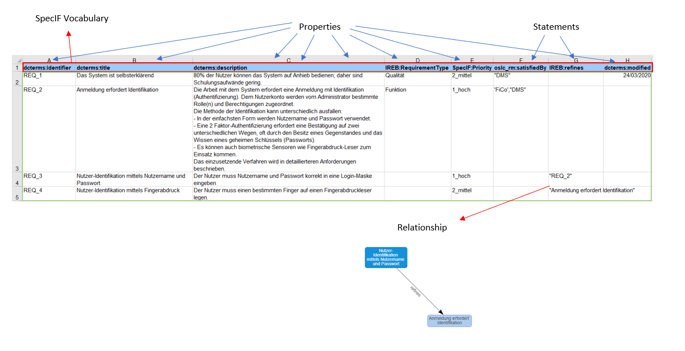
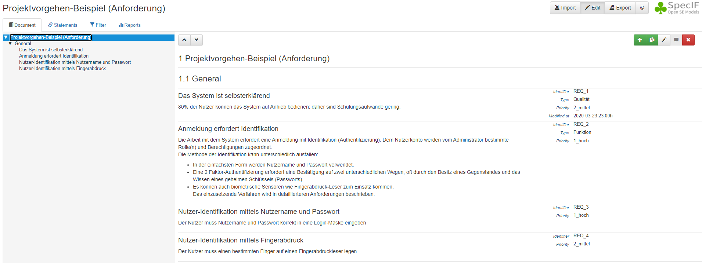
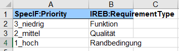
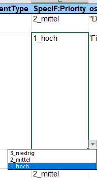

# Guidelines for importing Excel-files to the SpecIF-Viewer/Editor
The tutorial explains how resources such as requirements can be imported using Excel spreadsheets and transformed to valid SpecIF. 
Semantic notion can be transported by using suitable vocabulary terms.

## Introduction
Excel sheets may use the [SpecIF Vocabulary Terms](https://specif.de/apps/edit#import=../examples/Vocabulary.specifz).

### Resources 
Resources represent artefacts, e.g. requirements or user-stories. 
Basically, all types of artefacts can be imported, however usually model-elements are defined via model-diagrams (FMC, BPMN, SysML or other) using a model authoring tool.
The *type* of the contained resources can be included in the filename within brackets: For example, the filename "ProjectName (Requirement).xslx" would specify *requirements*. 
Unfortunately vocabulary terms cannot be used with name-space, because a DOS/Windows and Linux filename may not contain a colon (':'). Instead, use the vocabulary term without name-space in this case.

### Properties
Attributes use the term 'properties'.
A *property* carries information 'payload' and may be applied to resources and statements. 
The SpecIF terms listed in this chapter are used as property name/title, whereas the information is provided as 'value'. 
Usually a combination of complimentary properties is used per resource or statement class.

###  Statements
Relationships use the term 'statements'
A *statement* represents a logic assertion or association between two resources, i.e. system specification artefacts. 
The terms listed in the vocabulary may be used as predicates to distinguish classes (types) of statements. 
Each statement class may define an individual set of properties for carrying the information 'payload'.

## Mapping
The visual mapping can currently be found (and modified) in the [config.ts](https://github.com/GfSE/SpecIF-Viewer/blob/master/src/config/config.ts) file of the SpecIF-Viewer.

### Keywords (for visibilty and arrangement)
####  idProperties
>All property titles which denote a property as identifier in another context.
Is necessary in certain use-cases such as updating content via Excel-sheet.
The value of the first element found in idProperties will be used to form the internal id.

* dcterms:identifier
* DC.identifier
* ReqIF.ForeignID
* Object Identifier
* id
* ID
* Identifier

#### headingProperties
>If a resourceClass or a resource has a property carrying a title equal to one of the values in the following list,
it is considered a heading (chapter title) and will be included in the outline numbering.
Also, this property will be used for the title when displaying the resource.

* SpecIF:Outline
* SpecIF:Heading
* ReqIF.ChapterName
* Überschrift

#### titleProperties
> The content of the property with a title in this list will be used for the title when displaying the resource:
The sequence defines a priority, in case a resource has multiple properties with a title appearing in this list.
For example, if a resource has a property with title 'Title' and another with title 'ReqiF.Name',
the value of the latter will be the title of the resource.

* dcterms:title
* DC.title
* ReqIF.Name
* Object Heading
* Title
* Titel

#### descProperties
>The content of all properties with a title in this list will be concatenated to form the description when displaying the resource.

* dcterms:description
* DC.description
* SpecIF:Diagram
* ReqIF.Text
* Object Text

#### hiddenProperties
>A list of properties to suppress generally, specified by title.
Applies to propertyClasses and property values (types and instances).
Properties with a title corresponding to the list entries are hidden,
You must enter the title used by SpecIF (after translation)

* VALUE_Table
* VALUE_TableType
* Table > 'Table*' as used in DOORS ReqIF Exports
* TableType
* PlainText
* implementerEnhanced
* ListNumberText

#### hiddenStatements
> A list of relations not to show in tab named CONFIG.relations, specified by title

* SpecIF:commentRefersTo

#### hierarchyRoots
> A list of resourceClasses serving as hierarchyRoot with meta-data

* SpecIF:Outline
* SpecIF:HierarchyRoot
* SpecIF:Hierarchy
* SpecIF:BillOfMaterials

#### diagramClasses
>A list of resources representing Model Diagrams, specified by resource title

* SpecIF:Diagram
* FMC:Plan

#### folderClasses

* SpecIF:Outline
* SpecIF:Heading

#### modelElementClasses
>A list with all model-element types by title,
is used for example to build a glossary;
it is expected that a plural of any list element exists ( element+'s' )

* FMC:Actor
* FMC:State
* FMC:Event
* SpecIF:Collection

#### statementClasses
>A list of statement types by title,
is used for example to recognize a statement to create when importing an xls sheet

* oslc_rm:satisfies
* oslc_rm:satisfiedBy
* oslc_rm:implements
* oslc_rm:implementedBy
* oslc_rm:validates
* oslc_rm:validatedBy
* IREB:refines
* IREB:refinedBy
* IR:refersTo

## Excel file example

The first row is reserved for attribute names (SpecIF Vocabaulary if possible), where:
**dcterms:identifier**, **dcterms:title**, **dcterms:description**, **dcterms:modified**, **SpecIF:Priority** and **IREB:RequirementType** 
are **properties**; **oslc_rm:satisfiedBy** and **IREB:refines** are **statements** in this example.

The columns in the excel sheet consists of a custom identifier which is needed to recognize the correct item on update.

Upon loading the Excel file to the viewer it will have the following structure:

----> Projektvorgehen-Beispiel (Anforderung) > Filename
----> General > Sheetname
------> dcterms:title > Title
---------> dcterms:description > Paragraphs

Property terms are shown on the right next to title and paragraph blocks.

As seen dcterms:title is a title element and dcterms:description the corresponding description element to it on the same row. 
The other properties dcterms:identifier, IREB:RequirementType, SpecIF:Priority and dcterms:modified are complimentary Property-Terms.

The statements tab shows relationships,  e. g. "Nutzeridentifikation [...] refines Anmeldung erfordert Identifikation" as specified in the Excel sheet.

The filter tab enables lookup for specific strings or resource classes. Looking up the Vocabulary.specifz file linked in the introduction enables filtering 
for **Recource-Terms**, **Predicate-Terms**, **Property-Terms** and **Value-Terms**.

## Enumerations

In order to assign properties easily there are so called (enumerations) in an extra sheet.

Specify values for a property in the (Enumerations) sheet. 

Once you have entered values in the (enumerations) sheet reuse the values in the main sheet:
 
>1.  Select the cells that you want to contain the lists.
>2.  On the ribbon, click  **DATA**  >  **Data Validation**.
>3.  In the dialog, set  **Allow**  to  **List**.  
>4.  Click in  **Source**, type the text or numbers (separated by commas, for a comma-delimited list) that you want in your drop-down list, and click  **OK**.

Afterwards it is possible to choose between all specified values in the main sheet via dropdown.

---